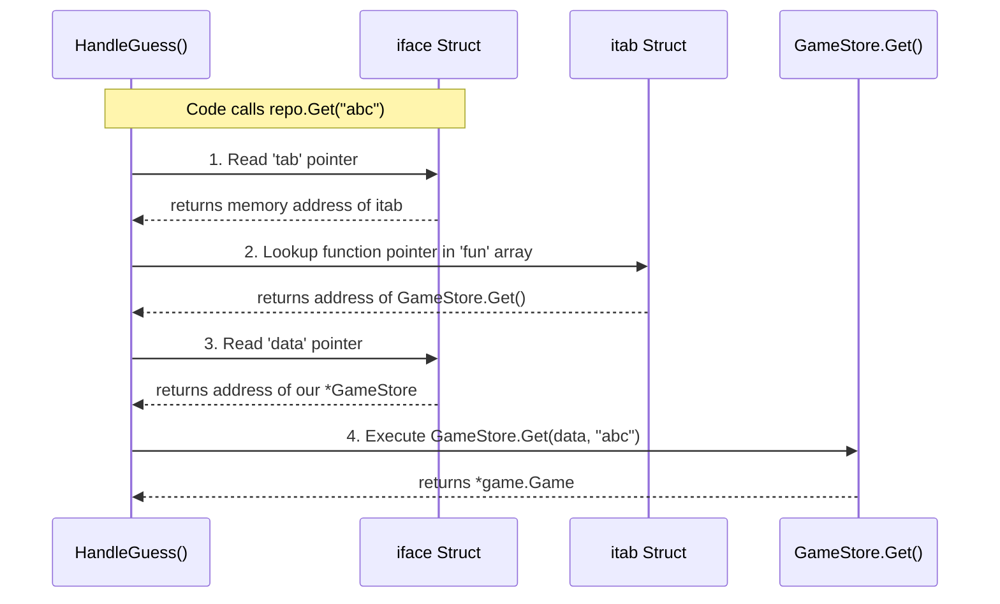
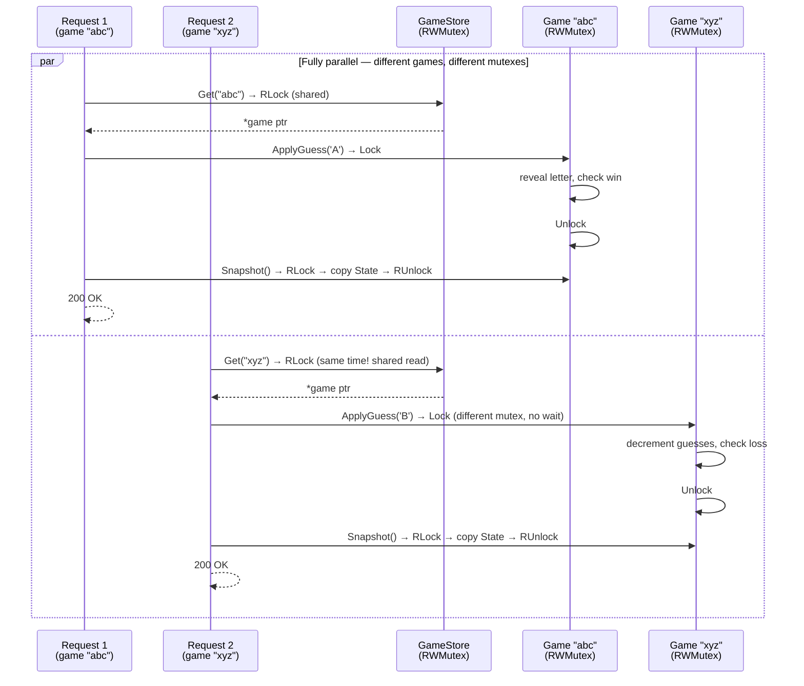
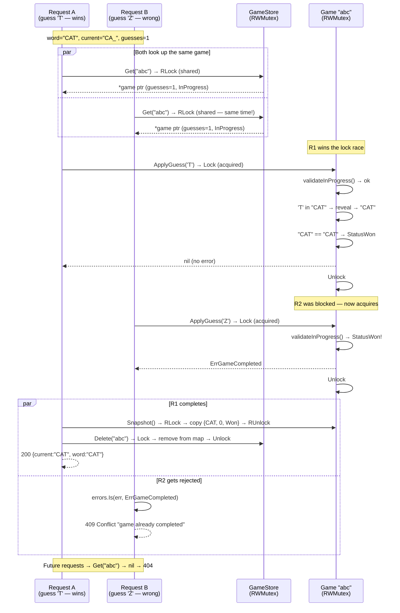

# Word Game — Interview Preparation

## Architecture Overview

```
POST /new, POST /guess  →  gorilla/mux  →  handler  →  game (business logic)
                                                    →  store (in-memory map)
```

**Three-layer design:**

| Layer | Package | Responsibility | Dependencies |
|-------|---------|---------------|-------------|
| HTTP | `internal/handler` | JSON decode/encode, input normalisation, string validation, orchestration | game, store, identifier |
| Domain | `internal/game` | Core game rules: guess processing, win/loss detection, thread safety | stdlib only |
| Data | `internal/store` | Thread-safe CRUD on `map[string]*Game` | game |

Plus two pure library packages (`pkg/words`, `pkg/identifier`) and a thin Cobra entry point (`cmd/wordgame`).

## Key Design Decisions to Defend

### 1. Why no interfaces? (YAGNI)

The `Server` struct takes `*store.GameStore` directly — not an interface. No `GameRepository`, no `WordLoader`, no `IDGenerator`.

**Defense:** Every package has exactly one implementation. Interfaces add indirection (v-table lookup) and an extra file for zero runtime benefit.

*Internal Deep Dive: How Go Interfaces Work*

To understand why we avoid interfaces when we don't need them, it helps to look under the hood. Go is statically typed, but interfaces introduce dynamic dispatch. When you assign a concrete struct (like `*GameStore`) to an interface variable, the Go runtime wraps it in a special internal struct called `iface`.

### The `iface` Struct

Here is what the `iface` struct looks like in the Go runtime source code:

```go
type iface struct {
    tab  *itab            // Points to the Interface Table
    data unsafe.Pointer   // Points to your actual struct (e.g., *GameStore)
}
```

Think of this as a shell. The `data` pointer holds the actual value, while the `tab` pointer holds the metadata needed to figure out which methods to call at runtime.

### The `itab` Struct (Interface Table)

The `tab` pointer inside `iface` points to an `itab` struct:

```go
type itab struct {
    inter *interfacetype  // Info about the interface itself (e.g., GameRepository)
    _type *_type          // Info about the concrete type (e.g., *GameStore)
    hash  uint32          // Used for fast type switches (e.g., v.(*GameStore))
    _     [4]byte
    fun   [1]uintptr      // A variable-sized array of function pointers (v-table)
}
```

The most important part here is the `fun` array. It acts like a C++ v-table (virtual method table). It holds the actual memory addresses of the implementation methods (like `GameStore.Get`).

### Mapping it to Our Code

Let's see exactly how this applies to our codebase if we used an interface for the store:

```go
// 1. The Interface
type GameRepository interface {
    Get(id string) *game.Game
}

// 2. The Concrete Implementation
type GameStore struct { /* map, mutex, etc. */ }
func (s *GameStore) Get(id string) *game.Game { /* ... */ }

// 3. The Handler passing the store to an interface parameter
func HandleGuess(repo GameRepository, id string) {
    game := repo.Get(id) 
}

// 4. The Wiring
store := &GameStore{}
HandleGuess(store, "abc") // ← The conversion happens here!
```

When we pass `store` into `HandleGuess`, the Go runtime creates an `iface` struct:

- `iface.data` points to the memory address of our `store`.
- `iface.tab._type` records that this is a `*GameStore`.
- `iface.tab.fun[0]` stores the memory address of the `GameStore.Get` function.

### Dynamic Dispatch Sequence

When `HandleGuess` executes `repo.Get("abc")`, it doesn't jump directly to the code. It has to unpack the "shell". Here is the runtime execution flow:



### The Cost of Indirection

While this dynamic dispatch is highly optimized in Go, it is not free:

1. **Pointer Dereferencing**: It requires chasing pointers through the `iface` and `itab` structs.
2. **Indirect Jumps**: CPU branch predictors struggle more with indirect function calls than direct ones.
3. **Heap Allocations**: Putting a value into an interface often forces the Go runtime to allocate memory on the heap so the `data` pointer has a stable address.

By using the concrete `*GameStore` struct directly in our server, we eliminate this "indirection" overhead. The compiler knows the exact address of `Get()` at compile time. We keep the code simpler and faster, and we only pay this interface cost when we actually need polymorphism (like introducing a `RedisStore`).

The Go convention is: interfaces are defined where they're **consumed**, not where they're **implemented**. If a PostgreSQL store were needed, the `Server` would define:

```go
type GameRepository interface {
    Get(id string) *game.Game
    Save(g *game.Game)
    Delete(id string)
}
```

And both `*GameStore` and `*PostgresStore` would satisfy it without code changes.

**The one interface we DO use:** `pkg/words.LoadWords(r io.Reader)` — the stdlib interface that decouples the loader from the filesystem, enabling tests with `strings.NewReader`.

### 2. Why split validation between handler and game?

| Layer | Checks | Why there |
|-------|--------|-----------|
| Handler | `guess == ""`, `len(guess) > 1` | String structure = HTTP concern. Prevents malformed input from reaching business logic. |
| Game | `guess` must be `[A-Z]` (`validateRune`) | Character content = domain rule. Game validates defensively so any caller (HTTP, gRPC, CLI, tests) is protected. |

**Defense:** `ApplyGuess` is a public method. If someone calls it from a non-HTTP context, the game still validates rune-level input. Empty/multi-char checks are fundamentally about protocol correctness (HTTP-specific), while A-Z is about game rules (domain-specific). Each layer owns what it's responsible for.

### 3. Two-level concurrency lock design

Two lock types, two scopes, one purpose: **allow as much parallelism as possible while keeping all mutations safe.**

#### Why two different locks?

| Lock | Type | Scope | Allows | Used by |
|------|------|-------|--------|---------|
| `GameStore.mu` | `sync.RWMutex` | The `map[string]*Game` | **Multiple readers** can look up games simultaneously, but only **one writer** at a time can add/remove games | `Get`, `Len` (RLock), `Save`, `Delete` (Lock) |
| `Game.mu` | `sync.RWMutex` | One `Game` struct's fields | **One writer** at a time per game, **concurrent readers** — different games are fully parallel | `ApplyGuess` (`game.go:75`, `Lock`), `Snapshot` (`game.go:146`, `RLock`) |

**Key insight:** `RWMutex` on the store means ten players doing `GET /guess` on ten different games can all do `Store.Get(id)` at the same time — zero contention at the map level. The serialisation only happens at the **game level**, and only when two requests hit the **same** game.

#### How they work together — normal operation (different games, full parallelism)



**Why this works:** `RWMutex.RLock` lets both `Get` calls proceed at the same time — they're just reading the map. Once each request has its own `*game` pointer, the two `Game.RWMutex` instances are **completely independent**. Request 1 locks Game "abc", Request 2 locks Game "xyz" — neither waits for the other.

#### How they work together — race condition (same game, one wins)



**Why this is safe:**

- **`RWMutex.RLock` on line `store.go:33`** lets both requests read the map concurrently — both get the same valid `*game` pointer before either mutates it.
- **`RWMutex.Lock` on line `game.go:75`** serialises the two `ApplyGuess` calls — only one can modify the game struct at a time. Whoever acquires first wins; the other waits.
- **`validateInProgress()` on line `game.go:93-98`** checks `Status != StatusInProgress` — it doesn't care whether the game is still in the map or already deleted. It only cares about the status field on the struct.
- **`Snapshot()` on line `game.go:145-149`** copies all fields under RLock — the handler never reads `g.Current` or `g.GuessesRemaining` directly, preventing data races with concurrent mutations.
- **The `*game` pointer stays valid** even after `Delete` removes it from the map — Go's garbage collector won't free it while R2 still holds a reference.

**No WebSockets. No polling. No distributed coordination. Two locks, correct ordering, seven lines of error dispatch — plain HTTP, safe concurrency.**

### 4. Smoke tests use real UUIDs (not injected)

The `WithIDGenerator(fn)` functional option exists for **unit tests** to simulate UUID collision failures. Smoke tests deliberately use the real `uuid.NewRandom`:

1. `POST /new` → get a real UUID in the JSON response
2. Extract it from the JSON
3. Use it in subsequent `POST /guess` requests

**Defense:** This exercises the full production path — real UUID generation, JSON round-trip, field naming, TCP serialisation. The test is deterministic because the word list is `["ZZZZ"]` ('Z' always correct, anything else wrong) and the test never asserts on the UUID value itself — only its presence.

### 5. Routes live in main.go, not handler

```go
// cmd/wordgame/main.go — single source of truth
func registerRoutes(r *mux.Router, srv *handler.Server) {
    r.HandleFunc("/new", srv.HandleNewGame).Methods(http.MethodPost)
    r.HandleFunc("/guess", srv.HandleGuess).Methods(http.MethodPost)
}
```

Called by both `runServer()` (production) and `setupSmoke()` (test) in `package main`.

**Defense:** `internal/handler` shouldn't depend on a router — it's pure HTTP handler logic. The router is a `cmd/` concern. Since `smoke_test.go` is in `package main`, it can call the unexported `registerRoutes` directly. Zero risk of test routes drifting from production routes.

### 6. Postel's Law: normalise before validate

```go
// request.go
func normaliseGuess(guess string) string {
    return strings.ToUpper(strings.TrimSpace(guess))
}
```

Input `" a "` → `"A"` → valid guess. Input `"5"` → `"5"` → fails `[A-Z]` → error.

**Defense:** The handler liberalises input before the game sees it. The game never receives raw user input — only clean, normalised data. This means the game's validation (`validateRune`) is purely about domain rules, not about cleaning up user typos.

### 7. Functional Options Pattern (WithIDGenerator)

This pattern solves: **how do you configure optional, named parameters without positional args, config struct bloat, or mutable globals?**

**The three wrong ways (and why our codebase needed to move past them):**

| Approach | Problem |
|----------|---------|
| Positional arguments | `NewServer(store, words, nil, nil, nil)` — order matters, what's each nil? |
| Config struct | Dead fields accumulate, zero-value ambiguity |
| Mutable package global | Racy under `t.Parallel()`, fragile `defer restore` |

**What our code used to do (before the refactor):**

```go
// handler.go — OLD pattern (mutable global)
var generateID = identifier.GenerateIdentifier

// handler_test.go — OLD test (fragile)
func TestSomething(t *testing.T) {
    orig := generateID
    defer func() { generateID = orig }()  // must restore or pollute other tests
    generateID = func() (string, error) { return "fixed", nil }
    // ...
}
```

If two tests ran in parallel with `t.Parallel()`, both would swap the same global — **race condition**. The `defer restore` is easy to forget and silently correct-looking if omitted.

**What we replaced it with (`handler.go:23-42`):**

```go
// 1. Option type — a function that mutates the receiver
type ServerOption func(*Server)

// 2. Each option returns a closure that sets exactly one field
func WithIDGenerator(fn func() (string, error)) ServerOption {
    return func(s *Server) { s.generateID = fn }
}

// 3. Constructor: apply defaults, then apply options
func NewServer(store *store.GameStore, words []string, opts ...ServerOption) *Server {
    s := &Server{
        store:      store,
        words:      words,
        generateID: identifier.GenerateIdentifier,  // default
    }
    for _, opt := range opts {
        opt(s)   // each option mutates the fresh struct — no globals touched
    }
    return s
}
```

**The call site reads like English (`handler_test.go:845-847`):**

```go
// Simulate UUID generation failure — never touch pkg/identifier globals
srv := NewServer(s, words,
    WithIDGenerator(func() (string, error) {
        return "", errors.New("simulated UUID failure")
    }),
)
```

**Why this is thread-safe:** Each `WithIDGenerator(fn)` returns a **new closure** — no shared state. The `for _, opt := range opts` loop mutates the freshly-allocated `s` before any goroutine can see it. No `defer restore`, no race conditions, no leaked state between tests.

**Concrete benefits in our codebase:**

| Before (mutable global) | After (functional option) |
|-------------------------|--------------------------|
| `defer restore` at every test | Tests compose cleanly — no cleanup needed (`handler_test.go:845`) |
| Races under `t.Parallel()` | Each test gets its own `*Server` with its own closure |
| Adding options later forces call-site changes | New options are additive — `opts ...ServerOption` just extends |
| Zero-value ambiguity (`nil` meaning "use default"?) | Defaults are explicit in `NewServer`; options only override what they name |

**When NOT to use this pattern:** If there's only one implementation and you'll never need test overrides, just hardcode it. The pattern pays for itself the moment you have **one test** that needs different behaviour from production — which is exactly our case with `WithIDGenerator`.

#### Where it runs: default vs overridden

The beauty of this pattern is that **most code never knows the option exists.** The default flows through automatically; only specific tests opt-in to override behaviour.

**Default path (everywhere except one test):**

```
NewServer(store, words)                        ← handler.go:44 (production)
  → generateID = identifier.GenerateIdentifier  ← the real uuid.NewRandom
  → HandleNewGame calls s.generateID()           ← handler.go:56
  → returns real UUID
```

Every production call, every handler test (~30 test functions) — all use the default. They call `NewServer(store, words)` with no options and get the real UUID generator. Zero ceremony.

**Overridden path (one test only):**

```
TestHandleNewGame_IdentifierError               ← handler_test.go:845
  → NewServer(s, words,
        WithIDGenerator(func() (string, error) {
            return "", errors.New("boom")        ← injected failure
        }),
    )
  → HandleNewGame calls s.generateID()           ← handler.go:56
  → returns "", error
  → handler writes 500 Internal Server Error     ← handler.go:58
  → test asserts rec.Code == 500                 ← handler_test.go:859
```

This is the **only** place `WithIDGenerator` is called in the entire codebase. It simulates a UUID collision/failure to verify the handler's error path. Without the functional option, this test would need the fragile `defer restore` global-swap pattern.

**Why only one test?** Because ID generation failure is the only scenario where the handler needs different behaviour from production. Every other test either:

- Uses the real generator (smoke tests) — tests the production path
- Hardcodes a known ID string (`"test-id"`) in game tests — unit tests at the domain layer don't touch UUIDs at all
- Calls `HandleNewGame` indirectly through the real server (smoke tests) — exercises the full stack

#### `pkg/identifier` still uses the mutable global pattern

**Current code — the problem:**

```go
// id.go:12 — package-level mutable var
var newUUID = uuid.NewRandom

// id_test.go:60-61 — the fragile defer restore
orig := newUUID
defer func() { newUUID = orig }()
newUUID = func() (uuid.UUID, error) {
    return uuid.Nil, errors.New("crypto/rand failure")
}
```

This is the exact pattern the handler package refactored away from. The codebase defends functional options as superior to mutable globals, but `pkg/identifier` still uses the old approach.

**Why this matters — three concrete problems:**

1. **Fragile test setup.** If you forget the `defer restore`, the next test in the same package uses the broken generator. Silent test pollution.
2. **No `t.Parallel()` safety.** If you ever add `t.Parallel()` to `id_test.go`, two tests swapping the same global will race. The race detector will flag it.
3. **Inconsistency.** The handler package uses `WithIDGenerator(fn)` to inject test behaviour cleanly. The identifier package does the same thing with a global swap. A reader seeing both patterns in the same codebase has to ask: "which is the right way?"

**Proposed refactor — `Generator` struct with functional option:**

```go
// id.go — REFACTORED
package identifier

import (
    "fmt"
    "github.com/google/uuid"
)

// UUIDFunc is the function signature for generating a UUID.
type UUIDFunc func() (uuid.UUID, error)

// Generator produces unique identifiers.
// The zero value is not usable — always use NewGenerator().
type Generator struct {
    newUUID UUIDFunc
}

// Option configures a Generator.
type Option func(*Generator)

// WithUUIDFunc overrides the default UUID generator (for testing).
func WithUUIDFunc(fn UUIDFunc) Option {
    return func(g *Generator) { g.newUUID = fn }
}

// NewGenerator creates a Generator with uuid.NewRandom as the default.
func NewGenerator(opts ...Option) *Generator {
    g := &Generator{newUUID: uuid.NewRandom}
    for _, opt := range opts {
        opt(g)
    }
    return g
}

// GenerateIdentifier produces a new UUID v4 string.
func (g *Generator) GenerateIdentifier() (string, error) {
    id, err := g.newUUID()
    if err != nil {
        return "", fmt.Errorf("generate game ID: %w", err)
    }
    return id.String(), nil
}

// --- Package-level convenience wrapper ---
// Keeps the original API: callers use identifier.GenerateIdentifier()
// without needing to know about the Generator struct.
var defaultGenerator = NewGenerator()

// GenerateIdentifier is the package-level convenience function.
// Zero config for production callers — same signature as before the refactor.
func GenerateIdentifier() (string, error) {
    return defaultGenerator.GenerateIdentifier()
}
```

The key insight: `defaultGenerator` is not a mutable global like the old `var newUUID`. It's a **read-only, immutable** package-level value — created once at init, never swapped. The old pattern's problem was `newUUID = func() { ... }` in tests mutating a shared global. Here, `defaultGenerator` is never reassigned; tests that need different behaviour create their own `NewGenerator(WithUUIDFunc(...))`.

**Test code — REFACTORED (no globals, no defer restore):**

```go
// id_test.go — clean, parallel-safe
func TestGenerateIdentifier_Error(t *testing.T) {
    t.Parallel() // ← safe now! Each test has its own Generator

    gen := NewGenerator(WithUUIDFunc(func() (uuid.UUID, error) {
        return uuid.Nil, errors.New("crypto/rand failure")
    }))

    id, err := gen.GenerateIdentifier()
    if err == nil {
        t.Fatal("expected error from failing UUID generator")
    }
    if id != "" {
        t.Errorf("expected empty id on error, got %q", id)
    }
}
```

**Handler wiring — production code stays unchanged:**

Because `GenerateIdentifier()` still exists as a package-level function (backed by `defaultGenerator`), the handler's default wiring doesn't change at all:

```go
// main.go — UNCHANGED from current code. Zero ceremony.
srv := handler.NewServer(gameStore, wordList)
// handler.go still defaults to: generateID: identifier.GenerateIdentifier

// handler_test.go — test override (also unchanged! compatible API)
srv := NewServer(s, words, WithIDGenerator(func() (string, error) {
    return "", errors.New("uuid failure")
}))

// id_test.go — the ONLY place that uses the Generator struct directly
gen := NewGenerator(WithUUIDFunc(func() (uuid.UUID, error) {
    return uuid.Nil, errors.New("crypto/rand failure")
}))
id, err := gen.GenerateIdentifier() // parallel-safe, no defer restore
```

The `Generator` struct and `WithUUIDFunc` option exist **solely** for `id_test.go`'s own parallel-safe tests. No other package needs to know about them.

**Two functional options — perfectly canonical Go:**

`handler.WithIDGenerator(func() (string, error))` and `identifier.WithUUIDFunc(func() (uuid.UUID, error))` look similar but serve different layers with different types:

| Option | Package | Type signature | Constructor | Purpose |
|--------|---------|----------------|-------------|---------|
| `WithIDGenerator` | `handler` | `func() (string, error)` | `NewServer(...)` | Override how the **handler** gets an ID string |
| `WithUUIDFunc` | `identifier` | `func() (uuid.UUID, error)` | `NewGenerator(...)` | Override how the **generator** produces a UUID |

Each package owns its own option type — that's the standard Go pattern. `zap.NewProduction(opts ...zap.Option)` doesn't share a type with `grpc.NewServer(opts ...grpc.ServerOption)`. No conflict, no duplication. The handler doesn't know or care that the identifier uses a `Generator` internally — it just calls a `func() (string, error)`.

**Before vs After — summary:**

| Aspect | Before (mutable global) | After (Generator + convenience func) |
|--------|------------------------|--------------------------------------|
| Test isolation in `id_test.go` | `defer restore` required — easy to forget | Each test creates its own `Generator` |
| `t.Parallel()` in `id_test.go` | Unsafe — global swap races | Safe — no shared mutable state |
| Production code (`main.go`) | `NewServer(store, words)` — zero config | `NewServer(store, words)` — **unchanged** |
| Handler tests | `WithIDGenerator(fn)` — clean | `WithIDGenerator(fn)` — **unchanged** |
| Adding new options to identifier | Add another `var` global | Add another `WithXxx` option |
| Consistency with handler | Different pattern (global swap) | Same functional options pattern |

### 8. Embedded `State` in `Game`

```go
type Game struct {
    ID   string
    Word string
    State          // promoted: Current, GuessesRemaining, Status
    mu   sync.RWMutex
}
```

`Snapshot()` returns `g.State` under RLock — one-line thread-safe copy. All code accessing `g.Current`, `g.GuessesRemaining`, `g.Status` works unchanged via promotion.

**Defense:** DRY principle — three fields are repeated verbatim in both `Game` and its `State` snapshot. Embedding eliminates the duplication while keeping `State` as the thread-safe boundary type. It's a standard Go pattern.

### 9. Cobra CLI layer

```go
func NewRootCommand() *cobra.Command {
    // --port / -p flag, defaults to PORT env var or "1337"
    // RunE returns error → Cobra prints it, no log.Fatal
    // cmd.OutOrStderr() → tests capture via cmd.SetErr(buf)
}
```

**Defense:** Replaces custom `port()` function with declarative flag parsing. Auto-generates `--help`. `RunE` returns error instead of `os.Exit` — makes the full CLI lifecycle testable. Three indirect deps (cobra, pflag, mousetrap) but cobra is ubiquitous in Go CLIs.

## Testing Strategy

| Level | File | What it tests | How |
|-------|------|---------------|-----|
| Unit | `game_test.go` (442L) | Pure game rules, all 5 SRP sub-methods, win/loss/snapshot | Direct struct calls |
| Handler | `handler_test.go` (917L) | HTTP handlers, error dispatch, Postel's Law, concurrent access | `httptest.NewRecorder` |
| Unit | `store_test.go`, `id_test.go`, `loader_test.go` | CRUD, UUID format, word filtering | Direct calls |
| Smoke | `smoke_test.go` (221L) | Full HTTP stack — routing, JSON, Content-Type, TCP | `httptest.NewServer` |

**Coverage:** game 100%, store 100%, identifier 100%, words 100%, handler 98.3%, cmd/wordgame 6.7%

The missing 1.7% in handler is a defense-in-depth `else` (default) branch for unknown `ApplyGuess` errors — logically unreachable since `ApplyGuess` only returns `ErrGameCompleted` or `ErrInvalidGuess`. Deliberately left uncovered rather than injecting a test-only fake error.

## Constants & Modern Go

- `const MaxGuesses = 6` in `game.go` — single source of truth, referenced everywhere via `game.MaxGuesses`
- **Derived values use expressions, not magic numbers** — tests assert `MaxGuesses-1` after one wrong guess, `MaxGuesses-2` after two, never hardcoded `5` or `4`
- `for i := range MaxGuesses` — Go 1.22+ range-over-int (no C-style `i < N`)
- `rand.IntN(len(words))` — `math/rand/v2` (Go 1.21+, auto-seeded)
- `errors.Is(err, game.ErrGameCompleted)` — Go 1.13+ sentinel error matching
- `decoder.DisallowUnknownFields()` — strict JSON, rejects extra fields
- `cobra` v1.10.2 — CLI framework with auto-help and testable `RunE`

## Stuff I'd Do With More Time

[Read the Code Review, Improvements, Go Idioms & Scaling to 100,000 Users guide](code-review-and-scaling.md)

## Quick Reference

| Question | File:Line |
|----------|-----------|
| How is DI done? | `handler.go:32-42` |
| Why no interfaces? | `handler.go:18` (`*store.GameStore`, not interface) |
| How is concurrency safe? | `game.go:40` (RWMutex), `store.go:13` (RWMutex) |
| How does the race condition resolve? | `game.go:94` (validateInProgress), `handler.go:113-123` (errors.Is dispatch) |
| Where is Postel's Law? | `request.go:18-20` (normaliseGuess) |
| Where is MaxGuesses? | `game.go:23` |
| How are routes shared? | `main.go:80-85` (registerRoutes), `smoke_test.go:27-28` |
| How are smoke tests deterministic? | `smoke_test.go:25` (`["ZZZZ"]` word list) |
| Where is the functional options pattern? | `handler.go:23-29` (WithIDGenerator), `handler.go:32-42` (NewServer) |
| Where is the embedded State? | `game.go:38` |
| Where is Cobra wired? | `main.go:25-43` |
| What linters are enabled? | `.golangci.yml` — errcheck, govet, staticcheck, unparam |

---

