# Word Game: A Learning Project

> **A complete Hangman-style word-guessing game, built to study how a real Go+React codebase is structured.**
>
> | | |
> |---|---|
> | **Backend demo** (terminal/CLI, VHS) |  |
> | **Frontend demo** (browser/UI, Playwright) |  |
>
> ⓘ *Best previewed in a browser (renders GIFs inline). The two demos show the same product from different vantage points — the terminal one drives the backend through `make` + `curl`, the browser one drives the React UI through Playwright.*

This is a **learning project**, not a production product. The point is to study the architecture, patterns, and tradeoffs of a real full-stack application. Every decision is documented here with the *why*, not just the *what*: package layout, concurrency model, state management, build pipeline, and test strategy.

If you're a backend engineer trying to learn React, or a frontend engineer trying to learn Go, or just a curious developer wanting to see how the pieces fit together, this README is designed to be readable on its own. The diagrams are inline (Mermaid), the code samples are real, and the references between sections keep the whole picture coherent.

---

## Table of Contents

1. [What This Project Is](#1-what-this-project-is)
2. [Architecture at a Glance](#2-architecture-at-a-glance)
3. [The Game: Rules & API](#3-the-game-rules--api)
4. [Backend (Go)](#4-backend-go)
5. [Frontend (React)](#5-frontend-react)
6. [How They Work Together: Dev vs Production](#6-how-they-work-together-dev-vs-production)
7. [Testing Strategy](#7-testing-strategy)
8. [Development Workflow](#8-development-workflow)
9. [Reference: Glossary & Code Map](#9-reference-glossary--code-map)

---

## 1. What This Project Is

This is a **Hangman-style word-guessing game** implemented as a full-stack web application:

- **Backend**: a Go HTTP server with two endpoints (`POST /new`, `POST /guess`) and a clean separation of [HTTP, domain logic, and storage](#43-package-separation-three-internal-packages).
- **Frontend**: a React single-page app that talks to the same Go binary ([no separate API server](#2-architecture-at-a-glance), [no CORS](#why-no-cors)).
- **Single binary deployment**: [`go-bindata`](#6-how-they-work-together-dev-vs-production) embeds the React build into the Go binary, so production is one self-contained executable.

The project is built with two guiding principles:

1. **Real production patterns**: every package, interface boundary, and tool choice is something you'd find in a real codebase, not a toy.
2. **Documented tradeoffs**: every decision is explained, including the ones we deliberately didn't take (like [interfaces when there's only one implementation](#44-why-there-are-no-interfaces-yet), or `//go:embed` when [`go-bindata -debug`](#6-how-they-work-together-dev-vs-production) is more useful).

### What you'll learn by reading this

| Topic | What you'll see (cross-references to detailed sections) |
|---|---|
| Go project layout | `cmd/` vs `internal/` vs `pkg/`, why each exists, dependency rules — [§4.1](#41-project-layout) |
| HTTP handlers in Go | gorilla/mux, JSON decode, [Postel's Law](#34-postels-law-be-liberal-in-what-you-accept), request flow through layers — [§4.5](#45-request-flow-through-packages) |
| Concurrency | `sync.RWMutex` at two levels (store + game), race conditions, atomic tests — [§4.9](#49-concurrency-model) |
| React architecture | SPA, hooks, Context, TanStack Query, three tiers of state — [§5](#5-frontend-react) |
| Build pipeline | Webpack + TypeScript + SCSS → bundle, [`go-bindata` for embedding](#6-how-they-work-together-dev-vs-production) — [§6](#6-how-they-work-together-dev-vs-production) |
| Test strategy | Unit tests, integration tests, smoke tests, [MSW](#511-msw-how-the-frontend-tests-work) for frontend — [§7](#7-testing-strategy) |
| Tooling | [Makefile](#8-development-workflow), `go-bindata`, `golangci-lint`, `jest-fixed-jsdom`, MSW — [§8](#8-development-workflow) |

---

## 2. Architecture at a Glance

The entire system is a single Go binary that serves both the API and the React frontend. But before that binary can serve anything, it has to be **built** — and the build is a two-stage pipeline that borrows a tool from each language ecosystem: **Node.js + webpack** compile the React/TypeScript source into static bundles, then **go-bindata + go build** embed those bundles into a Go binary. This section walks through both stages, then shows what the binary does at runtime.

### How the binary is built

`make generate` runs the whole build in order: `generate-js` then `generate-go`. Each stage has one job.

#### Stage 1 — webpack: TypeScript/React → JS + CSS bundles

`npm run build` (defined as `webpack --mode production` in `package.json`) starts Node.js, which runs webpack. Webpack begins at the entry point `frontend/index.tsx`, follows every `import` statement to build a **dependency graph**, and runs each file through the matching **loader** (a per-file-type transform) and **plugin** (a whole-build hook).

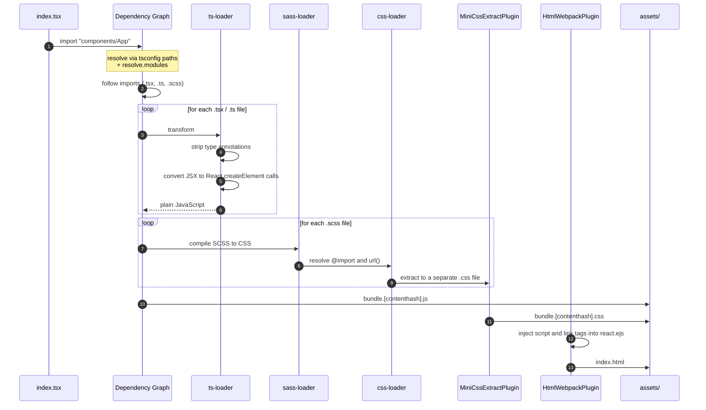
```mermaid
sequenceDiagram
    autonumber
    participant Entry as index.tsx
    participant Graph as Dependency Graph
    participant TS as ts-loader
    participant SASS as sass-loader
    participant CSS as css-loader
    participant Extract as MiniCssExtractPlugin
    participant HTML as HtmlWebpackPlugin
    participant Out as assets/

    Entry->>Graph: import "components/App"
    Note over Graph: resolve via tsconfig paths<br/>+ resolve.modules
    Graph->>Graph: follow imports (.tsx, .ts, .scss)

    loop for each .tsx / .ts file
        Graph->>TS: transform
        TS->>TS: strip type annotations
        TS->>TS: convert JSX to React.createElement calls
        TS-->>Graph: plain JavaScript
    end

    loop for each .scss file
        Graph->>SASS: compile SCSS to CSS
        SASS->>CSS: resolve @import and url()
        CSS->>Extract: extract to a separate .css file
    end

    Graph->>Out: bundle.[contenthash].js
    Extract->>Out: bundle.[contenthash].css
    HTML->>HTML: inject script and link tags into react.ejs
    HTML->>Out: index.html
```

The loader chain for styles runs **right-to-left** (`[mini-css-extract, css-loader, postcss-loader, sass-loader]`): SCSS is compiled to CSS by `sass-loader`, post-processed by `postcss-loader` (autoprefixer, etc.), import-resolved by `css-loader`, then pulled into a standalone `.css` file by `MiniCssExtractPlugin` rather than being inlined in a `<style>` tag.

**The three files webpack writes to `assets/`:**

| File | What it contains | Source |
|---|---|---|
| `bundle.[contenthash].js` | All TypeScript/React compiled to plain JS, plus the entire React runtime from `node_modules` | `frontend/**/*.tsx` + `node_modules/react*` |
| `bundle.[contenthash].css` | All SCSS compiled and concatenated into one CSS file | `frontend/**/*.scss` |
| `index.html` | The HTML shell (`<div id="app"></div>`) with `<script>` and `<link>` tags auto-injected | `frontend/templates/react.ejs` |

The `[contenthash]` in the filename is a hash of the file's contents — change the code and the filename changes, which forces browsers to fetch the new version instead of serving a stale cached copy.

> **Type checking runs in parallel.** `ForkTsCheckerWebpackPlugin` spins up a separate Node process running the TypeScript compiler in *check-only* mode. It doesn't emit JS (`ts-loader` already did that) — it just reports type errors. This keeps the build fast because type-checking and transpilation happen concurrently.

#### Stage 2 — go-bindata + go build: embed the bundles into a Go binary

Stage 1 left three files in `assets/`. Stage 2 turns those files into Go source code, then compiles everything into one binary.

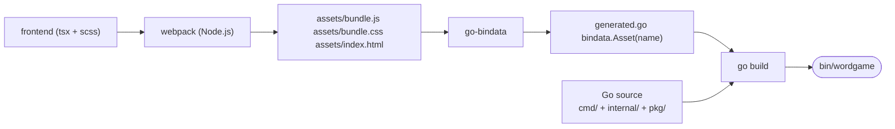
```mermaid
%%{init: {"flowchart": {"htmlLabels": true}}}%%
flowchart LR
    Fe["frontend (tsx + scss)"]
    GoSrc["Go source<br/>cmd/ + internal/ + pkg/"]
    WP["webpack (Node.js)"]
    Assets["assets/bundle.js assets/bundle.css assets/index.html"]
    GB["go-bindata"]
    Gen["generated.go bindata.Asset(name)"]
    GoBuild["go build"]
    Bin(["bin/wordgame"])

    Fe --> WP --> Assets --> GB --> Gen --> GoBuild --> Bin
    GoSrc --> GoBuild
```

`go-bindata` reads every file under `assets/` and emits `internal/bindata/generated.go` — a Go file in package `bindata` that stores each file's bytes in a `map[string][]byte` and exposes an `Asset(name string) ([]byte, error)` function. The HTTP handler in `internal/bindata/handler.go` calls `bindata.Asset("assets/index.html")`, `bindata.Asset("assets/bundle.js")`, etc. — it has no idea those bytes were originally webpack output.

Finally, `go build ./cmd/wordgame/` compiles the entry point, all of `internal/*` (handler, game, store, **including the generated `generated.go`**), and `pkg/*` into a single binary: `bin/wordgame`.

**The result:** one file. No `node_modules`, no `assets/` directory, no Node.js runtime. The React app and the Go server are the same program.

> **Development mode flips stage 2.** The goal is fast feedback: recompiling Go (which embeds the bundle bytes at compile time) on every CSS tweak would cost ~5–10s per change and kill the edit-save-refresh loop. So `make dev` runs `go-bindata -debug`, which generates a `generated.go` whose `Asset()` calls `os.ReadFile(path)` at request time instead of returning embedded bytes — the server reads straight from disk. webpack runs in `--watch` mode in the background, rewriting `assets/bundle.js` on every save. The running server picks up the new file on the next request — no recompile, no restart, ~0.5s edit-to-refresh. This switch happens entirely at code-generation time; the handler code is identical. See [§6.2 The `go-bindata` switch](#62-the-go-bindata-switch) for the side-by-side.

### The request lifecycle at runtime

Now that the binary exists, here's what happens when a user opens the page. The sequence below walks through the full request lifecycle — from the user opening the page, through static asset loading, React mounting, and one complete game (new + guess):

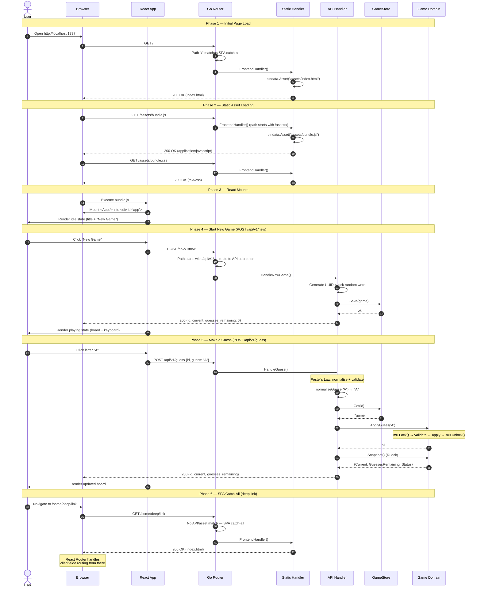
```mermaid
sequenceDiagram
    autonumber
    actor User
    participant Browser
    participant React as React App
    participant Router as Go Router
    participant Static as Static Handler
    participant API as API Handler
    participant Store as GameStore
    participant Game as Game Domain

    Note over User,Game: Phase 1 — Initial Page Load
    User->>Browser: Open http://localhost:1337
    Browser->>Router: GET /
    Router->>Router: Path "/" matches SPA catch-all
    Router->>Static: FrontendHandler()
    Static->>Static: bindata.Asset("assets/index.html")
    Static-->>Browser: 200 OK (index.html)

    Note over User,Game: Phase 2 — Static Asset Loading
    Browser->>Router: GET /assets/bundle.js
    Router->>Static: FrontendHandler() (path starts with /assets/)
    Static->>Static: bindata.Asset("assets/bundle.js")
    Static-->>Browser: 200 OK (application/javascript)
    Browser->>Router: GET /assets/bundle.css
    Router->>Static: FrontendHandler()
    Static-->>Browser: 200 OK (text/css)

    Note over User,Game: Phase 3 — React Mounts
    Browser->>React: Execute bundle.js
    React->>Browser: Mount <App /> into <div id="app">
    React->>User: Render idle state (title + "New Game")

    Note over User,Game: Phase 4 — Start New Game (POST /api/v1/new)
    User->>React: Click "New Game"
    React->>Router: POST /api/v1/new
    Router->>Router: Path starts with /api/v1/ — route to API subrouter
    Router->>API: HandleNewGame()
    API->>API: Generate UUID + pick random word
    API->>Store: Save(game)
    Store-->>API: ok
    API-->>Browser: 200 {id, current, guesses_remaining: 6}
    React->>User: Render playing state (board + keyboard)

    Note over User,Game: Phase 5 — Make a Guess (POST /api/v1/guess)
    User->>React: Click letter "A"
    React->>Router: POST /api/v1/guess {id, guess: "A"}
    Router->>API: HandleGuess()
    Note over API: Postel's Law: normalise + validate
    API->>API: normaliseGuess("A") → "A"
    API->>Store: Get(id)
    Store-->>API: *game
    API->>Game: ApplyGuess('A')
    Note over Game: mu.Lock() → validate → apply → mu.Unlock()
    Game-->>API: nil
    API->>Game: Snapshot() (RLock)
    Game-->>API: {Current, GuessesRemaining, Status}
    API-->>Browser: 200 {id, current, guesses_remaining}
    React->>User: Render updated board

    Note over User,Game: Phase 6 — SPA Catch-All (deep link)
    User->>Browser: Navigate to /some/deep/link
    Browser->>Router: GET /some/deep/link
    Router->>Router: No API/asset match — SPA catch-all
    Router->>Static: FrontendHandler()
    Static-->>Browser: 200 OK (index.html)
    Note over Browser: React Router handles<br/>client-side routing from there
```

**One server, one port, one binary.** Open `http://localhost:1337` in a browser → React app loads → same origin makes API calls to `/api/v1/*` on the same port. No CORS. No separate API server. No proxy. Each phase of the diagram maps to detailed sections below:

- **Phase 1–3** (page load, assets, React mount) → [§5.3 How the Go binary serves the frontend](#53-how-the-go-binary-serves-the-frontend)
- **Phase 4** (start game) → [§4.10 New game flow](#new-game-flow) and the [§5.10 useGame hook](#510-key-files)
- **Phase 5** (guess) → [§4.5 Request flow through packages](#45-request-flow-through-packages) and the [§5.10 useGame hook](#510-key-files)
- **Phase 6** (SPA catch-all) → [§6.4 The SPA catch-all](#64-the-spa-catch-all)
- The internal split between API serving and static asset serving is covered in [§6.2 The `go-bindata` switch](#62-the-go-bindata-switch).

### Why no CORS?

**CORS** (Cross-Origin Resource Sharing) is a browser security feature. JavaScript on a page loaded from one **origin** (protocol + host + port) cannot make HTTP requests to a *different* origin unless the server opts in via `Access-Control-Allow-Origin` headers. Non-simple requests (like a `POST` with a JSON body) also trigger a preflight `OPTIONS` request first.

#### When CORS kicks in — different origins

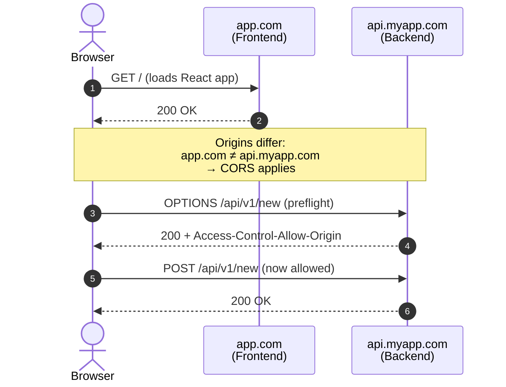
```mermaid
sequenceDiagram
    autonumber
    actor Browser
    participant Site as app.com<br/>(Frontend)
    participant API as api.myapp.com<br/>(Backend)

    Browser->>Site: GET / (loads React app)
    Site-->>Browser: 200 OK
    Note over Browser,API: Origins differ:<br/>app.com ≠ api.myapp.com<br/>→ CORS applies
    Browser->>API: OPTIONS /api/v1/new (preflight)
    API-->>Browser: 200 + Access-Control-Allow-Origin
    Browser->>API: POST /api/v1/new (now allowed)
    API-->>Browser: 200 OK
```

#### Our case — same origin

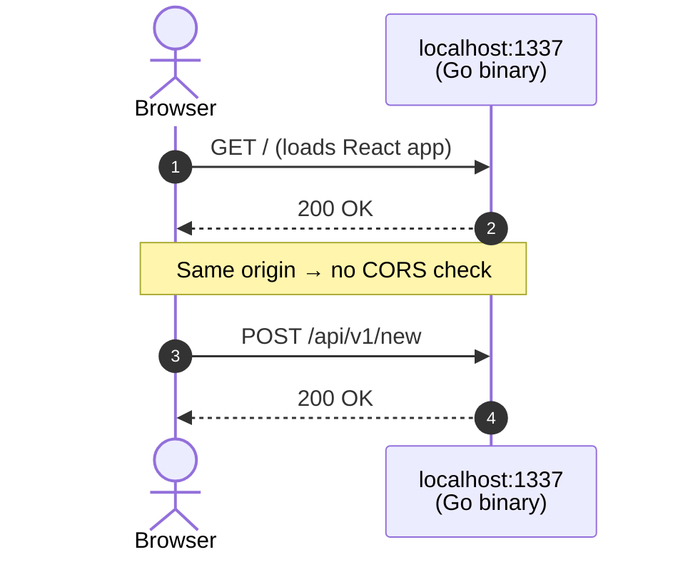
```mermaid
sequenceDiagram
    autonumber
    actor Browser
    participant Server as localhost:1337<br/>(Go binary)

    Browser->>Server: GET / (loads React app)
    Server-->>Browser: 200 OK
    Note over Browser,Server: Same origin → no CORS check
    Browser->>Server: POST /api/v1/new
    Server-->>Browser: 200 OK
```

#### What CORS would cost us (and why we don't pay it)

If the frontend and the API were on different origins, we would need:

- **CORS middleware** in the API server to set `Access-Control-Allow-Origin` headers on every response
- **Preflight `OPTIONS` handling** for every non-simple request (every `POST` with a JSON body, every custom header)
- **Per-environment config** — allowed origins for dev, staging, prod (each environment usually has different URLs)
- **Credential handling** — if cookies/auth headers are involved, `Access-Control-Allow-Credentials: true` plus `SameSite` cookies
- **Pre-flight testing** in every browser you support — CORS behaviour has historically been inconsistent across Safari, Firefox, older Edge

With one binary on one port, the React app and the API are on the same origin. The browser doesn't apply CORS checks at all. No preflight, no special headers, no per-environment config. It just works.

### The three logical pieces

| Layer | What it does | Implementation |
|---|---|---|
| **API layer** | HTTP routes, JSON encode/decode, validation | `internal/handler/` |
| **Domain layer** | Game rules: what a "correct guess" means, when to win/lose | `internal/game/` |
| **Storage layer** | Thread-safe in-memory game CRUD | `internal/store/` |
| **Static assets** | React bundle, served by the same Go process | `internal/bindata/` ([go-bindata](#62-the-go-bindata-switch)) |

Each layer has a single responsibility and can be replaced independently. To swap the in-memory store for Redis, change only `internal/store/`. To swap the HTTP framework, change only `internal/handler/`.

---

## 3. The Game: Rules & API

### 3.1 How to play

1. Click **"New Game"** → the server picks a random word (e.g. `APPLE`) and returns the masked board (`_____`) and `guesses_remaining: 6`.
2. Click a letter on the keyboard. If it's in the word, all its positions are revealed. If not, `guesses_remaining` decrements.
3. Game ends when all letters are revealed (win) or `guesses_remaining` reaches 0 (lose). The secret word is returned in the final response, then the game is deleted from memory.

### 3.2 Functional requirements

| ID | Rule |
|---|---|
| FR-1 | Start a new game: random word, UUID v4, `current` = underscores, `guesses_remaining` = 6 |
| FR-2 | Guess = single letter, accepted via POST |
| FR-3 | Correct guess: reveal all positions, **don't** decrement guesses |
| FR-4 | Wrong guess: decrement `guesses_remaining` by 1, **don't** change board |
| FR-5 | Win = no underscores in `current` |
| FR-6 | Loss = `guesses_remaining == 0` |
| FR-7 | Completed games are immediately deleted; the final response includes the `word` field |
| FR-8 | Server listens on `:1337` (or `$PORT`) |

### 3.3 API contract

#### `POST /new`: Start a new game

```http
POST /new
Content-Type: application/json   (optional)
```

**Response (200 OK):**

```json
{
  "id": "f8302916-69f1-462b-b640-e503faa94397",
  "current": "________",
  "guesses_remaining": 6
}
```

#### `POST /guess`: Guess a letter

```http
POST /guess
Content-Type: application/json

{ "id": "f8302916-69f1-462b-b640-e503faa94397", "guess": "A" }
```

**Response (200 OK) — during play:**

```json
{ "id": "...", "current": "______A_", "guesses_remaining": 6 }
```

**Response (200 OK) — on win or loss (game ends, returns the word):**

```json
{ "id": "...", "current": "APPLE", "guesses_remaining": 6, "word": "APPLE" }
```

#### Error responses

All errors share this shape:

```json
{ "error": "human-readable description" }
```

| Scenario | HTTP | Message |
|---|---|---|
| Game ID not found | 404 | `game not found` |
| Guessing on a completed game | 404 | `game not found` (deleted on completion) |
| Race: another request just completed the game | 409 | `game already completed` |
| Empty `guess` | 422 | `missing guess` |
| `guess` longer than 1 character | 422 | `guess must be a single character` |
| `guess` not `[A-Z]` (e.g. `"5"`, `"é"`) | 422 | `guess must be a single A-Z character` |
| Missing `id` | 400 | `missing game id` |
| Invalid JSON | 400 | `invalid request body` |

### 3.4 Postel's Law: Be Liberal in What You Accept

The handler **normalises input before validation**, so `"a"`, `" A "`, and `" A "` all work. Only truly malformed input (`"5"`, `""`, `"abc"`) returns an error. Implementation:

```go
// internal/handler/request.go
func normaliseGuess(guess string) string {
    return strings.ToUpper(strings.TrimSpace(guess))
}
```

The game logic receives only clean, validated data: it never sees raw user input. This separation is documented in detail in [§4.6 Postel's Law in Code](#46-postels-law-in-code).

---

## 4. Backend (Go)

### 4.1 Project layout

```
wordgame-main/
├── cmd/
│   └── wordgame/
│       ├── main.go              ← Entry point , wires deps, starts server (gorilla/mux)
│       └── smoke_test.go        ← End-to-end HTTP smoke tests (httptest.Server)
├── internal/                    ← Private application code (not importable externally)
│   ├── handler/                 ← HTTP layer
│   │   ├── handler.go           ← Orchestration: route → normalise → validate → apply
│   │   ├── request.go           ← JSON decode, normaliseGuess (Postel's Law)
│   │   ├── response.go          ← writeJSON, writeError helpers
│   │   ├── types.go             ← DTOs: NewGameResponse, GuessRequest, etc.
│   │   └── handler_test.go
│   ├── game/                    ← Pure domain logic (zero I/O)
│   │   ├── game.go              ← Game struct + ApplyGuess() business rules
│   │   └── game_test.go
│   └── store/                   ← In-memory CRUD
│       ├── store.go             ← GameStore (sync.RWMutex + map)
│       └── store_test.go
├── pkg/                         ← Public library code (importable by others)
│   ├── words/                   ← Word loader
│   │   ├── loader.go            ← LoadWords(r io.Reader) , decoupled from filesystem
│   │   └── loader_test.go
│   └── identifier/              ← UUID v4 generator
│       ├── id.go                ← GenerateIdentifier()
│       └── id.go_test
├── internal/bindata/            ← Auto-generated static asset serving
│   ├── generated.go             ← go-bindata output (gitignored, regenerated)
│   └── handler.go               ← FrontendHandler , single source of truth
├── docs/
│   └── assets/
│       ├── demo.gif             ← Terminal/CLI demo recording (VHS)
│       └── demo-frontend.gif    ← Browser/UI demo recording (Playwright)
├── Makefile
├── .golangci.yml
├── words.txt
├── go.mod
├── docs.md
├── code-structure.md
└── README.md
```

**Why this structure?**

- **`cmd/`**: one subdirectory per executable. Keeps `main.go` small (just wiring). See [§4.1](#41-project-layout) for the full layout.
- **`internal/`**: the Go compiler blocks external modules from importing these. Perfect for private business logic.
- **`pkg/`**: libraries safe for others to import. The word loader and ID generator have no game-specific logic, so they belong here.

### 4.2 Domain model

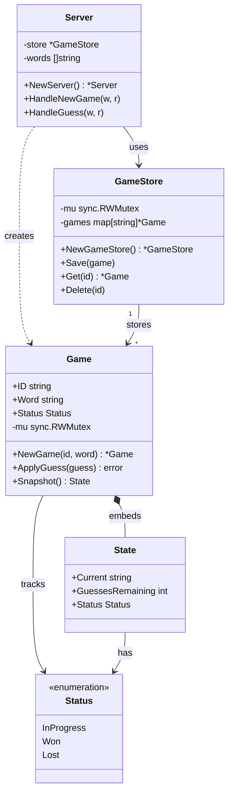
```mermaid
classDiagram
    class Server {
        -store *GameStore
        -words []string
        +NewServer() *Server
        +HandleNewGame(w, r)
        +HandleGuess(w, r)
    }

    class GameStore {
        -mu sync.RWMutex
        -games map[string]*Game
        +NewGameStore() *GameStore
        +Save(game)
        +Get(id) *Game
        +Delete(id)
    }

    class Game {
        +ID string
        +Word string
        +Status Status
        -mu sync.RWMutex
        +NewGame(id, word) *Game
        +ApplyGuess(guess) error
        +Snapshot() State
    }

    class State {
        +Current string
        +GuessesRemaining int
        +Status Status
    }

    class Status {
        <<enumeration>>
        InProgress
        Won
        Lost
    }

    Server --> GameStore : uses
    Server ..> Game : creates
    GameStore "1" --> "*" Game : stores
    Game *-- State : embeds
    Game --> Status : tracks
    State --> Status : has
```

**Field visibility** (Mermaid convention):

- `+` exported (public): `Game.ID`, `NewGameStore()`
- `-` unexported (private): `Game.mu`, `GameStore.games`

**Why `Game` is the aggregate root:** every operation revolves around a `Game` instance. `Game` enforces its own invariants (no guesses after win/loss, valid letters only). Nothing outside can break its state.

### 4.3 Package separation: three `internal/` packages

| Package | What it does | What it does NOT do | Reason to change |
|---|---|---|---|
| `internal/handler` | HTTP concerns: decode, normalise, validate, encode, orchestrate | Know how letters are matched, know how guesses are counted, know how state is stored | New endpoint, different HTTP framework |
| `internal/game` | Pure domain logic: guess processing, win/loss detection, mutex | Read from network, write JSON, know about HTTP | New game rules, different state |
| `internal/store` | Data access: in-memory map with `sync.RWMutex`, thread-safe CRUD | Know HTTP, know game rules, know word loading | New storage (Redis, Postgres, file) |

**The win:** you can swap any one of these layers without touching the others. Switch `internal/store` to a Redis client? Only that file changes. Replace `internal/handler` with gRPC? Only that file changes.

### 4.4 Why there are no interfaces (yet)

Every package currently has exactly one concrete implementation:

| Package | Implementation | Interface would be |
|---|---|---|
| `internal/store` | In-memory `GameStore` | `GameRepository` |
| `pkg/words` | `LoadWords(io.Reader)` | `WordLoader` |
| `pkg/identifier` | `GenerateIdentifier()` | `IDGenerator` |

**YAGNI**: there's no second implementation to abstract over. Extracting an interface now adds indirection without benefit.

**When would we add interfaces?**

- **PostgreSQL store** → create `GameRepository` interface, implement `PostgresGameStore`
- **Multiple word sources** → create `WordLoader` interface, implement `FileLoader` and `APILoader`
- **Integration tests** → inject a real store but a fake word list

The Go convention is: **define interfaces where they are consumed, not where they are implemented.** So `Server` would own the interface definition:

```go
// hypothetical , NOT implemented
type GameRepository interface {
    Get(id string) *game.Game
    Save(g *game.Game)
    Delete(id string)
}
```

### 4.5 Request flow through packages

The full business logic for a `POST /guess` request, from HTTP arrival to JSON response:

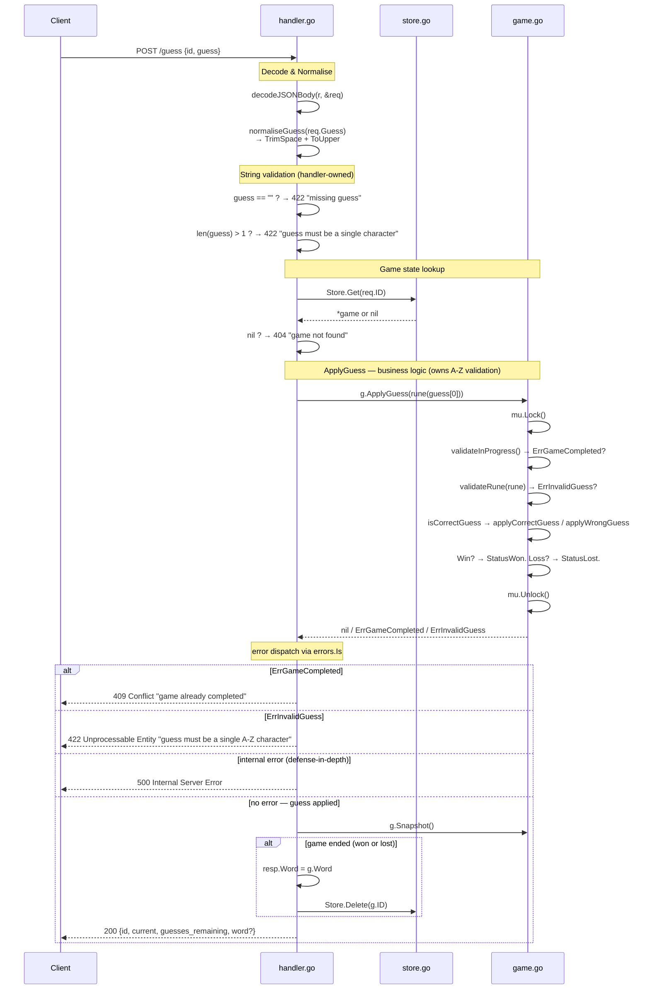
```mermaid
sequenceDiagram
    participant Client
    participant Handler as handler.go
    participant Store as store.go
    participant Game as game.go

    Client->>Handler: POST /guess {id, guess}

    Note over Handler: Decode & Normalise
    Handler->>Handler: decodeJSONBody(r, &req)
    Handler->>Handler: normaliseGuess(req.Guess)<br/>→ TrimSpace + ToUpper

    Note over Handler: String validation (handler-owned)
    Handler->>Handler: guess == "" ? → 422 "missing guess"
    Handler->>Handler: len(guess) > 1 ? → 422 "guess must be a single character"

    Note over Handler,Game: Game state lookup
    Handler->>Store: Store.Get(req.ID)
    Store-->>Handler: *game or nil
    Handler->>Handler: nil ? → 404 "game not found"

    Note over Handler,Game: ApplyGuess — business logic (owns A-Z validation)
    Handler->>Game: g.ApplyGuess(rune(guess[0]))
    Game->>Game: mu.Lock()
    Game->>Game: validateInProgress() → ErrGameCompleted?
    Game->>Game: validateRune(rune) → ErrInvalidGuess?
    Game->>Game: isCorrectGuess → applyCorrectGuess / applyWrongGuess
    Game->>Game: Win? → StatusWon. Loss? → StatusLost.
    Game->>Game: mu.Unlock()
    Game-->>Handler: nil / ErrGameCompleted / ErrInvalidGuess

    Note over Handler: error dispatch via errors.Is
    alt ErrGameCompleted
        Handler-->>Client: 409 Conflict "game already completed"
    else ErrInvalidGuess
        Handler-->>Client: 422 Unprocessable Entity "guess must be a single A-Z character"
    else internal error (defense-in-depth)
        Handler-->>Client: 500 Internal Server Error
    else no error — guess applied
        Handler->>Game: g.Snapshot()
        alt game ended (won or lost)
            Handler->>Handler: resp.Word = g.Word
            Handler->>Store: Store.Delete(g.ID)
        end
        Handler-->>Client: 200 {id, current, guesses_remaining, word?}
    end
```

**Key insight:** the handler never reads `Game.Current` or `Game.GuessesRemaining` directly; it always goes through `Snapshot()` to avoid data races. Similarly, it never touches the store's internal map directly — it uses `Get`/`Save`/`Delete` which handle locking internally.

### 4.6 Postel's Law in code

> *"Be conservative in what you send, be liberal in what you accept."*
> — Jon Postel, RFC 761 (TCP specification)

The handler normalises input **before** validation. The game logic never sees raw user input: it only receives clean, validated data.

```go
// internal/handler/request.go , normalisation & validation extracted to SRP functions

// normaliseGuess applies Postel's Law to the guess string:
// trims surrounding whitespace and converts to uppercase.
func normaliseGuess(guess string) string {
    return strings.ToUpper(strings.TrimSpace(guess))
}

// internal/handler/handler.go , handler orchestrates the flow

func (s *Server) HandleGuess(w http.ResponseWriter, r *http.Request) {
    // ... decode JSON ...

    // Postel's Law: normalise before you validate
    guess := normaliseGuess(req.Guess)

    // String-level checks (empty, too long) stay in the handler
    if guess == "" {
        writeError(w, http.StatusUnprocessableEntity, "missing guess")
        return
    }
    if len(guess) > 1 {
        writeError(w, http.StatusUnprocessableEntity, "guess must be a single character")
        return
    }

    // Character-level validation (A-Z) is delegated to the game's
    // validateRune inside ApplyGuess, caught via errors.Is below
    if err := g.ApplyGuess(rune(guess[0])); err != nil {
        if errors.Is(err, game.ErrGameCompleted) {
            writeError(w, http.StatusConflict, err.Error())
        } else if errors.Is(err, game.ErrInvalidGuess) {
            writeError(w, http.StatusUnprocessableEntity, err.Error())
        } else {
            writeError(w, http.StatusInternalServerError, "internal error")
        }
        return
    }
    // ... snapshot + response
}
```

**Why split validation between handler and game?** Each layer owns the checks it's responsible for:

- `normaliseGuess` changes if normalisation rules change
- The handler validates **string structure**: empty, too long
- The game validates **character content**: A-Z via `validateRune` inside `ApplyGuess`

| Input | Raw | After `normaliseGuess` | Result |
|---|---|---|---|
| Lowercase | `"a"` | `"A"` | Valid guess |
| Whitespace | `" A "` | `"A"` | Valid guess |
| Mixed | `" b "` | `"B"` | Valid guess |
| Non-alpha | `"5"` | `"5"` → fails `[A-Z]` | 422 error |
| Empty | `""` | `""` → fails length | 422 error |

### 4.7 Game method responsibility table

`ApplyGuess` is an orchestrator: it delegates to five single-responsibility methods. Each has exactly one reason to change:

| Method | Responsibility |
|---|---|
| `validateInProgress` | Precondition: game not already won/lost |
| `validateRune` | Defensive: guess is `[A-Z]` |
| `isCorrectGuess` | Match: does the letter appear in the word? |
| `applyCorrectGuess` | Mutate: reveal letter + detect win |
| `applyWrongGuess` | Mutate: decrement guess + detect loss |

Sentinel errors (`ErrGameCompleted`, `ErrInvalidGuess`) allow callers to use `errors.Is` for precise matching.

### 4.8 Build order

Build bottom-up, each step depends only on packages already built:

| Step | Package | What to build |
|---|---|---|
| 1 | `pkg/identifier/` | `GenerateIdentifier() (string, error)`: UUID v4 via `fmt.Errorf` + `%w` |
| 2 | `pkg/words/` | `LoadWords(r io.Reader) ([]string, error)`: decoupled from filesystem |
| 3 | `internal/game/` | `Game` struct, `NewGame()`, `ApplyGuess(rune)`: pure business logic |
| 4 | `internal/store/` | `GameStore` with `sync.RWMutex`: `Get`, `Save`, `Delete` |
| 5 | `internal/handler/` | `Server` struct (DI), handlers, Postel's Law, JSON helpers, DTOs |
| 6 | `cmd/wordgame/` | Open `words.txt`, wire everything, register routes, `ListenAndServe` |

### 4.9 Concurrency model

Two-level locking: `GameStore.RWMutex` protects the game map, `Game.RWMutex` protects a single game's state.

#### Same game, concurrent guesses

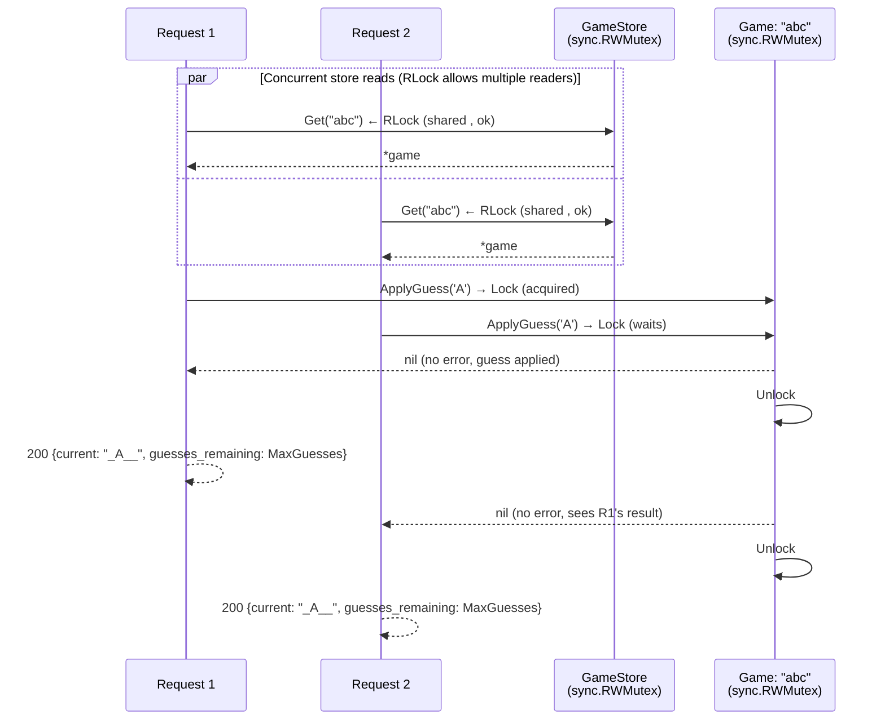
```mermaid
sequenceDiagram
    participant R1 as Request 1
    participant R2 as Request 2
    participant Store as GameStore<br/>(sync.RWMutex)
    participant Game as Game: "abc"<br/>(sync.RWMutex)

    par Concurrent store reads (RLock allows multiple readers)
        R1->>Store: Get("abc") ← RLock (shared , ok)
        Store-->>R1: *game
    and
        R2->>Store: Get("abc") ← RLock (shared , ok)
        Store-->>R2: *game
    end

    R1->>Game: ApplyGuess('A') → Lock (acquired)
    R2->>Game: ApplyGuess('A') → Lock (waits)
    Game-->>R1: nil (no error, guess applied)
    Game->>Game: Unlock
    R1-->>R1: 200 {current: "_A__", guesses_remaining: MaxGuesses}

    Game-->>R2: nil (no error, sees R1's result)
    Game->>Game: Unlock
    R2-->>R2: 200 {current: "_A__", guesses_remaining: MaxGuesses}
```

#### Different games, no contention

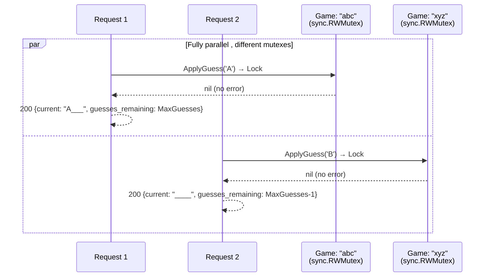
```mermaid
sequenceDiagram
    participant R1 as Request 1
    participant R2 as Request 2
    participant GameA as Game: "abc"<br/>(sync.RWMutex)
    participant GameB as Game: "xyz"<br/>(sync.RWMutex)

    par Fully parallel , different mutexes
        R1->>GameA: ApplyGuess('A') → Lock
        GameA-->>R1: nil (no error)
        R1-->>R1: 200 {current: "A___", guesses_remaining: MaxGuesses}
    and
        R2->>GameB: ApplyGuess('B') → Lock
        GameB-->>R2: nil (no error)
        R2-->>R2: 200 {current: "____", guesses_remaining: MaxGuesses-1}
    end
```

#### Lock summary

| Lock | Protects | Acquired by |
|---|---|---|
| `GameStore.RWMutex` (RLock) | The `games` map during lookups | `Store.Get` |
| `GameStore.RWMutex` (Lock) | The `games` map during mutations | `Store.Save`, `Store.Delete` |
| `Game.RWMutex` (Lock) | A single game's state | `Game.ApplyGuess` |
| `Game.RWMutex` (RLock) | A single game's state (read-only) | `Game.Snapshot` |

This means:

- Looking up games is concurrent: `RLock` allows many readers
- Creating or deleting briefly blocks new lookups: `Lock` is exclusive
- Guessing on the **same** game serialises: `Game.RWMutex`
- Guessing on **different** games runs fully in parallel: each game has its own mutex

### 4.10 Sequence diagrams: the key flows

#### New game flow

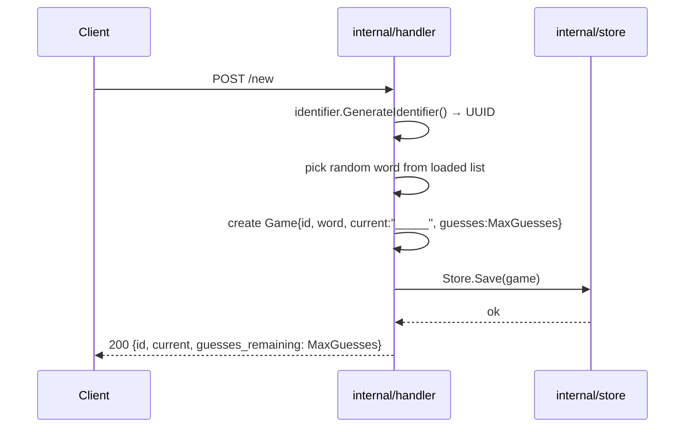
```mermaid
sequenceDiagram
    participant Client
    participant Handler as internal/handler
    participant Store as internal/store

    Client->>Handler: POST /new
    Handler->>Handler: identifier.GenerateIdentifier() → UUID
    Handler->>Handler: pick random word from loaded list
    Handler->>Handler: create Game{id, word, current:"_____", guesses:MaxGuesses}
    Handler->>Store: Store.Save(game)
    Store-->>Handler: ok
    Handler-->>Client: 200 {id, current, guesses_remaining: MaxGuesses}
```

#### Guess flow: with Postel's Law normalisation

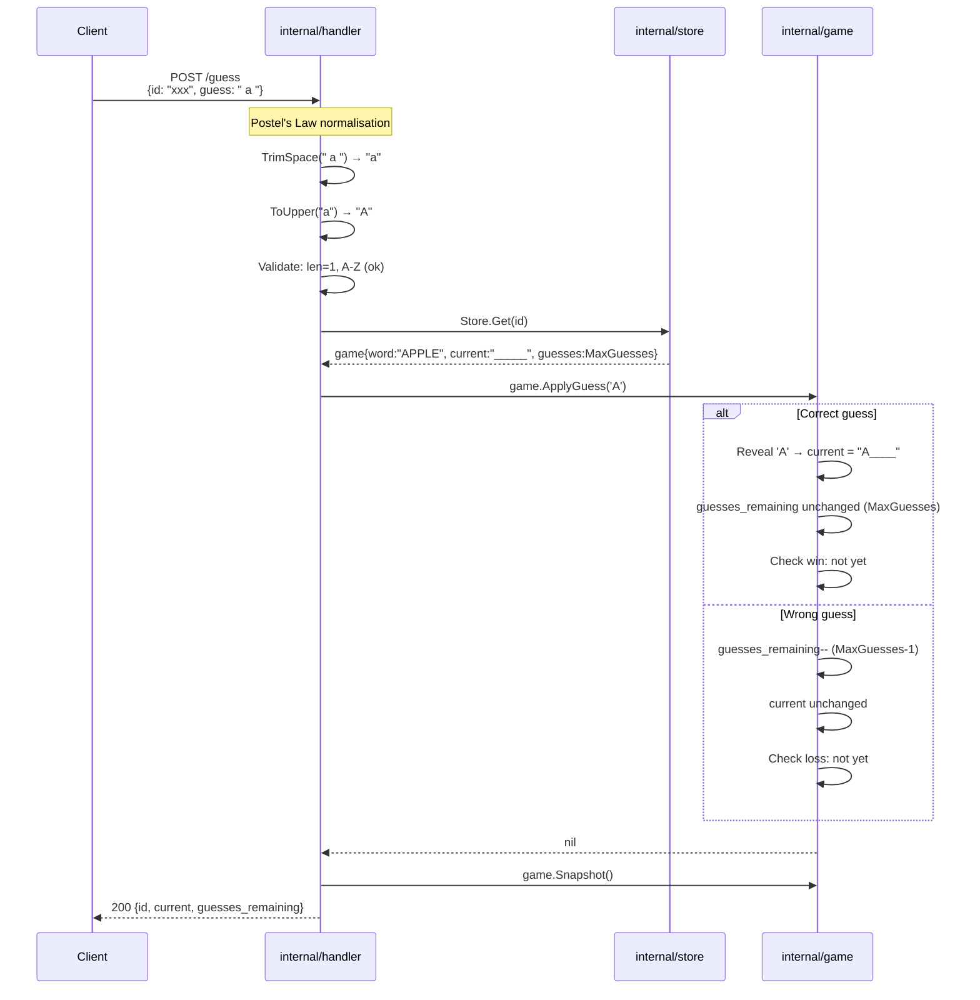
```mermaid
sequenceDiagram
    participant Client
    participant Handler as internal/handler
    participant Store as internal/store
    participant Game as internal/game

    Client->>Handler: POST /guess<br/>{id: "xxx", guess: " a "}

    Note over Handler: Postel's Law normalisation
    Handler->>Handler: TrimSpace(" a ") → "a"
    Handler->>Handler: ToUpper("a") → "A"
    Handler->>Handler: Validate: len=1, A-Z (ok)

    Handler->>Store: Store.Get(id)
    Store-->>Handler: game{word:"APPLE", current:"_____", guesses:MaxGuesses}
    Handler->>Game: game.ApplyGuess('A')

    alt Correct guess
        Game->>Game: Reveal 'A' → current = "A____"
        Game->>Game: guesses_remaining unchanged (MaxGuesses)
        Game->>Game: Check win: not yet
    else Wrong guess
        Game->>Game: guesses_remaining-- (MaxGuesses-1)
        Game->>Game: current unchanged
        Game->>Game: Check loss: not yet
    end

    Game-->>Handler: nil
    Handler->>Game: game.Snapshot()
    Handler-->>Client: 200 {id, current, guesses_remaining}
```

#### Win detection & cleanup

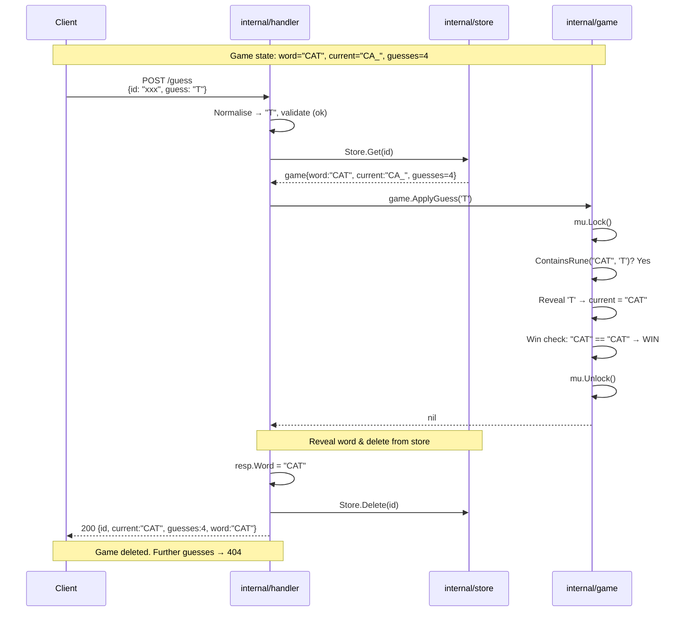
```mermaid
sequenceDiagram
    participant Client
    participant Handler as internal/handler
    participant Store as internal/store
    participant Game as internal/game

    Note over Client,Game: Game state: word="CAT", current="CA_", guesses=4

    Client->>Handler: POST /guess<br/>{id: "xxx", guess: "T"}
    Handler->>Handler: Normalise → "T", validate (ok)
    Handler->>Store: Store.Get(id)
    Store-->>Handler: game{word:"CAT", current:"CA_", guesses=4}

    Handler->>Game: game.ApplyGuess('T')
    Game->>Game: mu.Lock()
    Game->>Game: ContainsRune("CAT", 'T')? Yes
    Game->>Game: Reveal 'T' → current = "CAT"
    Game->>Game: Win check: "CAT" == "CAT" → WIN
    Game->>Game: mu.Unlock()
    Game-->>Handler: nil

    Note over Handler,Store: Reveal word & delete from store
    Handler->>Handler: resp.Word = "CAT"
    Handler->>Store: Store.Delete(id)

    Handler-->>Client: 200 {id, current:"CAT", guesses:4, word:"CAT"}

    Note over Client,Handler: Game deleted. Further guesses → 404
```

#### Concurrent access: race condition when game completes

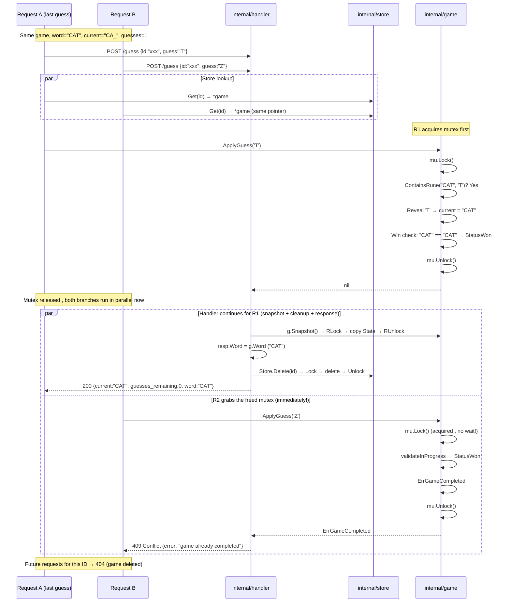
```mermaid
sequenceDiagram
    participant R1 as Request A (last guess)
    participant R2 as Request B
    participant Handler as internal/handler
    participant Store as internal/store
    participant Game as internal/game

    Note over R1,R2: Same game, word="CAT", current="CA_", guesses=1

    R1->>Handler: POST /guess {id:"xxx", guess:"T"}
    R2->>Handler: POST /guess {id:"xxx", guess:"Z"}

    par Store lookup
        R1->>Store: Get(id) → *game
        R2->>Store: Get(id) → *game (same pointer)
    end

    Note over Game: R1 acquires mutex first
    R1->>Game: ApplyGuess('T')
    Game->>Game: mu.Lock()
    Game->>Game: ContainsRune("CAT", 'T')? Yes
    Game->>Game: Reveal 'T' → current = "CAT"
    Game->>Game: Win check: "CAT" == "CAT" → StatusWon
    Game->>Game: mu.Unlock()
    Game-->>Handler: nil

    Note over R1,R2: Mutex released , both branches run in parallel now

    par Handler continues for R1 (snapshot + cleanup + response)
        Handler->>Game: g.Snapshot() → RLock → copy State → RUnlock
        Handler->>Handler: resp.Word = g.Word ("CAT")
        Handler->>Store: Store.Delete(id) → Lock → delete → Unlock
        Handler-->>R1: 200 {current:"CAT", guesses_remaining:0, word:"CAT"}
    and R2 grabs the freed mutex (immediately!)
        R2->>Game: ApplyGuess('Z')
        Game->>Game: mu.Lock() (acquired , no wait!)
        Game->>Game: validateInProgress → StatusWon!
        Game->>Game: ErrGameCompleted
        Game->>Game: mu.Unlock()
        Game-->>Handler: ErrGameCompleted
        Handler-->>R2: 409 Conflict {error: "game already completed"}
    end

    Note over R1,R2: Future requests for this ID → 404 (game deleted)
```

**How the design handles this correctly:**

- `Game.Mutex` serialises `ApplyGuess`: no data race on the game struct
- `Store.RWMutex` allows concurrent reads: both requests retrieve the game pointer before deletion
- Request A completes the game, sets `StatusWon`, deletes from store
- Request B still holds the `*game` pointer, but `validateInProgress()` catches the changed status
- `ApplyGuess` returns `ErrGameCompleted` → handler uses `errors.Is` → **409 Conflict**
- Any subsequent request on that ID reaches a nil `store.Get` → **404 Not Found**

### 4.11 Data model

```go
// internal/game/game.go
type Game struct {
    ID   string    // UUID v4
    Word string    // The chosen word (uppercase, e.g. "APPLE")
    State          // Embedded , Current, GuessesRemaining, Status promoted

    mu sync.RWMutex  // Protects all fields from concurrent access
}

type State struct {
    Current          string
    GuessesRemaining int
    Status           Status
}

// Snapshot copies the embedded State under a read lock.
func (g *Game) Snapshot() State {
    g.mu.RLock()
    defer g.mu.RUnlock()
    return g.State
}

type Status int

const (
    StatusInProgress Status = iota
    StatusWon
    StatusLost
)
```

```go
// internal/store/store.go
type GameStore struct {
    mu    sync.RWMutex
    games map[string]*Game  // keyed by UUID
}

func NewGameStore() *GameStore {
    return &GameStore{
        games: make(map[string]*Game),
    }
}

func (s *GameStore) Save(game *Game)
func (s *GameStore) Get(id string) *Game
func (s *GameStore) Delete(id string)
```

#### State diagram

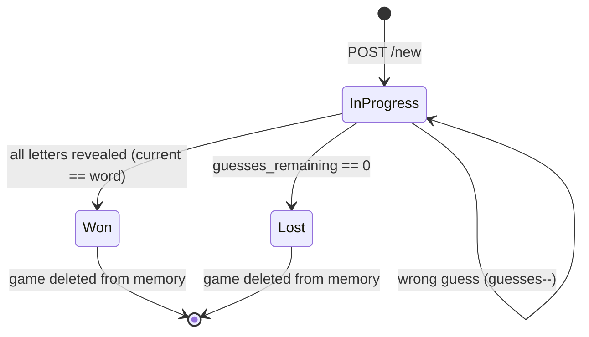
```mermaid
stateDiagram-v2
    [*] --> InProgress: POST /new

    InProgress --> Won: all letters revealed (current == word)
    InProgress --> Lost: guesses_remaining == 0
    InProgress --> InProgress: correct guess
    InProgress --> InProgress: wrong guess (guesses--)

    Won --> [*]: game deleted from memory
    Lost --> [*]: game deleted from memory
```

### 4.12 Entry point wiring

`cmd/wordgame/main.go` uses [Cobra](https://github.com/spf13/cobra) for CLI parsing:

1. `main()` calls `NewRootCommand().Execute()` , exits 1 on error
2. `NewRootCommand()` defines the `--port` / `-p` flag (default: `$PORT` env var, fallback `"1337"`), auto-generates `--help` text, and wires `RunE` to `runServer`
3. `runServer(stderr, port)` opens `words.txt`, loads words, creates `store.NewGameStore()`, creates `handler.NewServer(store, words)`, calls `registerRoutes(r, srv)`, and starts `http.ListenAndServe`
4. `registerRoutes(r, srv)` is the single source of truth for HTTP routing , shared by `runServer()` and smoke tests

### 4.13 Modern Go patterns

A few patterns used throughout the codebase:

```go
// 9.13.1 Use const for magic numbers
const (
    MaxGuesses = 6
)

// 9.13.2 Error wrapping , fmt.Errorf + %w
return fmt.Errorf("load words: %w", err)
return fmt.Errorf("generate game ID: %w", err)
// %w wraps the original error so callers can use errors.Is and errors.As.

// 9.13.3 Use math/rand/v2 (Go 1.21+)
import "math/rand/v2"
// No more rand.Seed() needed , auto-seeded in Go 1.20+
// word := words[rand.IntN(len(words))]
```

---

## 5. Frontend (React)

The frontend is a **React 18 SPA** that talks to the same Go binary's API. It loads as static assets (HTML/JS/CSS) served by `bindata.FrontendHandler()` and makes API calls to `/api/v1/*` on the same origin.

### 5.1 What we're building

- Shows the hidden word as underscore tiles (`_ _ P P _`)
- Shows a clickable keyboard (A through Z)
- Tracks remaining guesses
- Handles win, loss, error, and idle states
- Talks to our **SAME** Go binary: no new server, no new process

### 5.2 The tech stack: one sentence each

Each library below solves a specific problem. The "Go analogy" column maps each to something you already know from backend work.

#### TypeScript

**What it does:** Adds a static type system to JavaScript: you declare the shapes and kinds of values (numbers, strings, objects, etc.), and the compiler catches mismatches before your code ever runs in the browser.

**Go analogy:** Go's compiler checking that you didn't pass a `string` where `int` is expected, but retrofitted onto JavaScript. The types are "erasable": they vanish during compilation.

#### React

**What it does:** A component-based UI library. You write small functions that each describe a piece of UI, then compose them into a tree. When data changes, React automatically re-runs the affected functions and surgically updates the real browser DOM.

**Go analogy:** Like `html/template` but interactive: React keeps a virtual copy of the DOM in memory, diffs it against the new output, and applies only the minimal changes.

#### React Router

**What it does:** Maps URL paths to React components. When the user clicks a link, React Router intercepts the click (no HTTP request to the server), updates the URL bar via `history.pushState()`, and renders the corresponding component. The SPA never reloads.

**Go analogy:** `gorilla/mux` running *inside the browser*. Routes handle URL changes in the browser's address bar instead of HTTP requests.

#### TanStack Query

**What it does:** A **state manager for server data** — not an HTTP client. It caches API responses in browser memory, deduplicates simultaneous requests, tracks `isLoading`/`isError`/`data` for the UI, and handles background refresh. Critically, it does **not** know how to talk to a server: you hand it a *fetcher function* (that's where Axios comes in) and TanStack Query wraps a cache + lifecycle around it.

**Go analogy:** A Redis cache for HTTP responses living in the browser's memory, with automatic cache invalidation and background refresh built in — except you plug in your own "database client" (the fetcher function).

#### Axios

**What it does:** An HTTP client. Its only job is to open a connection, send the request, parse the JSON response, and close. It has **no memory**: call it ten times for the same URL and it makes ten identical network trips. Every API call in our frontend goes through a single Axios wrapper (`sendRequest`), which TanStack Query uses as its fetcher.

**Go analogy:** Go's `net/http` client: `http.Get()`, `http.Post()`, `client.Do(req)`. Axios is the browser's `fetch()` but with better defaults.

#### SCSS (Sass)

**What it does:** A superset of CSS that adds variables, nesting, mixins, and functions. Compiles down to plain CSS. Lets you organise styles into partial files (`_styles.scss`).

**Go analogy:** Like Go templates (variables, includes, functions) but for CSS instead of HTML.

#### Webpack

**What it does:** A module bundler. It starts at an entry file, follows every `import` statement, processes each file through loaders (TypeScript → JavaScript, SCSS → CSS), and bundles everything into a small number of output files.

**Go analogy:** `go build`: it reads imports, resolves the dependency graph, applies the compiler, and outputs a single binary. Webpack outputs `bundle.js` and `bundle.css`.

#### Jest

**What it does:** A test runner and assertion library. Finds files matching `*.tests.tsx` or `*.spec.ts` patterns, executes them in a Node.js environment, and reports pass/fail. Includes built-in mocking, code coverage, snapshot testing, and watch mode.

**Go analogy:** `go test`: discovers `*_test.go` files, runs them, and reports results. `go test -cover` for coverage.

#### React Testing Library

**What it does:** Renders React components in a simulated browser environment (jsdom) so you can test them without a real browser. Provides queries to find elements by their accessible role, label text, or data-testid.

**Go analogy:** `httptest.NewRecorder` and `httptest.NewServer`: creates a fake environment (jsdom instead of a real browser) where components can render.

#### MSW (Mock Service Worker)

**What it does:** Intercepts network requests at the browser's fetch/XHR level (and at Node's `http`/`https` level for tests) and returns mock responses. The same mock handlers can be shared between tests and dev.

**Go analogy:** `httptest.NewServer`: a fake HTTP server that your code talks to.

### 5.3 How the Go binary serves the frontend

This is the most important architectural diagram:

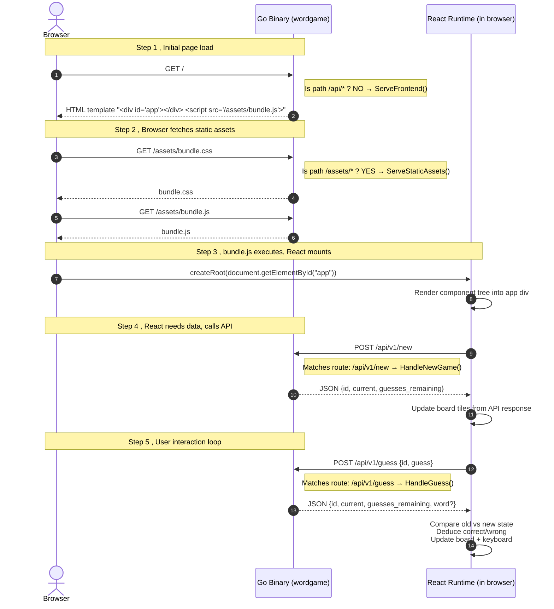
```mermaid
sequenceDiagram
    autonumber

    actor B as Browser
    participant G as Go Binary (wordgame)
    participant R as React Runtime (in browser)

    Note over B,G: Step 1 , Initial page load
    B->>G: GET /
    Note right of G: Is path /api/* ? NO → ServeFrontend()
    G-->>B: HTML template "<div id='app'></div> <script src='/assets/bundle.js'>"

    Note over B,G: Step 2 , Browser fetches static assets
    B->>G: GET /assets/bundle.css
    Note right of G: Is path /assets/* ? YES → ServeStaticAssets()
    G-->>B: bundle.css

    B->>G: GET /assets/bundle.js
    G-->>B: bundle.js

    Note over B,R: Step 3 , bundle.js executes, React mounts
    B->>R: createRoot(document.getElementById("app"))
    R->>R: Render component tree into app div

    Note over B,G: Step 4 , React needs data, calls API
    R->>G: POST /api/v1/new
    Note right of G: Matches route: /api/v1/new → HandleNewGame()
    G-->>R: JSON {id, current, guesses_remaining}
    R->>R: Update board tiles from API response

    Note over B,G: Step 5 , User interaction loop
    R->>G: POST /api/v1/guess {id, guess}
    Note right of G: Matches route: /api/v1/guess → HandleGuess()
    G-->>R: JSON {id, current, guesses_remaining, word?}
    R->>R: Compare old vs new state<br/>Deduce correct/wrong<br/>Update board + keyboard
```

**Key insight:** All API routes live under `/api/v1/`, keeping a clean separation between the JSON API and the HTML/assets.

### 5.4 SPA: what "Single Page Application" actually means

#### The old way (multi-page)

```
User clicks "Hosts" link
  → Browser sends GET /hosts to server
  → Go server renders full HTML page
  → Browser clears screen, paints new page
  → User sees a white flash, then new content
```

Every navigation = full page reload. Slow, clunky, wasteful.

#### The SPA way (our way)

```
User clicks "New Game" button
  → React Router intercepts the click (no HTTP request!)
  → React swaps out the old component, renders the new one
  → Only the changed portion of the DOM updates
  → No white flash, no full reload, no re-downloading assets
```

The browser loads `index.html` **once**. After that, React handles all "navigation" by swapping components in and out of `<div id="app">`. The URL bar still changes (React Router updates it), but no HTTP request is made.

### 5.5 TypeScript in 30 seconds

JavaScript has no types. The bug surfaces at runtime:

```javascript
function add(a, b) { return a + b; }
add("hello", 3);  // "hello3" , silently succeeds but is wrong
add({}, []);       // "0[object Object]" , WTF?
```

TypeScript catches this at compile time:

```typescript
function add(a: number, b: number): number { return a + b; }
add("hello", 3);  // ✗ COMPILE ERROR
```

#### .ts vs .tsx

| Extension | Contains | Example |
|---|---|---|
| `.ts` | Pure TypeScript (no HTML-like syntax) | `utilities/endpoints.ts` |
| `.tsx` | TypeScript + JSX (HTML inside code) | `components/Game/Game.tsx` |

#### Bare imports

```typescript
// Without paths , fragile
import Button from "../../../components/buttons/Button";

// With tsconfig paths , clean, survives refactoring
import Button from "components/buttons/Button";
```

Configured via:

1. `tsconfig.json` → `"paths": { "*": ["./frontend/*"] }`
2. `webpack.config.js` → `resolve.modules: ["./frontend", "node_modules"]`

### 5.6 React's mental model: the render cycle

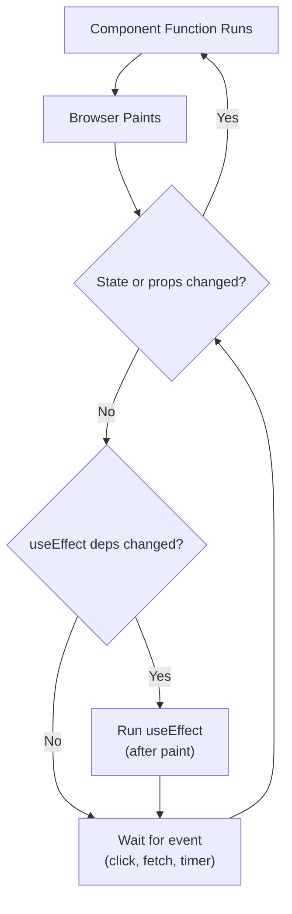
```mermaid
flowchart TD
    R["Component Function Runs"] --> P["Browser Paints"]
    P --> S{"State or props changed?"}
    S -->|"Yes"| R
    S -->|"No"| E{"useEffect deps changed?"}
    E -->|"Yes"| X["Run useEffect<br/>(after paint)"]
    E -->|"No"| W["Wait for event<br/>(click, fetch, timer)"]
    X --> W
    W --> S
```

A step-by-step re-render walkthrough (player guesses "P", board changes from `"_____"` to `"_PP__"`):

```
╔══════════════════════════════════════════════════════════════════╗
║  FRAME 1: Player clicks "P"                                      ║
║  setCurrent("_PP__")   ← React queues a re-render                ║
║  setGuessesLeft(6)     ← React queues a re-render                ║
║                         (React batches these into ONE re-render) ║
╚══════════════════════════════════════════════════════════════════╝
                               │
                               ▼
╔══════════════════════════════════════════════════════════════════╗
║  FRAME 2: React re-runs GamePage() function                      ║
║  The function returns NEW JSX:                                   ║
║  <div class="board">                                             ║
║    <span key=0 class="board__tile">_</span>                      ║
║    <span key=1 class="board__tile board__tile--revealed">P</span>║
║    <span key=2 class="board__tile board__tile--revealed">P</span>║
║    <span key=3 class="board__tile">_</span>                      ║
║    <span key=4 class="board__tile">_</span>                      ║
║  </div>                                                          ║
╚══════════════════════════════════════════════════════════════════╝
                               │
                               ▼
╔══════════════════════════════════════════════════════════════════╗
║  FRAME 3: Reconciliation (Diffing)                               ║
║  key=0: "_" → "_"   NO CHANGE                                    ║
║  key=1: "_" → "P"   TEXT CHANGED + CLASS CHANGED                 ║
║  key=2: "_" → "P"   TEXT CHANGED + CLASS CHANGED                 ║
║  Result: only 2 DOM operations needed.                           ║
╚══════════════════════════════════════════════════════════════════╝
                               │
                               ▼
╔══════════════════════════════════════════════════════════════════╗
║  FRAME 4: React applies minimal mutations to real DOM            ║
║  document.querySelector("[key='1']").textContent = "P";          ║
║  document.querySelector("[key='2']").textContent = "P";          ║
║  (key=0, key=3, key=4 were not touched at all.)                  ║
╚══════════════════════════════════════════════════════════════════╝
```

**Backend analogy:** Manual DOM manipulation is like writing raw SQL queries for every CRUD operation. React is like an ORM: you declare the desired state, and it figures out the optimal way to get there.

### 5.7 React Hooks

A hook is a **function that "hooks into" React's internal runtime**. It lets your component functions do things that plain functions can't — each with a familiar counterpart in C++ and Go:

- **Remember values across calls** (like `useState` or `useRef`): in C++ a `static` local variable; in Go a closure-captured variable or a package-level `var`. The function gets called again and again, but the value persists.
- **Run code after rendering** (like `useEffect`): in C++ an RAII destructor that fires when the object goes out of scope; in Go a `defer` block. React calls your setup code after the screen updates, and your cleanup code before the next run or teardown.
- **Read shared global state** (like `useContext`): in C++ a global `extern` variable or a singleton; in Go a package-level variable. Any component in the tree can reach up to the nearest `<Provider value={...}>` and read the shared value without threading it through every intermediate layer.

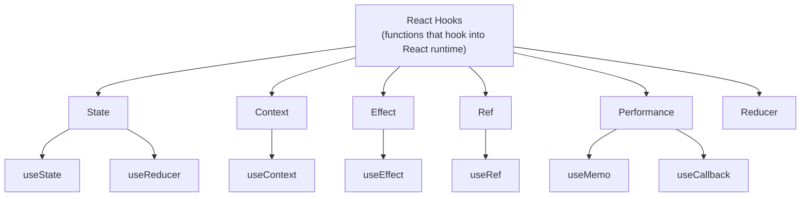
```mermaid
flowchart TB
    H["React Hooks<br/>(functions that hook into React runtime)"] --> S["State"]
    H --> C["Context"]
    H --> E["Effect"]
    H --> R["Ref"]
    H --> P["Performance"]
    H --> Rd["Reducer"]
    S --> S1["useState"]
    S --> S2["useReducer"]
    C --> C1["useContext"]
    E --> E1["useEffect"]
    R --> R1["useRef"]
    P --> P1["useMemo"]
    P --> P2["useCallback"]
```

#### The 6 hooks you'll use every day

| Hook | Purpose | Mental model |
|---|---|---|
| `useState` | Local variables that survive re-renders | **A struct field with a built-in dirty flag.** `const [value, setValue] = useState(init)`. Reading `value` is like reading the struct field. Calling `setValue(newVal)` marks the field as dirty and schedules a re-execution of the entire function (the component). On the next execution, `value` is `newVal`. |
| `useReducer` | `useState` for complex state transitions | **A state machine with explicit event types.** You define a reducer function `(state, action) => newState` — a pure switch on `action.type` that returns the next state. `dispatch(action)` feeds events into the machine. This is exactly the same pattern as a Go function that takes a `State` struct and an `Event` interface and returns a new `State`. No magic. |
| `useContext` | Read global state without prop-drilling | **Dependency injection without threading params through every layer.** Some ancestor wrapped the tree in `<Provider value={thing}>`. Calling `useContext(ThatCtx)` reads `thing` directly from the nearest provider. When `thing` changes, your component re-executes. Think of it as reading from a global registry whose key is the context object — no `context.WithValue` needed. |
| `useEffect` | Run code after render (API calls, timers) | **A defer block with a guard clause.** `useEffect(() => { ... }, [dep1, dep2])` runs the function AFTER the render commits to the screen — like `defer` in Go. The dependency array is a diff check: the block only executes when `dep1` or `dep2` changed between renders. Returning a function from the block registers cleanup for the *next* run (or teardown), like `defer cancel()`. |
| `useRef` | A mutable box that survives re-renders | **A pointer to heap-allocated mutable state.** `const ref = useRef(init)`. `ref.current` is a mutable `*T` — you write it directly and it persists across re-executions. Writes do NOT trigger a re-render. Use it for DOM handles, interval IDs, or any mutable value that shouldn't cause a repaint. |
| `useMemo` / `useCallback` | Performance caching | **Memoization — cache the output, invalidate on key rotation.** `const x = useMemo(() => expensive(a, b), [a, b])` caches the return value of an expensive computation. The function only reruns when `a` or `b` changes. `useCallback` does the same but caches the function *reference* itself (needed when passing callbacks to memoized children). Think of both as a single-entry LRU cache keyed on the dependency array. |

#### The two rules of hooks

```
RULE 1: Only call hooks at the TOP LEVEL.
  ✓ function Comp() {
      const [a, setA] = useState(0);  // top level ✓
      const [b, setB] = useState(0);  // top level ✓
      return ...
    }
  ✗ function Comp() {
      if (condition) {
        const [a, setA] = useState(0);  // inside if ✗
      }
    }
  WHY: React identifies hooks by call ORDER. If the order
  changes between renders, React gets confused.

RULE 2: Only call hooks from React functions.
  ✓ Inside component functions
  ✓ Inside custom hooks (functions starting with "use")
  ✗ Inside regular JavaScript functions
```

### 5.8 The three tiers of state

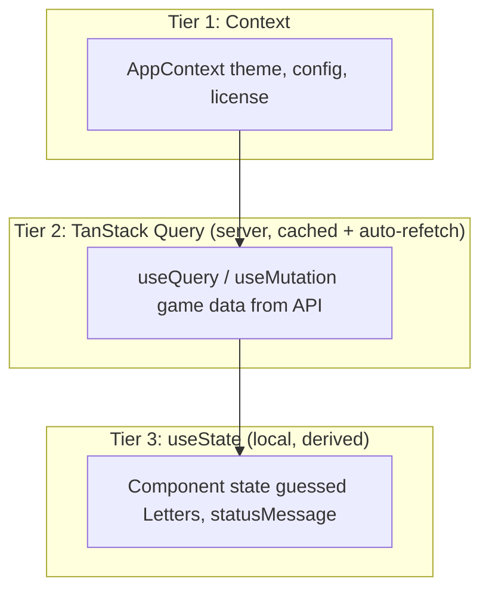
```mermaid
flowchart TB
    subgraph T1["Tier 1: Context<br/>(global, set once)"]
        T1a["AppContext theme, config, license"]
    end
    subgraph T2["Tier 2: TanStack Query (server, cached + auto-refetch)"]
        T2a["useQuery / useMutation game data from API"]
    end
    subgraph T3["Tier 3: useState (local, derived)"]
        T3a["Component state guessed Letters, statusMessage"]
    end
    T1a --> T2a
    T2a --> T3a
```

| Data | Tier | Why this tier? |
|---|---|---|
| `theme`, `config.apiBaseUrl` | Tier 1 (Context) | Set once at startup. Every component may need it. No API call needed. |
| `gameId`, game data | Tier 2 (TanStack Query) | Comes from the API. Changes frequently. Needs caching, refetching, loading/error states. |
| `guessedLetters` | Tier 3 (useState) | Derived locally. No other component needs it. |

The API never tells you "that guess was correct" or "that guess was wrong." It just returns the new `current` and `guesses_remaining`. The frontend **compares** the new response to the old state to figure out what happened. That local deduction lives in `useState`; the API data lives in TanStack Query.

### 5.9 Project structure

```
frontend/
├── index.tsx                          ← Entry point
├── index.scss                          ← Master stylesheet
├── templates/
│   └── react.ejs                      ← HTML shell template
│
├── components/
│   └── App/
│       ├── App.tsx                    ← Root component (wires providers + ThemeSync)
│       ├── App.tests.tsx              ← Smoke test
│       └── index.ts                    ← Barrel export
│
├── context/
│   ├── app.tsx                        ← Tier 1: AppProvider + useReducer
│   └── query.tsx                      ← Tier 2: QueryClientProvider
│
├── hooks/
│   └── useGame.ts                     ← Game state hook (Tier 2 + Tier 3)
│
├── interfaces/
│   └── game.ts                        ← API response type definitions
│
├── layouts/
│   ├── CoreLayout/
│   │   ├── CoreLayout.tsx             ← App chrome (SiteTopNav + Outlet)
│   │   ├── CoreLayout.tests.tsx       ← Smoke test
│   │   ├── _styles.scss               ← App chrome styles (theme-aware)
│   │   └── index.ts                   ← Barrel export
│   │
│   └── SiteTopNav/
│       ├── SiteTopNav.tsx             ← Nav bar (title + theme toggle)
│       ├── SiteTopNav.tests.tsx       ← Smoke test
│       ├── _styles.scss               ← Yellow gradient + toggle button
│       └── index.ts                   ← Barrel export
│
├── pages/
│   └── GamePage/
│       ├── GamePage.tsx               ← Main game screen (5 states)
│       ├── GamePage.tests.tsx         ← 7 tests covering all states
│       ├── _styles.scss               ← Game styles (theme-aware)
│       └── index.ts                   ← Barrel export
│
├── router/
│   ├── index.tsx                      ← createBrowserRouter definition
│   └── paths.ts                       ← URL path constants
│
├── services/
│   └── entities/
│       └── game.ts                    ← API entity (newGame, guess)
│
├── styles/
│   └── var/
│       └── colors.scss                ← Color palette + theme CSS variables
│
├── test/
│   ├── test-setup.ts                  ← MSW lifecycle + Web API polyfills
│   ├── test-utils.tsx                 ← Custom render with providers
│   ├── mock-server.ts                 ← MSW setupServer (default export)
│   └── default-handlers.ts            ← Default route handlers
│
└── utilities/
    ├── endpoints.ts                   ← API path constants
    └── sendRequest.ts                 ← Single HTTP choke point
```

33 source files. The grouping follows a "what does this file do" mental model:

- `context/`: Tier 1 (AppProvider) and Tier 2 (QueryProvider)
- `hooks/`: the core state hook (`useGame`)
- `services/entities/`: API service wrappers
- `utilities/`: `sendRequest` and endpoint constants
- `test/`: test infrastructure

### 5.10 Key files

#### `context/query.tsx`: Tier 2 provider

```tsx
const FIVE_MINUTES = 5 * 60 * 1000;  // 5 × 60 sec × 1000 ms

const queryClient = new QueryClient({
  defaultOptions: {
    queries: {
      staleTime: FIVE_MINUTES,         // cache freshness window
      retry: 1,                         // retry once on failure
      refetchOnWindowFocus: false,      // don't refetch on tab switch
    },
  },
});

export function QueryProvider({ children }: { children: ReactNode }) {
  return <QueryClientProvider client={queryClient}>{children}</QueryClientProvider>;
}
```

**What this client does:** provides the cache + lifecycle tracking (`isPending`, `isError`) for `useMutation` calls. It does **not** fetch anything on its own; mutations call it via `queryClient.setQueryData()` to write to the cache.

#### `hooks/useGame.ts`: the game logic

```ts
export function useGame() {
  const queryClient = useQueryClient();
  const [gameId, setGameId] = useState<string | null>(null);
  const [guessedLetters, setGuessedLetters] = useState<string[]>([]);

  // Read game data from cache (cache-first; enabled only when gameId is set)
  const { data: gameData } = useQuery<IGuessResponse>({
    queryKey: ["game", gameId],
    queryFn: () => gameAPI.getGame(gameId!),
    enabled: !!gameId,
  });

  const newGameMutation = useMutation({
    mutationFn: gameAPI.newGame,
    onSuccess: (data) => {
      queryClient.setQueryData(["game", data.id], data); // seed cache
      setGameId(data.id);                                // activate game
      setGuessedLetters([]);                             // clear previous guesses
    },
    onError: () => {
      setGameId(null);                                   // back to idle
      setGuessedLetters([]);
    },
  });

  const guessMutation = useMutation({
    mutationFn: ({ id, guess }) => gameAPI.guess(id, guess),
    onSuccess: (data, variables) => {
      queryClient.setQueryData(["game", variables.id], data); // update cache
    },
    onError: () => {
      setGameId(null);
      setGuessedLetters([]);
    },
  });

  // ... derived values + makeGuess + return object
}
```

**How TanStack Query and Axios collaborate — the read-through cache pattern:**

The relationship mirrors a familiar backend architecture: a cache tier (TanStack Query) wrapping a stateless transport (Axios).

- **Axios is the transport layer.** It operates like Go's `http.Client` or a database driver — you hand it a request, it opens a connection, returns the response, and closes. It has no cache, no state, no memory of prior calls. Issue the same request ten times and it makes ten TCP handshakes.
- **TanStack Query is a read-through cache.** Like Redis sitting in front of a database: on a hit (data fresh, within `staleTime`) it returns the cached value immediately — zero network I/O. On a miss (cold start or stale) it delegates to Axios, stores the result, then returns it. The component never talks to the transport directly.

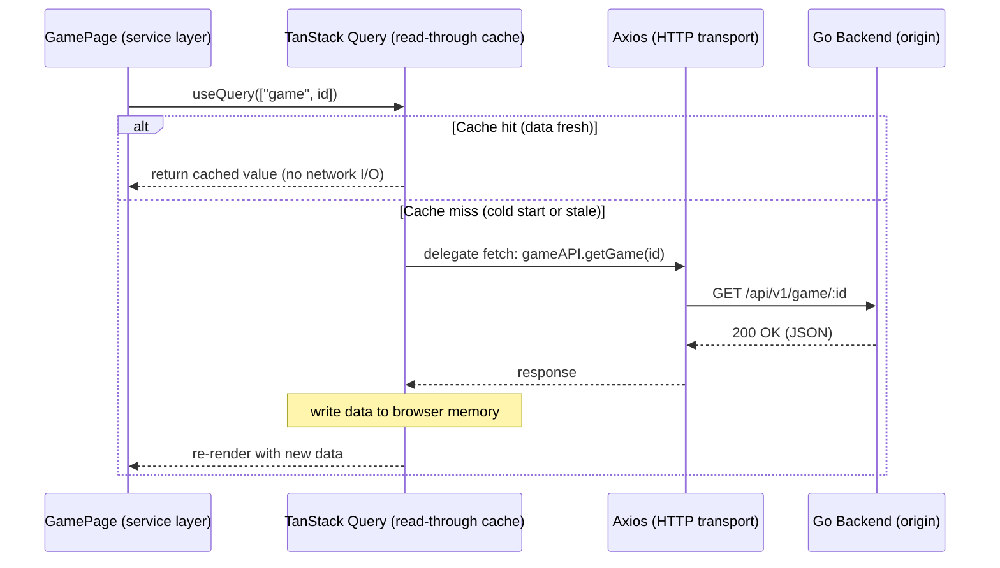
```mermaid
sequenceDiagram
    participant UI as GamePage (service layer)
    participant Cache as TanStack Query (read-through cache)
    participant Transport as Axios (HTTP transport)
    participant Origin as Go Backend (origin)

    UI->>Cache: useQuery(["game", id])

    alt Cache hit (data fresh)
        Cache-->>UI: return cached value (no network I/O)
    else Cache miss (cold start or stale)
        Cache->>Transport: delegate fetch: gameAPI.getGame(id)
        Transport->>Origin: GET /api/v1/game/:id
        Origin-->>Transport: 200 OK (JSON)
        Transport-->>Cache: response
        Note over Cache: write data to browser memory
        Cache-->>UI: re-render with new data
    end
```

**Write-through updates — mutations skip the transport.** After a `POST /guess` succeeds, the mutation's `onSuccess` calls `queryClient.setQueryData(["game", id], data)` — it writes the new state *directly into the cache*, bypassing Axios entirely. This is the write-through pattern: the cache is updated in-band by the caller rather than fetched from the origin. The `useQuery` above observes the cache write and re-renders, so **no second GET is fired**. Axios only runs on a cold start (page refresh with a `gameId` already in scope).

#### `pages/GamePage/GamePage.tsx`: the main screen

```tsx
export function GamePage() {
  const baseClass = "game-page";

  const {
    current, word, guessesRemaining,
    newGame, makeGuess,
    isLoading, guessedLetters, isPendingGuess,
    isWon, isLost, isError, error,
  } = useGame();

  if (isError) {
    return <div className={baseClass}>
      <p>Error: {error?.message}</p>
      <button onClick={newGame}>Try Again</button>
    </div>;
  }

  if (current === null) {
    return <div className={baseClass}>
      <h1>Word Game</h1>
      <button onClick={newGame} disabled={isLoading}>
        {isLoading ? "Starting..." : "New Game"}
      </button>
    </div>;
  }

  if (isWon) {
    return <div className={baseClass}>
      <h1>You Won!</h1>
      <div className={`${baseClass}__board`}>
        {current.split("").map((letter, i) => (
          <span key={i} className={`${baseClass}__tile ${baseClass}__tile--revealed`}>{letter}</span>
        ))}
      </div>
      <button onClick={newGame}>Play Again</button>
    </div>;
  }

  if (isLost) {
    return <div className={baseClass}>
      <h1>Game Over</h1>
      <p>The word was: <strong>{word ?? current}</strong></p>
      <button onClick={newGame}>Try Again</button>
    </div>;
  }

  return <div className={baseClass}>
    <h1>Word Game</h1>
    <div className={`${baseClass}__board`}>
      {current.split("").map((letter, i) => (
        <span key={i} className={`${baseClass}__tile ${letter !== "_" ? `${baseClass}__tile--revealed` : ""}`}>{letter}</span>
      ))}
    </div>
    <div className={`${baseClass}__keyboard`}>
      {"ABCDEFGHIJKLMNOPQRSTUVWXYZ".split("").map(letter => (
        <button key={letter} onClick={() => makeGuess(letter)}
                disabled={isPendingGuess || guessedLetters.includes(letter)}>
          {letter}
        </button>
      ))}
    </div>
    <p>Guesses remaining: {guessesRemaining}</p>
    <button onClick={newGame}>New Game</button>
  </div>;
}
```

**State priority:** Error trumps idle trumps won/lost trumps playing. Because `isError` is checked first, an API failure during a game will show the error overlay.

#### `test/mock-server.ts` + `test/default-handlers.ts`: MSW for tests

```ts
// test/mock-server.ts
import { setupServer } from "msw/node";
import handlers from "./default-handlers";

const mockServer = setupServer(...handlers);
export default mockServer;
```

```ts
// test/default-handlers.ts
import { http, HttpResponse } from "msw";

export const handlers = [
  http.post("/api/v1/new", () =>
    HttpResponse.json({ id: "test-id", current: "_____", guesses_remaining: 6 })
  ),
  http.get("/api/v1/game/:id", ({ params }) =>
    HttpResponse.json({ id: params.id, current: "_____", guesses_remaining: 6 })
  ),
  http.post("/api/v1/guess", () =>
    HttpResponse.json({ id: "test-id", current: "_____", guesses_remaining: 5 })
  ),
];

export default handlers;
```

Override a default per test:

```ts
mockServer.use(
  http.post("/api/v1/guess", () =>
    HttpResponse.json({ id: "test-id", current: "APPLE", guesses_remaining: 6 })
  )
);
```

#### `test/test-utils.tsx`: custom render

```tsx
function customRender(ui, options) {
  const queryClient = new QueryClient({
    defaultOptions: {
      queries: { retry: false, refetchOnMount: false },
      mutations: { retry: false },
    },
  });

  function AllProviders({ children }) {
    return (
      <AppProvider>
        <QueryClientProvider client={queryClient}>
          {children}
        </QueryClientProvider>
      </AppProvider>
    );
  }

  return render(ui, { wrapper: AllProviders, ...options });
}

export { customRender as render };
```

**Fresh `QueryClient` per render** prevents cache bleed between tests.

### 5.11 MSW: how the frontend tests work

The frontend tests never hit the Go backend. Instead, **MSW (Mock Service Worker)** intercepts outgoing HTTP requests inside the Node.js test process and returns canned JSON — the same principle as `httptest.NewServer` in Go tests, except MSW hooks into Node's `http` module rather than spinning up a separate TCP listener.

#### What is being mocked — and what isn't

MSW sits at the **network boundary**: it intercepts the `fetch()` call that Axios makes. Everything above that boundary — the React component, the `useGame` hook, the TanStack Query cache, the `sendRequest` wrapper, and Axios itself — runs exactly as it does in production. Only the final TCP round-trip (and therefore the Go backend) is replaced.

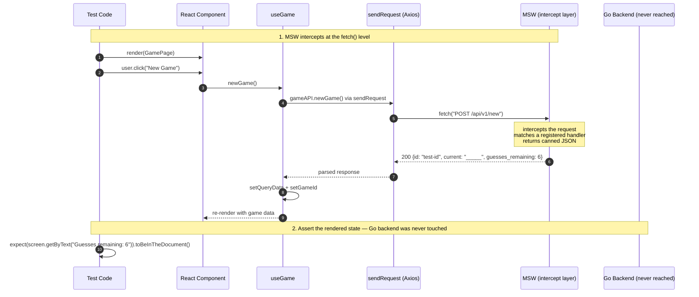
```mermaid
sequenceDiagram
    autonumber
    participant Test as Test Code
    participant Component as React Component
    participant Hook as useGame
    participant Axios as sendRequest (Axios)
    participant MSW as MSW (intercept layer)
    participant Go as Go Backend (never reached)

    Note over Test,MSW: 1. MSW intercepts at the fetch() level
    Test->>Component: render(GamePage)
    Test->>Component: user.click("New Game")
    Component->>Hook: newGame()
    Hook->>Axios: gameAPI.newGame() via sendRequest
    Axios->>MSW: fetch("POST /api/v1/new")
    Note over MSW: intercepts the request<br/>matches a registered handler<br/>returns canned JSON
    MSW-->>Axios: 200 {id: "test-id", current: "_____", guesses_remaining: 6}
    Axios-->>Hook: parsed response
    Hook->>Hook: setQueryData + setGameId
    Hook-->>Component: re-render with game data

    Note over Test,Go: 2. Assert the rendered state — Go backend was never touched
    Test->>Test: expect(screen.getByText("Guesses remaining: 6")).toBeInTheDocument()
```

The Go binary never receives a single byte. The component, hook, cache, and transport all run real production code — only the network socket is fake.

#### The three setup files

**`test/mock-server.ts`** — creates the MSW server from a set of default handlers:

```ts
import { setupServer } from "msw/node";
import handlers from "./default-handlers";

const mockServer = setupServer(...handlers);
export default mockServer;
```

**`test/default-handlers.ts`** — declares the default JSON responses for each endpoint. Every test starts with these fallbacks:

```ts
export const handlers = [
  http.post("/api/v1/new", () => HttpResponse.json({
    id: "test-id", current: "_____", guesses_remaining: 6
  })),
  http.get("/api/v1/game/:id", ({ params }) => HttpResponse.json({
    id: params.id, current: "_____", guesses_remaining: 6
  })),
  http.post("/api/v1/guess", () => HttpResponse.json({
    id: "test-id", current: "_____", guesses_remaining: 5
  })),
];
```

**`test/test-setup.ts`** — registers the lifecycle hooks (Jest runs this file once, before any tests). The file also polyfills a few Web APIs (`WritableStream`, `MessagePort`, `MessageChannel`, `Event`, `EventTarget`) that `jest-fixed-jsdom@0.0.8` doesn't expose yet — MSW's internal modules need these globals to load.

```ts
beforeAll(() => mockServer.listen());     // start the MSW server
afterEach(() => mockServer.resetHandlers()); // restore defaults
afterAll(() => mockServer.close());       // shut down
```

#### Per-test handler overrides

A test that needs a different response from a specific endpoint calls `mockServer.use(...)`. This adds a temporary handler that **takes priority** over the defaults — and is cleaned up by `afterEach`'s `resetHandlers()` before the next test runs.

Here's the "renders won state" test, traced step-by-step:

```mermaid
sequenceDiagram
    autonumber
    participant Test as Test: "renders won state"
    participant MSW as MSW Server
    participant Component as GamePage
    participant Hook as useGame

    Note over Test,MSW: 1. Override the POST /guess handler for this test only
    Test->>MSW: mockServer.use(<br/>  http.post("/guess", () =><br/>    HttpResponse.json({current: "APPLE", guesses_remaining: 6})<br/>  )<br/>)
    Note over MSW: POST /guess now returns APPLE<br/>defaults for GET and POST /new unchanged

    Note over Test,Hook: 2. Start a game (hits the default POST /new handler)
    Test->>Component: user.click("New Game")
    Component->>Hook: newGame() → POST /api/v1/new
    MSW-->>Hook: {id: "test-id", current: "_____", guesses_remaining: 6}
    Hook-->>Component: render playing state

    Note over Test,Hook: 3. Guess a letter (hits the overridden POST /guess handler)
    Test->>Component: user.click("A")
    Component->>Hook: makeGuess("A") → POST /api/v1/guess
    MSW-->>Hook: {current: "APPLE", guesses_remaining: 6}
    Note over Hook: isWon = !"APPLE".includes("_") = true
    Hook-->>Component: render "You Won!"

    Note over Test: 4. Assert the expected state
    Test->>Test: expect(screen.getByText("You Won!")).toBeInTheDocument()
    Test->>Test: expect button with text "Play Again" is visible
```

The test never sets `isWon` or injects `current: "APPLE"` directly. It overrides the **API contract** at the HTTP level — the same surface a real Go server presents — and lets the component, the hook, and the production code compute the state from the response. This is why the tests catch real bugs: they exercise the full data path, not mocked return values.

#### The seven GamePage tests and what each verifies

Every test follows the same pattern: override a handler if needed → drive the UI with `userEvent` → assert the rendered output.

| Test | Override | Verifies |
|---|---|---|
| Idle state | Nothing | New Game button exists on mount; no game in progress |
| Start a game | Default POST /new | Clicking "New Game" shows `Guesses remaining: 6` and 5 underscore tiles |
| Keyboard renders | Defaults | All 26 letters A–Z are present as buttons in playing state |
| Disabled letter | Default POST /guess (returns `guesses_remaining: 5`) | After guessing Z, the Z button is disabled and the counter drops to 5 |
| Won state | POST /guess returns `current: "APPLE"` | A single correct guess renders `You Won!` and a "Play Again" button |
| Lost state | POST /guess returns `current: "_____"` + `guesses_remaining: 0` + `word: "APPLE"` | The secret word is revealed and a "Try Again" button appears |
| Error state | POST /new returns HTTP 500 | An error message and "Try Again" button appear |

#### Why MSW instead of module-level mocking

| | `jest.mock()` | MSW |
|---|---|---|
| Intercepts at | Module boundary (replaces a function) | Network boundary (replaces the HTTP response) |
| The `sendRequest` wrapper runs? | No — replaced by a mock | Yes — it makes a real call, MSW intercepts `fetch()` |
| A misspelled endpoint breaks the test? | No — you're testing the mock, not the real code path | Yes — a wrong URL or HTTP method causes a real error |
| Same handlers work in browser dev? | No | Yes — MSW runs in the browser too |

 MSW verifies the real request/response contract. A typo in `endpoints.ts` or a wrong HTTP method in `sendRequest` breaks the test — exactly as it would break the app in production.

---

## 6. How They Work Together: Dev vs Production

This is the **single biggest architectural decision** in the project: the Go binary serves the React frontend. Same process, same port, same origin. No separate API server, no CORS, no proxy.

### 6.1 The two modes

| Mode | Frontend files come from... | After editing a component... |
|---|---|---|
| **Production** (`make generate && make run`) | Embedded in Go binary via `go-bindata` | Re-run `make generate` (~5-10s) |
| **Development** (`make dev`) | On disk in `./assets/` (via `go-bindata -debug`) | Just refresh the browser (~0.5s) |

The secret: **`go-bindata`** generates a Go file that either embeds file bytes (production) or stores file paths (development, with `-debug` flag). The HTTP handler calls `bindata.Asset()` either way; it doesn't know or care which mode it's in.

### 6.2 The `go-bindata` switch

```bash
# Production: embed file bytes into the binary
go-bindata -pkg=bindata -o=internal/bindata/generated.go assets/...

# Development: store file paths instead (reads from disk at runtime)
go-bindata -debug -pkg=bindata -o=internal/bindata/generated.go assets/...
```

The `-debug` flag is the magic switch:

```go
// Production (generated WITHOUT -debug):
func Asset(name string) ([]byte, error) {
    return data[name], nil  // data is a map[string][]byte embedded in the .go file
}

// Dev mode (generated WITH -debug):
func Asset(name string) ([]byte, error) {
    return os.ReadFile(name)  // reads from the real filesystem on disk
}
```

The HTTP handler calls `bindata.Asset()` either way; it has no idea which code path will execute:

```go
// internal/bindata/handler.go
func FrontendHandler() http.Handler {
    return http.HandlerFunc(func(w http.ResponseWriter, r *http.Request) {
        path := r.URL.Path
        var assetPath string
        if strings.HasPrefix(path, "/assets/") {
            assetPath = path[1:]
        } else {
            assetPath = "assets/index.html"
        }
        data, err := Asset(assetPath)
        if err != nil {
            http.NotFound(w, r)
            return
        }
        contentType := mime.TypeByExtension(filepath.Ext(assetPath))
        w.Header().Set("Content-Type", contentType)
        w.Write(data)
    })
}
```

**No `--dev` flag needed on the server.** The decision between "read from embedded memory" vs "read from disk" happens at **generation time** (when you run go-bindata), not at runtime. The generated Go file **is** the switch.

### 6.3 Dev vs Production side by side

| Aspect | Production (`make generate` + `make run`) | Development (`make dev`) |
|---|---|---|
| Frontend source | Embedded in Go binary (via go-bindata) | Files on disk (`./assets/`) |
| Go recompilation after frontend change? | Yes (re-run `make generate`) | No (webpack watch + bindata `-debug` reads new file from disk) |
| Webpack mode | `--mode production` (minified, hashed filenames) | `--mode development` (unminified, readable sourcemaps) |
| Iterating on a frontend change | ~5s, webpack + go-bindata + `go build` | ~0.5s, webpack watch + browser refresh |
| Starting the server | `make generate && make run` | `make dev` (one command) |
| Runtime dependencies | None (single binary) | Node.js, node_modules |
| Use case | Staging, production, CI | Local development |

### 6.4 The SPA catch-all

React Router handles navigation in the browser, not the server. The server only needs to return one HTML file (`index.html`), and React Router figures out what to render based on the URL.

But there's a problem: if you navigate directly to `http://localhost:1337/some/deep/link`, the browser sends a `GET /some/deep/link` request. The server has no HTML file at that path. The solution: the server always returns `index.html` for any request that doesn't match an API route or an asset file:

```
GET /                    → SPA catch-all → index.html  ✓
GET /api/v1/new          → API route      → JSON        ✓
GET /assets/bundle.js    → /assets/*      → bundle.js   ✓
GET /some/deep/link      → SPA catch-all → index.html  ✓
GET /nonexistent/file.js → /assets/*      → 404         ✓
```

Route priority in the mux router:

```go
func registerRoutes(r *mux.Router, srv *handler.Server) {
    api := r.PathPrefix("/api/v1").Subrouter()
    api.HandleFunc("/new", srv.HandleNewGame)
    api.HandleFunc("/guess", srv.HandleGuess)

    // SPA catch-all registered LAST so API routes take priority
    r.PathPrefix("/").Handler(bindata.FrontendHandler())
}
```

### 6.5 `make dev` in detail

`make dev` does four things in one terminal:

1. Runs `npm run build` , initial webpack build
2. Runs `go-bindata -debug` , generates bindata code that reads from disk
3. Starts `npx webpack --mode development --watch` in the background
4. Runs `go run ./cmd/wordgame/` in the foreground

```makefile
dev:
    @( \
        trap 'kill 0' SIGINT EXIT; \
        npm run build && \
        go-bindata -debug -pkg=bindata -o=internal/bindata/generated.go assets/... && \
        npx webpack --mode development --watch & \
        sleep 3 && \
        go run ./cmd/wordgame/; \
    )
```

The `trap 'kill 0' SIGINT EXIT` is critical: it kills the webpack watch process when you press Ctrl+C. Without it, webpack keeps running in the background.

When you change a file:

1. Webpack detects the change, rebuilds (~500ms)
2. New `bundle.js` is written to `./assets/`
3. You refresh the browser
4. The Go server reads the new `bundle.js` from disk
5. The browser renders the new code

No server restart. No Go recompilation. Just edit, save, refresh.

---

## 7. Testing Strategy

### 7.1 Backend testing

The Go code uses Go's standard `testing` package. Tests are co-located with the code (like `handler_test.go` next to `handler.go`).

#### What we test at each layer

| File | Tests | What it verifies |
|---|---|---|
| `pkg/words/loader_test.go` | Uses `strings.NewReader` (no filesystem) | Filtering, empty input, whitespace, non-alpha, mixed case, single-letter words |
| `internal/game/game_test.go` | Pure logic, no I/O | Correct/wrong guesses, win/loss, repeat-wrong, repeat-correct, invalid runes, completed-game rejection |
| `internal/handler/handler_test.go` | Real `GameStore` + `httptest.NewRecorder` | Full HTTP integration: response shape, Postel's Law, unknown JSON fields, race conditions |
| `cmd/wordgame/smoke_test.go` | Real `httptest.Server`, real TCP | Content-Type headers, route registration, handler signature, JSON round-trip |

**SRP method tests:** Every extracted method (`validateInProgress`, `validateRune`, `isCorrectGuess`, `applyCorrectGuess`, `applyWrongGuess`, `normaliseGuess`, `decodeJSONBody`) has direct unit tests.

#### What unit tests miss, smoke tests catch

| Bug class | Unit tests | Smoke tests |
|---|:---:|:---:|
| Wrong `Content-Type` header | Miss | **Caught** |
| Route not registered (typo) | Miss | **Caught** |
| Handler signature mismatch | Miss | **Caught** |
| Response body truncated at TCP | Miss | **Caught** |
| `ListenAndServe` / port binding | Miss | **Caught** |
| Game logic bugs | Caught | Caught |

Smoke tests use Go's `httptest.Server` to start a real HTTP server on a random port, then send real TCP requests via `http.Post`. The server is configured with a deterministic word list (`["ZZZZ"]`) so outcomes are predictable.

#### Coverage

```
ok      github.com/.../cmd/wordgame        0.006s  coverage: 6.7%   of statements
ok      github.com/.../internal/game       0.003s  coverage: 100.0% of statements
ok      github.com/.../internal/handler    0.006s  coverage: 98.3%  of statements
ok      github.com/.../internal/store      0.003s  coverage: 100.0% of statements
ok      github.com/.../pkg/identifier      0.003s  coverage: 100.0% of statements
ok      github.com/.../pkg/words           0.003s  coverage: 100.0% of statements
```

| Package | Coverage | Notes |
|---|---|---|
| `cmd/wordgame` | 6.7% | Entry point: `main()`, `NewRootCommand()`, `runServer()` exercised via smoke tests, not unit tests |
| `internal/game` | 100.0% | Pure business logic, zero I/O |
| `internal/handler` | 98.3% | Defense-in-depth `else` branch is unreachable, see below |
| `internal/store` | 100.0% | Simple CRUD with mutex, all paths covered |
| `pkg/identifier` | 100.0% | Single function with wrapped error |
| `pkg/words` | 100.0% | `io.Reader`-based loader, all filtering paths tested |

The 98.3% in `internal/handler` is intentional: the `else` branch in `HandleGuess` is defense-in-depth for unknown `ApplyGuess` errors:

```go
if err := g.ApplyGuess(rune(guess[0])); err != nil {
    if errors.Is(err, game.ErrGameCompleted) {
        writeError(w, http.StatusConflict, err.Error())
    } else if errors.Is(err, game.ErrInvalidGuess) {
        writeError(w, http.StatusUnprocessableEntity, err.Error())
    } else {
        writeError(w, http.StatusInternalServerError, "internal error")
    }
    return
}
```

`ApplyGuess` only returns `ErrGameCompleted` or `ErrInvalidGuess`; the `else` branch is logically unreachable. Injecting a fake error to cover a dead branch adds test-only complexity with no runtime benefit.

### 7.2 Frontend testing

The frontend uses **Jest + React Testing Library + MSW**

**11 tests, 4 suites, all passing:**

| Test file | Tests | Coverage |
|---|---|---|
| `App.tests.tsx` | 1 | Root component mounts without crashing |
| `CoreLayout.tests.tsx` | 1 | Nav bar renders |
| `GamePage.tests.tsx` | 7 | All 5 states + keyboard + guess interaction |
| `SiteTopNav.tests.tsx` | 2 | Brand text + theme toggle button render |

The GamePage tests cover all five UI states via MSW handler overrides:

```ts
test("renders won state", async () => {
  mockServer.use(
    http.post("/api/v1/guess", () => {
      return HttpResponse.json({
        id: "test-id",
        current: "APPLE",
        guesses_remaining: 6,
      });
    })
  );

  const user = userEvent.setup();
  renderPage();
  await user.click(screen.getByRole("button", { name: /new game/i }));
  await waitFor(() => expect(screen.getByText("Guesses remaining: 6")).toBeInTheDocument());
  await user.click(screen.getByRole("button", { name: "A" }));
  await waitFor(() => expect(screen.getByText("You Won!")).toBeInTheDocument());
});
```

### 7.3 Why MSW, not `jest.mock()`?

| Approach | Tests know implementation? | Catches contract breaks? | Shared between suites? |
|---|---|---|---|
| `jest.mock()` | Yes (which module is called) | No | Manual |
| MSW | No (just HTTP) | Yes (tests verify real request/response) | Yes (handlers) |

MSW intercepts at the network level, so tests verify the real request/response contract. Handlers can be reused across test files (e.g., the default handlers in `test/default-handlers.ts`).

---

## 8. Development Workflow

### 8.1 Quick start

```bash
# 1. Install dependencies
make deps

# 2. Run the dev server (one command: webpack + go-bindata + Go server)
make dev

# 3. Open http://localhost:1337 in your browser
```

That's it. Edit a file, save, refresh — the change is live in ~0.5s.

### 8.2 Makefile target reference

| Target | What it does | Example |
|---|---|---|
| `make dev` | One-command hot-reload: build JS, generate bindata -debug, webpack watch, go run | `make dev` |
| `make run` | Start the server on `:1337` (requires `make generate` first) | `make run` |
| `make generate` | Full production build: webpack + go-bindata + go build | `make generate` |
| `make build` | Compile the Go binary → `bin/wordgame` | `make build` |
| `make test` | Run all Go tests with verbose output | `make test` |
| `make test-race` | Run tests with the race detector | `make test-race` |
| `make test-cover` | Run tests + print per-package coverage % | `make test-cover` |
| `make test-cover-html` | Run tests + open coverage in browser | `make test-cover-html` |
| `make smoke` | Run end-to-end HTTP smoke tests | `make smoke` |
| `make new-game` | `POST /new` and pretty-print (server must be running) | `make new-game` |
| `make guess ID=<uuid> GUESS=a` | Guess a letter | `make guess ID=abc GUESS=p` |
| `make demo` | Record the terminal/CLI demo GIF (VHS tape → `docs/assets/demo.gif`) | `make demo` |
| `make demo-frontend` | Record the browser/UI demo GIF (Playwright → `docs/assets/demo-frontend.gif`) | `make demo-frontend` |
| `make demo-frontend-record` | Same as `demo-frontend` but assumes a server is already running on `:1337` (useful when iterating on the script) | `make demo-frontend-record` |
| `make fmt` | `go fmt` | `make fmt` |
| `make vet` | `go vet` | `make vet` |
| `make lint` | `golangci-lint` (must be installed separately) | `make lint` |
| `make check` | All quality gates: fmt → vet → lint → test | `make check` |
| `make clean` | Remove `bin/`, `coverage.out`, generated bindata | `make clean` |

### 8.3 Frontend commands

```bash
npm test         # Run all Jest tests
npm run build    # Webpack production build
```

### 8.4 Linting and formatting

| Target | Tool | What it checks |
|---|---|---|
| `make fmt` | `go fmt` | Code formatting (tabs, alignment) |
| `make vet` | `go vet` | Suspicious constructs (unused code, printf mismatches) |
| `make lint` | `golangci-lint` | 80+ linters (errcheck, govet, staticcheck, unparam) |
| `make check` | All of the above + tests | Full quality gate |

**Quick developer workflow:**

```bash
make check
```

### 8.5 Typical development workflow

**Terminal 1**: start the server (hot reload):

```bash
make dev
```

**Terminal 2**: interact with the game:

```bash
# Start a new game, capture the ID
make new-game
# {"id":"f8302916-...","current":"________","guesses_remaining":6}

# Make a guess
make guess ID=f8302916-... GUESS=a
# {"id":"f8302916-...","current":"______A_","guesses_remaining":6}

# Run all checks before committing
make check
```

---

## 9. Reference: Glossary & Code Map

### 9.1 Glossary (frontend ↔ backend concepts)

| Frontend Concept | Backend Equivalent | What it does |
|---|---|---|
| **TypeScript** (`.ts`/`.tsx`) | Go with types | JavaScript + compile-time type checking. `.tsx` = TypeScript with JSX |
| **React** | Template rendering engine | UI as composable function tree |
| **JSX** | `html/template` | HTML-like syntax embedded in JavaScript, compiled to function calls |
| **Component** | Handler + template | Function that takes props and returns UI |
| **State** (`useState`) | Struct field | Data that triggers re-render when changed |
| **Props** | Function parameters | Data passed from parent to child, read-only |
| **Effect** (`useEffect`) | `defer` | Code that runs after render , API calls, subscriptions, cleanup |
| **Context** (`useContext`) | Global registry | Data available to all descendants without prop-drilling |
| **useReducer** | State machine | For complex state transitions: dispatches actions to a reducer |
| **React Router** | `gorilla/mux` | Client-side URL routing, no HTTP request needed |
| **TanStack Query** | HTTP cache (Redis-like) | Fetches, caches, deduplicates API calls |
| **Axios** | `net/http` client | Promise-based HTTP client with JSON parsing |
| **Webpack** | `go build` | Bundles `.tsx`/`.scss` into `.js`/`.css` |
| **SCSS** | Go templates for CSS | CSS with variables, nesting, mixins |
| **Jest** | `go test` | Test runner for TypeScript/JavaScript |
| **React Testing Library** | `httptest` | Renders components in jsdom (fake browser) |
| **MSW** | `httptest.NewServer` | Intercepts HTTP for tests, returns canned responses |
| **Bare imports** | Module path imports | `import "components/Thing"` instead of `../../components/Thing` |
| **SPA** | No Go equivalent | One HTML page, JavaScript handles all "navigation" in-memory |

### 9.2 Complete file map

#### Backend (Go)

| File | Purpose |
|---|---|
| `cmd/wordgame/main.go` | Entry point: wires deps, starts server |
| `cmd/wordgame/smoke_test.go` | End-to-end HTTP smoke tests |
| `internal/handler/handler.go` | Orchestration: route → normalise → validate → apply |
| `internal/handler/request.go` | JSON decode, `normaliseGuess` (Postel's Law) |
| `internal/handler/response.go` | `writeJSON`, `writeError` helpers |
| `internal/handler/types.go` | DTOs: `NewGameResponse`, `GuessRequest`, `GuessResponse`, `ErrorResponse` |
| `internal/handler/handler_test.go` | HTTP integration tests with `httptest.NewRecorder` |
| `internal/game/game.go` | `Game` struct + `ApplyGuess()` (with `validateInProgress`, `validateRune`, `isCorrectGuess`, `applyCorrectGuess`, `applyWrongGuess`) |
| `internal/game/game_test.go` | Pure logic tests, no I/O |
| `internal/store/store.go` | `GameStore`: `sync.RWMutex` + `map[string]*Game` |
| `internal/store/store_test.go` | CRUD tests with concurrent access verification |
| `pkg/words/loader.go` | `LoadWords(r io.Reader) ([]string, error)`: decoupled from filesystem |
| `pkg/words/loader_test.go` | Tests using `strings.NewReader` |
| `pkg/identifier/id.go` | `GenerateIdentifier() (string, error)`: UUID v4 |
| `internal/bindata/handler.go` | `FrontendHandler()`: serves static assets via `bindata.Asset()` |
| `internal/bindata/generated.go` | **Auto-generated** by `go-bindata` (gitignored) |

#### Frontend (React)

| File | Purpose |
|---|---|
| `frontend/index.tsx` | Entry point: mounts React app |
| `frontend/index.scss` | Master stylesheet, imports all component styles |
| `frontend/templates/react.ejs` | HTML shell template (only HTML file loaded) |
| `frontend/components/App/App.tsx` | Root component: wires providers + `ThemeSync` |
| `frontend/context/app.tsx` | Tier 1: `AppProvider` + `useReducer` (theme, config) |
| `frontend/context/query.tsx` | Tier 2: `QueryClientProvider` (cache + mutation lifecycle) |
| `frontend/hooks/useGame.ts` | The game logic hook (cache reads + mutations) |
| `frontend/interfaces/game.ts` | `INewGameResponse`, `IGuessResponse`, `IGameError` |
| `frontend/layouts/CoreLayout/CoreLayout.tsx` | App chrome: `<SiteTopNav />` + `<Outlet />` |
| `frontend/layouts/SiteTopNav/SiteTopNav.tsx` | Nav bar: title + theme toggle |
| `frontend/pages/GamePage/GamePage.tsx` | Main game screen (5 states) |
| `frontend/router/index.tsx` | `createBrowserRouter` route tree |
| `frontend/router/paths.ts` | URL path constants |
| `frontend/services/entities/game.ts` | `gameAPI` , `newGame()`, `guess(id, letter)` |
| `frontend/utilities/endpoints.ts` | `NEW_GAME`, `GUESS` API path constants |
| `frontend/utilities/sendRequest.ts` | Single HTTP choke point (typed Axios wrapper) |
| `frontend/test/test-setup.ts` | MSW lifecycle + Web API polyfills |
| `frontend/test/test-utils.tsx` | Custom `render` with `AppProvider` + `QueryClientProvider` |
| `frontend/test/mock-server.ts` | MSW `setupServer(...handlers)` |
| `frontend/test/default-handlers.ts` | Default route handlers for MSW |
| `frontend/styles/var/colors.scss` | Theme variables (`[data-theme="light"]` / `[data-theme="dark"]`) |

### 9.3 Build artifacts

| File | What it is | When it exists |
|---|---|---|
| `internal/bindata/generated.go` | Auto-generated by `go-bindata` | After `make generate` or `make dev` |
| `assets/bundle.[hash].js` | Webpack production output | After `npm run build` |
| `assets/bundle.[hash].css` | Webpack production output | After `npm run build` |
| `assets/index.html` | Webpack HTML output (with auto-injected `<script>` tags) | After `npm run build` |
| `bin/wordgame` | Compiled Go binary | After `make build` or `make generate` |

All build artifacts are gitignored. The source of truth is the Go source files, the `frontend/` directory, and the `Makefile`.

---

## What's Next

If you want to extend this project, here are good next steps:

1. **Persistence**: swap `internal/store` for a Redis or Postgres implementation. Define a `GameRepository` interface, implement it for the new store, inject it into `Server`.
2. **WebSocket real-time updates**: let multiple players watch the same game and see each other's guesses live.
3. **Difficulty levels**: different word lists (easy/medium/hard) with different `MaxGuesses`.
4. **Hint system**: expose a `GET /api/v1/hint` endpoint that reveals a random unrevealed letter for a cost (e.g., -2 guesses).
5. **Multi-language**: currently English-only via `words.txt`. Add `words_es.txt`, `words_fr.txt`, etc., with a `?lang=` query param.
6. **Animations**: the board tiles could animate on letter reveal using CSS transitions or a library like Framer Motion.

Each of these would touch the same three-package separation (`handler` / `game` / `store`) and follow the same patterns you've seen in this README. The architecture is designed to make additions land in the right place.

---

*Built as a learning project. The patterns here are real — this same stack (Go backend + embedded React SPA + TypeScript + TanStack Query + MSW testing) is used in production at Fleet, Uber, HashiCorp, Stripe, and others. The code is small enough to read in an afternoon, but structured enough to grow into a real application.*
