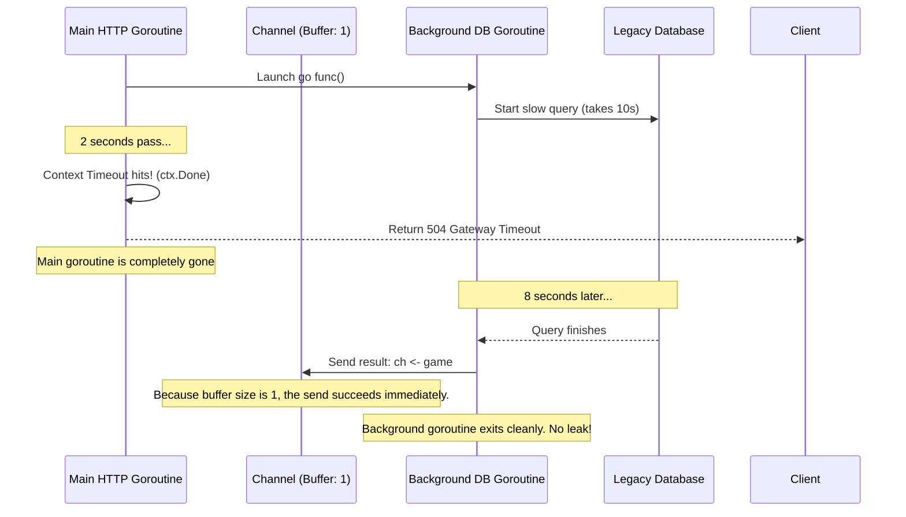
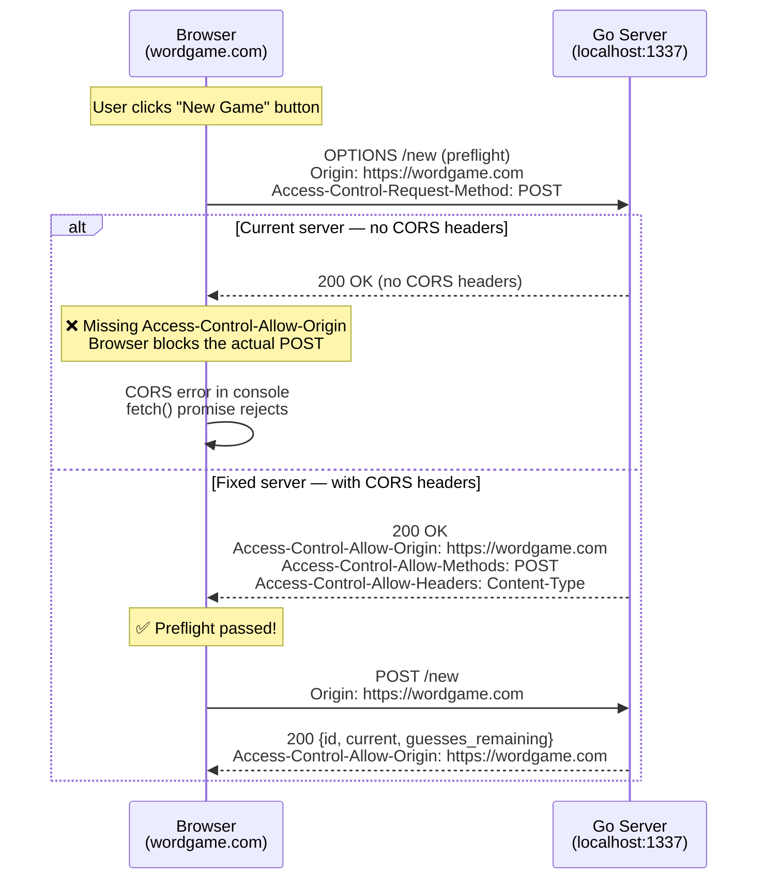
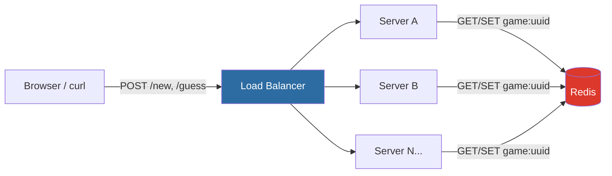
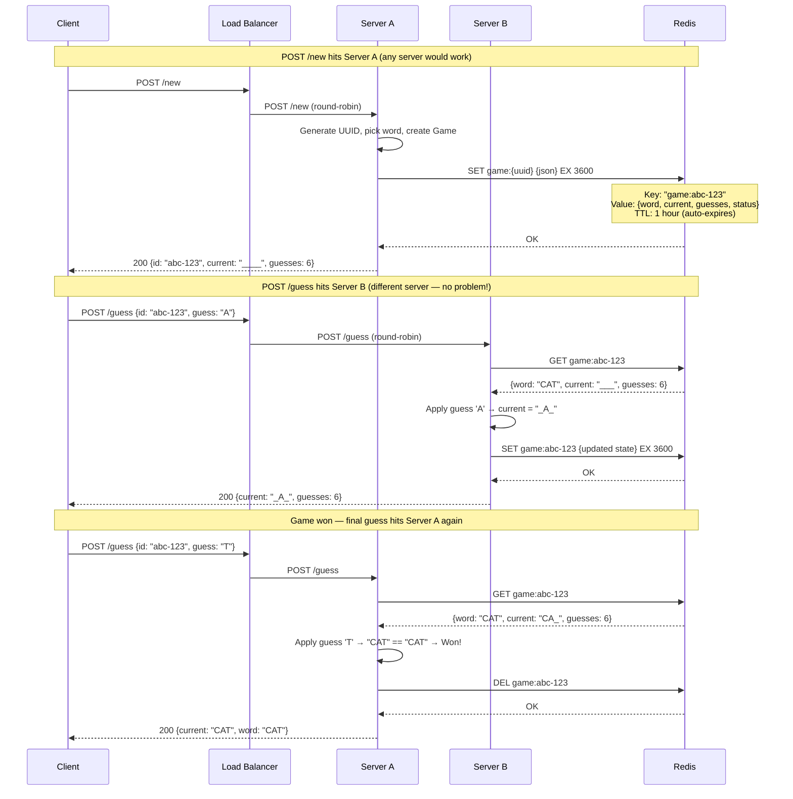
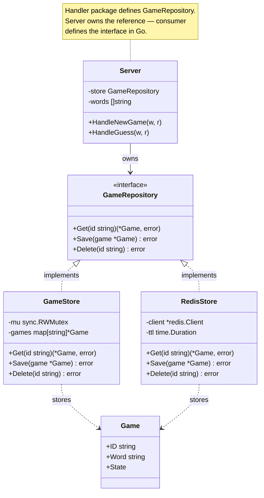
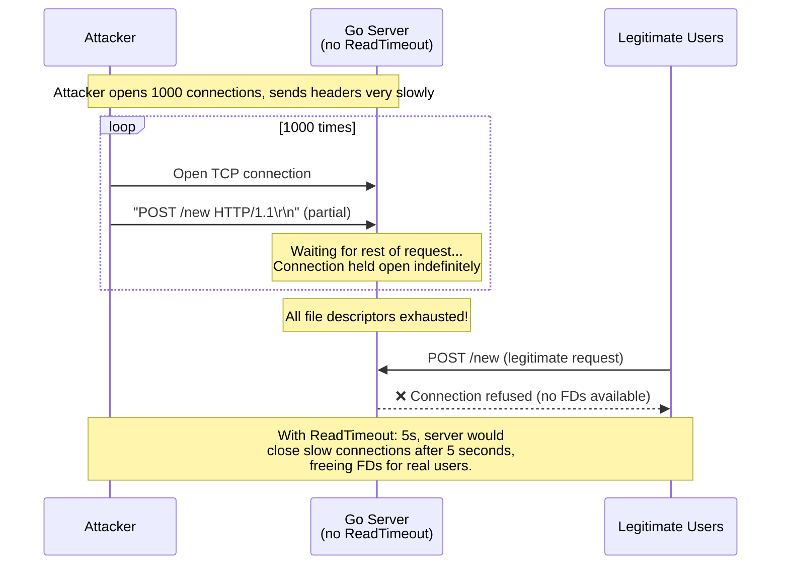

# Code Review: Improvements, Go Idioms & Scaling to 100,000 Users

### Go Idioms — Issues & Improvements

#### 1. Missing `context.Context` propagation

None of the handlers accept or propagate a `context.Context`. This is the single biggest Go idiom gap. Every HTTP handler receives a context via `r.Context()`, but the code never uses it. At scale, this matters because:

- You can't implement request timeouts or deadline propagation
- Graceful shutdown can't signal in-flight handlers to abort
- Tracing/observability middleware (OpenTelemetry, Datadog) relies on context to correlate spans

**Fix:** Thread `ctx context.Context` through `ApplyGuess`, `Store.Get`, etc., and use `select` on `ctx.Done()` where appropriate.

```go
func (g *Game) ApplyGuess(ctx context.Context, guess rune) error {
    // Check if request was cancelled before acquiring the lock
    select {
    case <-ctx.Done():
        return ctx.Err()
    default:
    }
    g.mu.Lock()
    defer g.mu.Unlock()
    // ...
}
```

**Example 1: Native Context Support (Modern Redis)**

If we implemented a Redis store, fetching data over the network might take too long. Modern drivers like `go-redis` accept a `context.Context` natively. If the user closes their browser (triggering `ctx.Done()`) or a timeout is reached, the driver automatically aborts the network request:

```go
func (s *RedisGameStore) Get(ctx context.Context, id string) (*game.Game, error) {
    // If the context is cancelled, s.client.Get immediately returns context.Canceled
    // and the underlying TCP connection handles the abort cleanly.
    data, err := s.client.Get(ctx, "game:"+id).Bytes()
    if err != nil {
        return nil, err
    }
    // ... unmarshal and return
}
```

**Example 2: Legacy Drivers & Avoiding Goroutine Leaks**

Sometimes you must integrate with a legacy database driver or a blocking library that *does not* accept a `context.Context`. To add a timeout, you have to run the blocking call in a separate goroutine and use `select`. 

**CRITICAL:** When doing this, the channel you use to receive the result **must be buffered**. If it is unbuffered and the context times out, the main function will return, leaving the background goroutine stuck forever trying to send to a channel that nobody is reading from. This is a classic Go memory leak.

```go
// BAD: Unbuffered channel causes a goroutine leak
func GetLegacyStore(ctx context.Context, id string) (*game.Game, error) {
    ch := make(chan *game.Game) // <-- UNBUFFERED!
    
    go func() {
        // This takes 10 seconds.
        game := legacyDB.Get(id) 
        // If the context timed out after 2 seconds, the main goroutine has returned.
        // This goroutine will block FOREVER trying to send to 'ch'.
        ch <- game 
    }()

    select {
    case <-ctx.Done():
        return nil, ctx.Err() // Main goroutine exits early
    case result := <-ch:
        return result, nil
    }
}

// GOOD: Buffered channel prevents the leak
func GetLegacyStoreSafe(ctx context.Context, id string) (*game.Game, error) {
    // Buffered channel of size 1
    ch := make(chan *game.Game, 1) 
    
    go func() {
        game := legacyDB.Get(id)
        // Even if the main goroutine is gone, this send will succeed 
        // because the buffer has room. The goroutine can then exit cleanly.
        ch <- game 
    }()

    select {
    case <-ctx.Done():
        return nil, ctx.Err()
    case result := <-ch:
        return result, nil
    }
}
```

**Sequence Diagram: Why the buffer saves the goroutine**




#### 2. Exported mutable fields on `Game` — breaks encapsulation

`Game.Status`, `Game.Current`, `Game.GuessesRemaining`, `Game.Word`, and `Game.ID` are all exported and directly mutated by tests:

```go
// game_test.go:110, 128, 232, 285 — directly set fields that the mutex should protect
g.Current = "CA_"
g.GuessesRemaining = 1
g.Status = StatusWon
```

This bypasses the `sync.RWMutex` entirely. Any external code can write to these fields without holding the lock. The embedded `State` struct's promotion makes this worse — it looks like you're just setting a field, but you're actually writing to a mutex-protected struct unsafely.

**Fix:** Make `State` fields unexported and provide constructor helpers or test-only builder methods:

```go
// game.go — unexport the mutable state
type State struct {
    current          string
    guessesRemaining int
    status           Status
}

// For tests that need pre-configured state:
func NewGameWithState(id, word, current string, guesses int, status Status) *Game { ... }
```

#### 3. `LetterRegex` compiled at package level — correct, but `regexp.MustCompile` is slightly wasteful for `^[A-Z]$`

The regex `^[A-Z]$` is being compiled into a finite automaton when a simple byte range check would be faster and allocation-free:

```go
// Current — allocates for regex engine
var LetterRegex = regexp.MustCompile(`^[A-Z]$`)

// Idiomatic Go — zero allocations, ~10x faster
func isUpperAlpha(r rune) bool {
    return r >= 'A' && r <= 'Z'
}
```

This matters at 100k users because `validateRune` is called on every single guess. The regex is also exported (`LetterRegex`) which couples the handler to the game's internal validation representation — if you change the regex, the handler's behaviour might silently change.

#### 4. `json.Encoder.Encode` error silently discarded in `response.go`

```go
// response.go:12
_ = json.NewEncoder(w).Encode(v)
```

If JSON marshalling fails (e.g. a field contains an invalid value), the error is silently swallowed. The response will be a partial/empty JSON body with a 200 status code already written. This is a known Go pitfall — `WriteHeader` can't be unwritten.

**Fix:** Marshal to a buffer first, then write:

```go
func writeJSON(w http.ResponseWriter, status int, v any) {
    data, err := json.Marshal(v)
    if err != nil {
        http.Error(w, `{"error":"internal error"}`, http.StatusInternalServerError)
        return
    }
    w.Header().Set("Content-Type", "application/json")
    w.WriteHeader(status)
    w.Write(data)
}
```

#### 5. `Status` type has no `String()` method

`Status` is an `int` iota (`StatusInProgress = 0`, `StatusWon = 1`, `StatusLost = 2`). When logged or printed, it shows as `0`, `1`, `2` — meaningless. Go convention is to implement `fmt.Stringer`:

```go
func (s Status) String() string {
    switch s {
    case StatusInProgress: return "in_progress"
    case StatusWon:        return "won"
    case StatusLost:       return "lost"
    default:               return fmt.Sprintf("unknown(%d)", int(s))
    }
}
```

Or use `go generate` with `stringer` for automatic generation.

#### 6. Handler does redundant method checks — gorilla/mux already does this

Both `HandleNewGame` and `HandleGuess` start with:

```go
if r.Method != http.MethodPost {
    writeError(w, http.StatusMethodNotAllowed, "method not allowed")
    return
}
```

But `registerRoutes` already constrains methods via `.Methods(http.MethodPost)`. The gorilla/mux router will return 405 automatically for non-POST requests. The handler checks are dead code in production — they only fire in unit tests that bypass the router.

**Trade-off:** This is "defence in depth" and isn't strictly wrong, but it duplicates router responsibility. If the handler is always called through the router, these checks are wasted cycles.

#### 7. `pickWord` uses `rand.IntN` (math/rand/v2) — not cryptographically random

For a game, this is fine. But if word selection ever needs to be unpredictable (e.g. anti-cheat), `math/rand/v2` is deterministic if seeded. Go 1.21+ auto-seeds from crypto/rand, so it's OK in practice, but worth noting.

#### 8. `pkg/identifier` still uses the mutable global pattern

**Current code — the problem:**

```go
// id.go:12 — package-level mutable var
var newUUID = uuid.NewRandom

// id_test.go:60-61 — the fragile defer restore
orig := newUUID
defer func() { newUUID = orig }()
newUUID = func() (uuid.UUID, error) {
    return uuid.Nil, errors.New("crypto/rand failure")
}
```

This is the exact pattern the handler package refactored away from. The codebase defends functional options as superior to mutable globals, but `pkg/identifier` still uses the old approach.

**Why this matters — three concrete problems:**

1. **Fragile test setup.** If you forget the `defer restore`, the next test in the same package uses the broken generator. Silent test pollution.
2. **No `t.Parallel()` safety.** If you ever add `t.Parallel()` to `id_test.go`, two tests swapping the same global will race. The race detector will flag it.
3. **Inconsistency.** The handler package uses `WithIDGenerator(fn)` to inject test behaviour cleanly. The identifier package does the same thing with a global swap. A reader seeing both patterns in the same codebase has to ask: "which is the right way?"

**Proposed refactor — `Generator` struct with functional option:**

```go
// id.go — REFACTORED
package identifier

import (
    "fmt"
    "github.com/google/uuid"
)

// UUIDFunc is the function signature for generating a UUID.
type UUIDFunc func() (uuid.UUID, error)

// Generator produces unique identifiers.
// The zero value is not usable — always use NewGenerator().
type Generator struct {
    newUUID UUIDFunc
}

// Option configures a Generator.
type Option func(*Generator)

// WithUUIDFunc overrides the default UUID generator (for testing).
func WithUUIDFunc(fn UUIDFunc) Option {
    return func(g *Generator) { g.newUUID = fn }
}

// NewGenerator creates a Generator with uuid.NewRandom as the default.
func NewGenerator(opts ...Option) *Generator {
    g := &Generator{newUUID: uuid.NewRandom}
    for _, opt := range opts {
        opt(g)
    }
    return g
}

// GenerateIdentifier produces a new UUID v4 string.
func (g *Generator) GenerateIdentifier() (string, error) {
    id, err := g.newUUID()
    if err != nil {
        return "", fmt.Errorf("generate game ID: %w", err)
    }
    return id.String(), nil
}

// --- Package-level convenience wrapper ---
// Keeps the original API: callers use identifier.GenerateIdentifier()
// without needing to know about the Generator struct.
var defaultGenerator = NewGenerator()

// GenerateIdentifier is the package-level convenience function.
// Zero config for production callers — same signature as before the refactor.
func GenerateIdentifier() (string, error) {
    return defaultGenerator.GenerateIdentifier()
}
```

The key insight: `defaultGenerator` is not a mutable global like the old `var newUUID`. It's a **read-only, immutable** package-level value — created once at init, never swapped. The old pattern's problem was `newUUID = func() { ... }` in tests mutating a shared global. Here, `defaultGenerator` is never reassigned; tests that need different behaviour create their own `NewGenerator(WithUUIDFunc(...))`.

**Test code — REFACTORED (no globals, no defer restore):**

```go
// id_test.go — clean, parallel-safe
func TestGenerateIdentifier_Error(t *testing.T) {
    t.Parallel() // ← safe now! Each test has its own Generator

    gen := NewGenerator(WithUUIDFunc(func() (uuid.UUID, error) {
        return uuid.Nil, errors.New("crypto/rand failure")
    }))

    id, err := gen.GenerateIdentifier()
    if err == nil {
        t.Fatal("expected error from failing UUID generator")
    }
    if id != "" {
        t.Errorf("expected empty id on error, got %q", id)
    }
}
```

**Handler wiring — production code stays unchanged:**

Because `GenerateIdentifier()` still exists as a package-level function (backed by `defaultGenerator`), the handler's default wiring doesn't change at all:

```go
// main.go — UNCHANGED from current code. Zero ceremony.
srv := handler.NewServer(gameStore, wordList)
// handler.go still defaults to: generateID: identifier.GenerateIdentifier

// handler_test.go — test override (also unchanged! compatible API)
srv := NewServer(s, words, WithIDGenerator(func() (string, error) {
    return "", errors.New("uuid failure")
}))

// id_test.go — the ONLY place that uses the Generator struct directly
gen := NewGenerator(WithUUIDFunc(func() (uuid.UUID, error) {
    return uuid.Nil, errors.New("crypto/rand failure")
}))
id, err := gen.GenerateIdentifier() // parallel-safe, no defer restore
```

The `Generator` struct and `WithUUIDFunc` option exist **solely** for `id_test.go`'s own parallel-safe tests. No other package needs to know about them.

**Two functional options — perfectly canonical Go:**

`handler.WithIDGenerator(func() (string, error))` and `identifier.WithUUIDFunc(func() (uuid.UUID, error))` look similar but serve different layers with different types:

| Option | Package | Type signature | Constructor | Purpose |
|--------|---------|----------------|-------------|---------|
| `WithIDGenerator` | `handler` | `func() (string, error)` | `NewServer(...)` | Override how the **handler** gets an ID string |
| `WithUUIDFunc` | `identifier` | `func() (uuid.UUID, error)` | `NewGenerator(...)` | Override how the **generator** produces a UUID |

Each package owns its own option type — that's the standard Go pattern. `zap.NewProduction(opts ...zap.Option)` doesn't share a type with `grpc.NewServer(opts ...grpc.ServerOption)`. No conflict, no duplication. The handler doesn't know or care that the identifier uses a `Generator` internally — it just calls a `func() (string, error)`.

**Before vs After — summary:**

| Aspect | Before (mutable global) | After (Generator + convenience func) |
|--------|------------------------|--------------------------------------|
| Test isolation in `id_test.go` | `defer restore` required — easy to forget | Each test creates its own `Generator` |
| `t.Parallel()` in `id_test.go` | Unsafe — global swap races | Safe — no shared mutable state |
| Production code (`main.go`) | `NewServer(store, words)` — zero config | `NewServer(store, words)` — **unchanged** |
| Handler tests | `WithIDGenerator(fn)` — clean | `WithIDGenerator(fn)` — **unchanged** |
| Adding new options to identifier | Add another `var` global | Add another `WithXxx` option |
| Consistency with handler | Different pattern (global swap) | Same functional options pattern |

---

### Important Code Improvements

#### 1. Graceful shutdown (critical for production)

`http.ListenAndServe` blocks forever and returns immediately on error. There's no signal handling. `SIGTERM` from a container orchestrator (Kubernetes, Docker, Heroku) will kill in-flight requests mid-response.

```go
// main.go — current
if err := http.ListenAndServe(addr, r); err != nil {
    return err
}

// Improved
srv := &http.Server{Addr: addr, Handler: r}
go func() {
    sigCh := make(chan os.Signal, 1)
    signal.Notify(sigCh, syscall.SIGTERM, syscall.SIGINT)
    <-sigCh
    ctx, cancel := context.WithTimeout(context.Background(), 10*time.Second)
    defer cancel()
    srv.Shutdown(ctx)
}()
return srv.ListenAndServe()
```

**What this code exactly does and why it's needed:**

When a container orchestrator like Kubernetes or Docker wants to stop your server (e.g., during a new deployment or scaling down), it sends a `SIGTERM` signal to the process. If your server doesn't handle this signal, the OS will abruptly terminate the process. This means any active HTTP requests — for instance, a user in the middle of submitting a guess — will immediately fail, and the connection will drop.

The "Improved" code fixes this by handling the shutdown gracefully:

1. **Listen for OS Signals:** It sets up a channel (`sigCh`) and tells the OS to notify it when `SIGTERM` (terminate) or `SIGINT` (Ctrl+C / interrupt) is received via `signal.Notify`.
2. **Run in Background:** A goroutine `go func() { ... }()` waits for these signals to arrive by blocking on `<-sigCh`. Meanwhile, the main thread continues down to `srv.ListenAndServe()`, which blocks and starts accepting incoming HTTP traffic.
3. **Trigger Shutdown:** When a termination signal is received, the goroutine unblocks. It creates a `context` with a 10-second timeout and calls `srv.Shutdown(ctx)`.
4. **Drain In-Flight Requests:** `srv.Shutdown` does two critical things:
   - It immediately stops accepting *new* connections (closing the listening port).
   - It waits (up to the context timeout) for all *active* requests to finish processing and send their responses to clients.
5. **Enforce a Deadline:** The 10-second context timeout ensures the server won't hang forever if an active request gets stuck (e.g., waiting on a slow database or network call). If 10 seconds pass, it force-quits the remaining connections so the process can exit.

This pattern ensures zero downtime and no dropped requests during deployments, which is essential for a production API.

#### 2. No request body size limits

`decodeJSONBody` reads `r.Body` with no size limit. A malicious client can POST a multi-gigabyte body to `/guess` and OOM the server.

```go
// Fix: limit request body to a reasonable size
r.Body = http.MaxBytesReader(w, r.Body, 1024) // 1KB is plenty for {"id":"...","guess":"A"}
```

#### 3. No structured logging

`log.Printf` with raw strings isn't queryable. At 100k users, you need structured logs (JSON) with request IDs, game IDs, latencies for debugging.

**Fix:** Use `log/slog` (stdlib since Go 1.21):

```go
logger := slog.New(slog.NewJSONHandler(os.Stderr, nil))
logger.Info("guess processed", "game_id", g.ID, "guess", guess, "status", snap.Status)
```

#### 4. No health/readiness endpoints

Any production deployment behind a load balancer needs:

- `GET /healthz` — liveness probe (is the process alive?)
- `GET /readyz` — readiness probe (can it serve traffic? word list loaded?)

Without these, Kubernetes/ECS can't health-check the service.

#### 5. No CORS headers

**What is CORS?** CORS (Cross-Origin Resource Sharing) is a browser security mechanism. When JavaScript on one domain (e.g. `https://wordgame.com`) tries to call an API on a different domain (e.g. `https://api.wordgame.com:1337`), the browser blocks the request by default. This is the "same-origin policy" — it prevents malicious websites from making requests to your bank's API using your cookies.

To allow legitimate cross-origin requests, the API server must include specific HTTP headers in its responses telling the browser "yes, this origin is allowed to call me."

**How it breaks the wordgame API — concrete example:**

Imagine you build a React frontend for the word game, hosted at `https://wordgame.com`. The frontend tries to call the API:

```javascript
// Frontend JavaScript (running in browser at https://wordgame.com)
const response = await fetch('http://localhost:1337/new', {
    method: 'POST',
    headers: { 'Content-Type': 'application/json' }
});
// ❌ Browser blocks this! "Access to fetch at 'http://localhost:1337/new'
//    from origin 'https://wordgame.com' has been blocked by CORS policy:
//    No 'Access-Control-Allow-Origin' header is present on the requested resource."
```

The browser doesn't even let the request reach your Go server. The user sees nothing — the game silently fails.

**What happens under the hood — preflight request:**

For `POST` requests with `Content-Type: application/json`, the browser sends a **preflight** request first (an `OPTIONS` request) to check if the server allows cross-origin calls. If the server doesn't respond with the right headers, the actual `POST` never fires:



**Fix — add CORS middleware:**

```go
// middleware.go — simple CORS middleware (no external dependency)
func corsMiddleware(next http.Handler) http.Handler {
    return http.HandlerFunc(func(w http.ResponseWriter, r *http.Request) {
        // Tell the browser which origins can call this API
        w.Header().Set("Access-Control-Allow-Origin", "https://wordgame.com")
        // Tell the browser which methods are allowed
        w.Header().Set("Access-Control-Allow-Methods", "POST, OPTIONS")
        // Tell the browser which headers it can send
        w.Header().Set("Access-Control-Allow-Headers", "Content-Type")

        // Handle the preflight OPTIONS request — just respond 200, don't process further
        if r.Method == http.MethodOptions {
            w.WriteHeader(http.StatusOK)
            return
        }

        next.ServeHTTP(w, r)
    })
}

// main.go — wrap the router
r := mux.NewRouter()
registerRoutes(r, srv)
http.ListenAndServe(addr, corsMiddleware(r)) // ← CORS wraps everything
```

**When you don't need this:** If the API is only ever called from `curl`, Postman, or server-to-server — CORS doesn't apply. Browsers are the only clients that enforce the same-origin policy. But the moment you build a web frontend, this is a hard blocker.

#### 6. No game expiry / TTL

Abandoned games live forever in memory. A user who creates a game and never finishes it permanently leaks a `Game` struct. At 100k users creating games, this is an unbounded memory leak.

**Fix:** Add a `CreatedAt time.Time` to `Game` and run a background goroutine that sweeps expired games:

```go
func (s *GameStore) evictExpired(ttl time.Duration) {
    ticker := time.NewTicker(ttl / 2)
    for range ticker.C {
        s.mu.Lock()
        for id, g := range s.games {
            if time.Since(g.CreatedAt) > ttl {
                delete(s.games, id)
            }
        }
        s.mu.Unlock()
    }
}
```

#### 7. `words.txt` path is hardcoded and relative

```go
// main.go:49
f, err := os.Open("words.txt")
```

This fails if the binary is run from any directory other than the project root. It's a common deployment pitfall. Should be configurable via flag/env:

```go
cmd.Flags().StringVar(&wordFile, "words", "words.txt", "Path to word list file")
```

#### 8. No request ID / correlation

Without a request ID header (e.g. `X-Request-ID`), correlating logs across handler → game → store for a single request is impossible at scale.

---

### Scaling to 100,000 Concurrent Users — What Breaks

#### Memory: the map becomes a bottleneck

**Current:** `map[string]*Game` with a single `sync.RWMutex`.

At 100k concurrent users, assume ~50k active games (some users playing, some idle). Each `Game` struct is small (~200 bytes), so raw data is ~10MB — fine. But the single RWMutex on the store becomes a write bottleneck:

- Every `POST /new` takes a **write lock** on the entire map to `Save()`
- Every `POST /guess` that ends a game takes a **write lock** to `Delete()`
- While any write is held, all `Get()` readers block

With 100k concurrent users, `Save`/`Delete` will serialise thousands of requests behind one mutex.

**Fix: Sharded map**

```go
const numShards = 256

type ShardedStore struct {
    shards [numShards]struct {
        mu    sync.RWMutex
        games map[string]*game.Game
    }
}

func (s *ShardedStore) shard(id string) int {
    h := fnv.New32a()
    h.Write([]byte(id))
    return int(h.Sum32()) % numShards
}
```

This reduces contention by 256x — writes to shard 7 don't block reads from shard 42.

#### Persistence & horizontal scaling: Redis as shared game store

**The core problem:** The current in-memory `map[string]*Game` is local to a single process. This has two consequences:

1. **Restarts lose everything.** A deploy, crash, or OOM kills all active games instantly.
2. **Can't run multiple replicas.** If a load balancer routes `POST /new` to Server A and the next `POST /guess` to Server B, Server B has never heard of that game — 404.

**The minimal fix: replace the in-memory store with Redis.** No WebSockets, no sticky sessions, no complex coordination. Redis is a single shared data store that all replicas read from and write to. It gives us three things for free:

- **Persistence across restarts** — games survive server redeploys
- **Horizontal scaling** — any replica can serve any game because game state lives in Redis, not in process memory
- **Built-in TTL** — `SETEX` automatically deletes abandoned games after a timeout (solves the game expiry problem too)

**Why not sticky sessions or WebSockets?** The API is stateless REST — each request contains the game ID. There's no long-lived connection to maintain. Sticky sessions (routing a user to the same server) add complexity for zero benefit when the state is already externalised. WebSockets would be needed if we wanted real-time push updates (e.g. multiplayer), but the current design is request-response — the client asks, the server answers.

**Minimal architecture with Redis:**



**How requests flow through Redis — sequence diagram:**



**What changes in the code — implementing `RedisGameStore`:**

The store interface (which we'd now extract from the handler) stays the same. Only the implementation changes:

```go
// internal/store/redis_store.go
type RedisGameStore struct {
    client *redis.Client
    ttl    time.Duration
}

func (s *RedisGameStore) Save(g *game.Game) error {
    data, _ := json.Marshal(g)
    return s.client.Set(ctx, "game:"+g.ID, data, s.ttl).Err()
}

func (s *RedisGameStore) Get(id string) (*game.Game, error) {
    data, err := s.client.Get(ctx, "game:"+id).Bytes()
    if errors.Is(err, redis.Nil) {
        return nil, nil // not found
    }
    var g game.Game
    json.Unmarshal(data, &g)
    return &g, nil
}

func (s *RedisGameStore) Delete(id string) error {
    return s.client.Del(ctx, "game:"+id).Err()
}
```

**Domain model with Redis — what owns what:**



**This is exactly when the codebase needs its first interface.** The handler currently takes `*store.GameStore` directly (see §1 — "Why no interfaces?"). With Redis, you now have two implementations, so you extract the interface at the consumer:

```go
// internal/handler/handler.go — the consumer defines the interface
type GameRepository interface {
    Get(id string) (*game.Game, error)
    Save(g *game.Game) error
    Delete(id string) error
}

type Server struct {
    store GameRepository   // ← was *store.GameStore
    words []string
}
```

Both `InMemoryStore` (for tests, local dev) and `RedisStore` (for production) satisfy the interface. The handler code doesn't change at all.

**What Redis gives us for free — no custom code needed:**

| Feature | Without Redis (current) | With Redis |
|---------|------------------------|------------|
| Game TTL / expiry | Must build custom goroutine sweeper | `SETEX` — Redis auto-deletes after TTL |
| Persistence across restarts | All games lost | Games survive (Redis persists to disk via RDB/AOF) |
| Multiple server replicas | Impossible — state is process-local | Any replica reads/writes the same Redis |
| Atomic operations | Manual mutex management | Redis commands are atomic by design |
| Memory management | Unbounded Go map growth | Redis has `maxmemory` with eviction policies |

#### Rate limiting: no protection against abuse

With 100k users, some will be bots or abusers. Currently:

- No rate limiting on `POST /new` — one client can create millions of games
- No rate limiting on `POST /guess` — can brute-force all 26 letters in <1 second
- No authentication — can't even identify who's creating games

**Fix:** Add middleware with `golang.org/x/time/rate` or a reverse proxy rate limiter (nginx, Envoy):

```go
// Per-IP rate limiter middleware
limiter := rate.NewLimiter(rate.Every(time.Second), 10) // 10 req/sec burst
```

#### Connection handling: no timeouts on the HTTP server

```go
// Current — no timeouts at all
http.ListenAndServe(addr, r)

// At 100k users, slow clients can hold connections open indefinitely
srv := &http.Server{
    Addr:         addr,
    Handler:      r,
    ReadTimeout:  5 * time.Second,
    WriteTimeout: 10 * time.Second,
    IdleTimeout:  120 * time.Second,
}
```

**What is a slowloris attack?** A slowloris is a denial-of-service attack where a single attacker opens many connections to the server but sends data extremely slowly — for example, sending one byte of the HTTP request every 30 seconds. The server keeps the connection open waiting for the full request to arrive. Without a `ReadTimeout`, the server will hold that connection open indefinitely. An attacker can open thousands of these slow connections, exhausting the server's file descriptor limit (typically 1024 or 65535), which means the server can't accept any new legitimate connections. The fix is simple: `ReadTimeout: 5 * time.Second` forces the server to close any connection that hasn't sent a complete request within 5 seconds.



#### Observability: no metrics or tracing

At 100k users, you need:

- **Metrics** (Prometheus): request latency, error rates, active games count, store size
- **Tracing** (OpenTelemetry): request → store.Get → game.ApplyGuess spans
- **Alerting**: fire when error rate > 1%, P99 latency > 500ms, store size > threshold

**Fix:** Add a `/metrics` endpoint with `prometheus/client_golang`:

```go
var (
    gamesCreated = promauto.NewCounter(prometheus.CounterOpts{Name: "games_created_total"})
    guessLatency = promauto.NewHistogram(prometheus.HistogramOpts{Name: "guess_duration_seconds"})
)
```

#### Word list loading: 370k lines loaded into a `[]string` slice

`words.txt` has 370,102 lines (4.2MB). After filtering, the valid words are loaded into a `[]string` held in memory. At 100k users this is fine (single copy, read-only after startup). But `pickWord()` uses `rand.IntN(len(words))` — the `[]string` can't be changed at runtime without a restart (no hot-reload).

If word list updates are needed at scale, consider loading from a database or config service.

#### Summary: what to fix first for 100k users

| Priority | Issue | Impact at 100k users |
|----------|-------|---------------------|
| **P0** | Graceful shutdown | Data loss on every deploy |
| **P0** | Request body size limits | OOM (Out-Of-Memory crash) from a single malicious request |
| **P0** | HTTP server timeouts | Slowloris DoS (see explanation above) takes down the server |
| **P1** | Redis as game store | Solves persistence, horizontal scaling, AND game TTL in one move |
| **P1** | Rate limiting | Brute-force and game creation spam |
| **P2** | `context.Context` propagation | Can't timeout or cancel slow requests |
| **P2** | Structured logging + request IDs | Can't debug issues across 100k users |
| **P2** | Metrics + health endpoints | Blind to performance degradation |
| **P3** | CORS headers | Hard blocker the moment a web frontend is built (see §5 above) |
| **P3** | Authentication, API versioning | Production API hygiene |

> **Key insight:** Redis at P1 is a single change that solves three problems at once — persistence (games survive restarts), horizontal scaling (any replica can serve any game), and game expiry (Redis TTL auto-deletes abandoned games). It replaces the need for a sharded in-memory map, a custom TTL sweeper goroutine, and sticky sessions. The `GameRepository` interface extracted for Redis also makes the codebase properly testable with mock stores.
