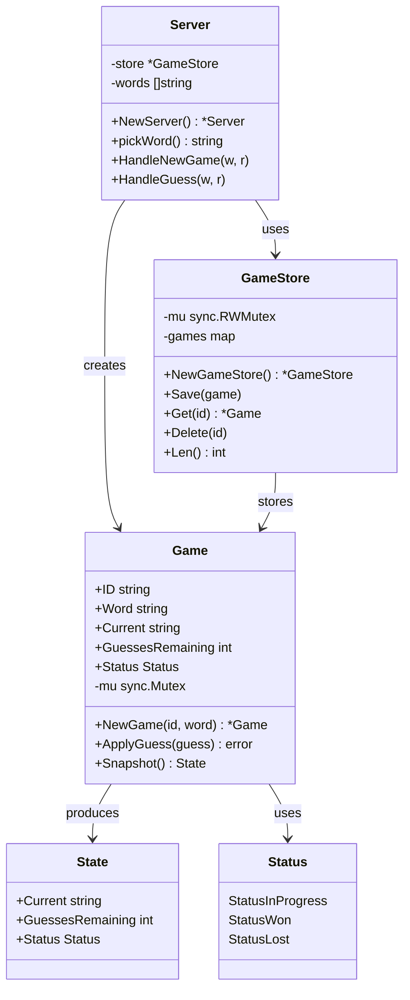
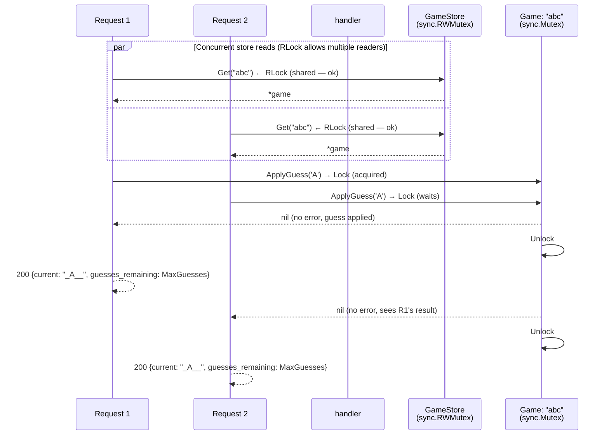
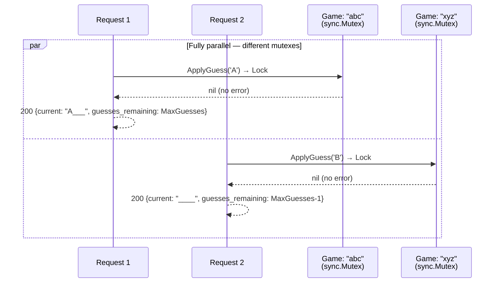

# Word Game — Domain Model & Code Structure

> How the codebase is organised, why each package exists, and how domain concepts map to code.

---

## Class Diagram



### Field Visibility Convention

| Prefix | Meaning | Example |
|--------|---------|---------|
| `+` | Exported (public) | `Game.ID`, `NewGameStore()` |
| `-` | Unexported (private) | `Game.mu`, `GameStore.games` |

---
**Rules enforced by Go:**

- `cmd/` can import `internal/` and `pkg/`
- `internal/` can import `pkg/` and other `internal/` packages
- `pkg/` can only import standard library + external deps (no `internal/`)
- No external module can import `internal/` — Go compiler blocks it

**Direction:** Dependencies flow toward stability. `pkg/` packages have zero internal dependencies. `internal/game` has zero I/O. `internal/handler` orchestrates but contains no business rules.

---

**Why Game is the aggregate root:** Every operation revolves around a `Game` instance. The `Game` enforces its own invariants (no guesses after win/loss, valid letters only). Nothing outside the `Game` can break its state.

---

## Package Separation — Why Three `internal/` Packages

```
internal/handler   →  HTTP layer (controllers)
internal/game      →  Domain logic (pure, no I/O)
internal/store     →  Data access (repository)
```

### `internal/handler` — HTTP Concerns Only (4 files, each with a single responsibility)

**Files:**

| File | Responsibility | Reason to change |
|------|---------------|------------------|
| `handler.go` | Orchestration — routes requests through the flow | New endpoint, different orchestration order |
| `request.go` | JSON decode, Postel's Law normalisation | New input format, different normalisation rules |
| `response.go` | JSON response encoding | Different serialisation format |
| `types.go` | Request/response DTOs | API contract changes |

**What it does:**

- Decodes JSON request bodies (`decodeJSONBody` in `request.go`)
- Applies Postel's Law (`normaliseGuess` in `request.go`)
- Validates input (string length checks in `handler.go`; character-level A-Z validation delegated to `game.ApplyGuess` via `errors.Is(err, game.ErrInvalidGuess)`)
- Encodes JSON responses (`writeJSON`/`writeError` in `response.go`)
- Orchestrates the flow: store → game logic → snapshot → response (in `handler.go`)

**What it does NOT do:**

- Know how letters are matched in a word
- Know how guesses are counted
- Know how game state is stored (map? database? Redis?)
- Contain any business rules

**Why separated:** You can swap the HTTP layer (e.g., gRPC, WebSocket, CLI) without touching game logic. You can test game logic without spinning up an HTTP server.

### `internal/game` — Pure Business Logic

**What it does:**

- Creates new games (`NewGame`)
- Processes guesses (`ApplyGuess`)
- Enforces game rules (win/loss detection, valid letters)
- Provides thread-safe snapshots (`Snapshot`)
- Owns its own mutex for concurrency

**What it does NOT do:**

- Read from the network
- Write JSON
- Know about HTTP status codes
- Know about the store

**Why separated:** This is the heart of the domain. It has zero I/O dependencies — just `fmt` and `strings`. You can unit-test every rule in isolation with no mocks. If the game rules change (e.g., 8 guesses instead of MaxGuesses (6)), you change only this package.

### `internal/store` — Data Access (Repository)

**What it does:**

- Thread-safe CRUD for `Game` instances
- In-memory `map[string]*Game` with `sync.RWMutex`

**What it does NOT do:**

- Know HTTP
- Know game rules
- Know word loading

**Why separated:** If you ever replace the in-memory map with Redis, PostgreSQL, or an on-disk store, you change only this package. The handler and game logic remain untouched.

*(The request flow through packages is documented in detail below — see [Request Flow Through Packages](#request-flow-through-packages).)*

---

## Why There Are No Interfaces (Yet)

Every package currently has **exactly one concrete implementation**:

| Package | Implementation | Interface would be |
|---------|---------------|-------------------|
| `internal/store` | In-memory `GameStore` | `GameRepository` |
| `pkg/words` | `LoadWords(io.Reader)` | `WordLoader` |
| `pkg/identifier` | `GenerateIdentifier()` | `IDGenerator` |

**We don't extract interfaces because:**

 **YAGNI** (You Ain't Gonna Need It) — there is no second implementation to abstract over. Extracting an interface now adds indirection without benefit.

**When would we add interfaces?**

If any of these happened:

- **PostgreSQL store** — create `GameRepository` interface, implement `PostgresGameStore`
- **Multiple word sources** — create `WordLoader` interface, implement `FileLoader` and `APILoader`
- **Integration tests** — inject a real store but a fake word list

The Go convention is: **define interfaces where they are consumed, not where they are implemented.** So the `Server` struct would own the interface definition:

```go
// hypothetical — NOT implemented
type GameRepository interface {
    Get(id string) *game.Game
    Save(g *game.Game)
    Delete(id string)
}

type Server struct {
    store GameRepository  // ← accepts anything that satisfies the interface
    words []string
}
```

This is the opposite of Java/C# — the interface lives with the consumer, not the implementation. We haven't reached a point where this pays off.

---

## Request Flow Through Packages

```
1. Client sends POST /guess
         │
         ▼
2. gorilla/mux routes to Handler.HandleGuess
         │
         ▼
3. Handler calls decodeJSONBody(r, &req)   ← request.go: JSON decode
         │
         ▼
4. Handler checks req.ID != ""              ← handler.go: missing ID check
         │
         ▼
5. Handler calls normaliseGuess(req.Guess)  ← request.go: Postel's Law
         │  (TrimSpace + ToUpper)
         ▼
6. Handler validates string structure            ← handler.go: inline checks
         │  (empty → "missing guess", len>1 → "too long")
         ▼
7. Handler calls Store.Get(id)                     ← data access
         │
         ▼
8. Handler calls Game.ApplyGuess(rune(guess[0]))   ← business logic
         │  (mu.Lock → validateInProgress → validateRune
         │   → isCorrectGuess → applyCorrectGuess/applyWrongGuess
         │   → mu.Unlock)
         │
         │  Note: validateRune owns A-Z character validation.
         │  The handler catches ErrInvalidGuess via errors.Is
         │  and returns 422. The handler's own length checks
         │  (empty, too-long) prevent broken runes from ever
         │  reaching the game.
         ▼
9. Handler calls Game.Snapshot()                   ← thread-safe read
         │
         ▼
10. If game won/lost:
    │  Handler sets response.Word
    │  Handler calls Store.Delete(id)       ← cleanup
         │
         ▼
11. Handler writes JSON 200 response        ← response.go: writeJSON
```

**Key insight:** The handler never reads `Game.Current` or `Game.GuessesRemaining` directly — it always goes through `Snapshot()` to avoid data races. Similarly, it never touches the store's internal map directly — it uses `Get`/`Save`/`Delete` which handle locking internally.

**Single-responsibility flow within each package:**

- `handler.go` orchestrates — string validation (empty, too-long) is inline. A-Z validation is delegated to `game.ApplyGuess` via `errors.Is(err, game.ErrInvalidGuess)`. JSON decode/serialise lives in `request.go`/`response.go`.
- `game.go`'s `ApplyGuess` delegates to five sub-methods: `validateInProgress`, `validateRune`, `isCorrectGuess`, `applyCorrectGuess`, `applyWrongGuess` — each has exactly one reason to change
- `cmd/wordgame/main.go` — `main()` is a thin wrapper; startup logic lives in `run(stderr)` for testability

---

## Build Order

Build bottom-up — each step depends only on packages already built:

| Step | Package | File | What to build |
|------|---------|------|---------------|
| 1 | `pkg/identifier/` | `id.go` | `GenerateIdentifier() (string, error)` — UUID v4 via `fmt.Errorf` + `%w` |
| 2 | `pkg/words/` | `loader.go` | `LoadWords(r io.Reader) ([]string, error)` — decoupled from filesystem |
| 3 | `internal/game/` | `game.go` | `Game` struct, `NewGame()`, `ApplyGuess(rune)` — pure business logic |
| 4 | `internal/store/` | `store.go` | `GameStore` with `sync.RWMutex` — `Get`, `Save`, `Delete` |
| 5 | `internal/handler/` | `handler.go`, `request.go`, `response.go`, `types.go` | `Server` struct (DI), handlers, Postel's Law, JSON helpers, DTOs |
| 6 | `cmd/wordgame/` | `main.go` | Open `words.txt`, wire everything, register routes, `ListenAndServe` |

---

## Game Method Responsibility Table

`ApplyGuess` is an orchestrator — it delegates to five single-responsibility methods. Each has exactly one reason to change:

| Method | Responsibility |
|--------|---------------|
| `validateInProgress` | Precondition: game not already won/lost |
| `validateRune` | Defensive: guess is `[A-Z]` |
| `isCorrectGuess` | Match: does the letter appear in the word? |
| `applyCorrectGuess` | Mutate: reveal letter + detect win |
| `applyWrongGuess` | Mutate: decrement guess + detect loss |

Sentinel errors (`ErrGameCompleted`, `ErrInvalidGuess`) allow callers to use `errors.Is` for precise matching.

---

## Entry Point Wiring

`cmd/wordgame/main.go` — uses [Cobra](https://github.com/spf13/cobra) for CLI parsing:

1. `main()` calls `NewRootCommand().Execute()` — exits 1 on error
2. `NewRootCommand()` defines the `--port` / `-p` flag (default: `PORT` env var, fallback `"1337"`), auto-generates `--help` text, and wires `RunE` to `runServer`
3. `runServer(stderr, port)` opens `words.txt`, loads words, creates `store.NewGameStore()`, creates `handler.NewServer(store, words)`, calls `registerRoutes(r, srv)`, and starts `http.ListenAndServe`
4. `registerRoutes(r, srv)` is the single source of truth for HTTP routing — shared by `runServer()` and smoke tests

Startup diagnostic messages (word count, listen address) go through a `log.New(stderr, ...)` logger. Cobra's `cmd.OutOrStderr()` passes the writer, so tests can capture output via `cmd.SetErr(buf)`.

---

## Concurrency Model

Two-level locking: `GameStore.RWMutex` protects the game map, `Game.Mutex` protects a single game's state.

### Same game, concurrent guesses



### Different games, no contention



**Two-level locking:**

| Lock | Protects | Acquired by |
|------|----------|-------------|
| `GameStore.RWMutex` (RLock) | The `games` map during lookups | `Store.Get` |
| `GameStore.RWMutex` (Lock) | The `games` map during mutations | `Store.Save`, `Store.Delete` |
| `Game.Mutex` (Lock) | A single game's state | `Game.ApplyGuess`, `Game.Snapshot` |

This means:

- Looking up games is concurrent — `RWMutex.RLock` allows many readers
- Creating or deleting a game briefly blocks new lookups — `RWMutex.Lock` is exclusive
- Guessing on the **same** game serialises — `Game.Mutex` ensures one guess at a time
- Guessing on **different** games runs fully in parallel — each game has its own mutex
