# Word Game — Backend Engineering Specification

> **Demo:** Watch the full API lifecycle — coverage, smoke tests, gameplay, etc.
>
> 
>
> ⓘ *Best previewed in a browser (renders GIFs inline.*)

---

## Table of Contents

1. [Project Overview](#1-project-overview)
2. [Functional Requirements](#2-functional-requirements)
3. [API Contract](#3-api-contract)
4. [Business Logic — Detailed Rules](#4-business-logic--detailed-rules)
5. [Error Handling & Edge Cases](#5-error-handling--edge-cases)
6. [Postel's Law — Be Liberal in What You Accept](#6-postels-law--be-liberal-in-what-you-accept)
7. [Sequence Diagrams](#7-sequence-diagrams)
8. [Data Model & In-Memory State](#8-data-model--in-memory-state)
9. [Modern Go Best Practices](#9-modern-go-best-practices)
10. [Testing Strategy](#10-testing-strategy)
11. [Makefile & Deployment](#11-makefile--deployment)
12. [Smoke Tests](#12-smoke-tests)
13. [Linting and Formatting](#13-linting-and-formatting)

---

## 1. Project Overview

This is a **Hangman-style word-guessing game** implemented as a REST API. The server:

- Picks a random English word from a 370K-word dictionary (`words.txt`).
- Exposes two endpoints: **`POST /new`** (start a game) and **`POST /guess`** (guess a letter).
- Maintains game state **entirely in memory** — no database.
- Runs on `http://localhost:1337`.

### Target Directory Structure

The codebase follows standard Go project layout conventions:

```
wordgame-main/
├── cmd/
│   └── wordgame/
│       ├── main.go                  ← Entry point — wires deps, starts server (gorilla/mux)
│       └── smoke_test.go            ← End-to-end HTTP smoke tests (httptest.Server)
├── internal/                        ← Private application code (not importable externally)
│   ├── handler/
│   │   ├── handler.go               ← HTTP handlers + inline string validation
│   │   ├── types.go                 ← DTOs: NewGameResponse, GuessRequest, etc.
│   │   ├── request.go               ← JSON decode, normaliseGuess (Postel's Law)
│   │   ├── response.go              ← writeJSON, writeError helpers
│   │   └── handler_test.go
│   ├── game/
│   │   ├── game.go                  ← Game struct + ApplyGuess() business logic
│   │   └── game_test.go
│   └── store/
│       ├── store.go                 ← In-memory GameStore (sync.RWMutex)
│       └── store_test.go
├── pkg/                             ← Public library code (reusable, importable)
│   ├── words/
│   │   ├── loader.go                ← LoadWords(r io.Reader) — decoupled, testable
│   │   └── loader_test.go
│   └── identifier/
│       ├── id.go                    ← GenerateIdentifier() — UUID v4 generation
│       └── id_test.go
├── assets/                          ← Demo GIF (recorded with VHS)
├── Makefile                         ← Build, test, coverage, linting & game interaction targets
├── .golangci.yml                    ← Linter config (errcheck, govet, staticcheck, unparam)
├── words.txt                        ← Word dictionary data file (unchanged)
├── go.mod                           ← Go 1.24, minimal deps (google/uuid, gorilla/mux)
├── go.sum
├── Procfile
├── code-structure.md                ← Domain model & package dependency documentation
├── README.md
└── docs.md                          ← This file
```

> **Why this structure?**
>
> - `cmd/` — one subdirectory per executable binary. Keeps `main.go` small (just wiring).
> - `internal/` — the Go compiler enforces that no external module can import these packages. Perfect for private business logic.
> - `pkg/` — libraries that are safe for others to import. The word loader and ID generator have no game-specific logic, so they belong here.

---

## 2. Functional Requirements

### FR-1: Start a New Game

- The server must select a **random** word from the filtered word list.
- The word must be chosen with **uniform probability** across all loaded words.
- Initial `guesses_remaining` must always be **`MaxGuesses`** (defined in `internal/game/game.go`, currently 6).
- The `current` board state must be a string of **underscores** (`_`), one per character in the word.
  - Example: word = `"APPLE"` → `"_____"` (length 5).
- A **new UUID v4** must be generated for each game.

### FR-2: Accept a Guess

- A guess is a **single letter** — the handler must be lenient about how it arrives (see [Postel's Law](#6-postels-law--be-liberal-in-what-you-accept)).
- The request must carry the game's UUID (`id`) and the guessed character (`guess`).
- The server must locate the game by UUID and apply the guess.

### FR-3: Reveal Correct Letters

- If the guessed letter appears **anywhere** in the word, **all** its positions must be revealed simultaneously in `current`.
  - Example: word = `"APPLE"`, guess = `"P"` → `current` changes from `"_____"` → `"_PP__"`.
- `guesses_remaining` must **NOT** change on a correct guess.

### FR-4: Penalise Wrong Guesses

- If the guessed letter **does not** appear in the word, `guesses_remaining` must be decremented by **1**.
- `current` must **NOT** change.

### FR-5: Detect Win Condition

- A win occurs when `current` contains **no underscores** (all letters revealed).
- After a win, the game is **complete**. Further guesses on this game must return an error.

### FR-6: Detect Loss Condition

- A loss occurs when `guesses_remaining` reaches **0**.
- After a loss, the game is **complete**. Further guesses on this game must return an error.

### FR-7: Clear Completed Games

- When a game is won or lost, it is **immediately deleted** from memory.
- The final `/guess` response includes the `word` field so the player sees what the answer was.
- Subsequent guesses on that game ID return `404 {"error": "game not found"}`.

### FR-8: Server Address

- Server must listen on `http://localhost:1337` (or `PORT` env var).

---

## 3. API Contract

### 3.1 `POST /new` — Start a New Game

```
POST /new
Content-Type: application/json   (optional — body is ignored)
```

**Request body:** Ignored. Any body (or no body) is accepted.

**Response** (200 OK):

| Field | Type | Description |
|-------|------|-------------|
| `id` | `string` | UUID v4 game identifier |
| `current` | `string` | Board state — only underscores, length = word length |
| `guesses_remaining` | `int` | Always `MaxGuesses` (6) for a new game |

```json
{
  "id": "f8302916-69f1-462b-b640-e503faa94397",
  "current": "________",
  "guesses_remaining": 6
}
```

### 3.2 `POST /guess` — Guess a Letter

```
POST /guess
Content-Type: application/json
```

**Request body:**

| Field | Type | Required | Description |
|-------|------|----------|-------------|
| `id` | `string` | **Yes** | Game UUID from `/new` |
| `guess` | `string` | **Yes** | A single letter. Lowercase and whitespace are normalised server-side. |

```json
{
  "id": "f8302916-69f1-462b-b640-e503faa94397",
  "guess": "A"
}
```

Both of these also work (thanks to Postel's Law):

```json
{"id": "...", "guess": "a"}       ← lowercase → normalised to "A"
{"id": "...", "guess": " A "}     ← whitespace → trimmed, then → "A"
```

**Response** (200 OK):

| Field | Type | Description |
|-------|------|-------------|
| `id` | `string` | Echo of the game UUID (unchanged) |
| `current` | `string` | Updated board state |
| `guesses_remaining` | `int` | Updated remaining guesses |
| `word` | `string` | The chosen word — **only included when the game ends** (win or loss). Omitted during active play. |

```json
{
  "id": "f8302916-69f1-462b-b640-e503faa94397",
  "current": "______A_",
  "guesses_remaining": 6
}
```

On win or loss, the `word` field is also included:

```json
{
  "id": "f8302916-69f1-462b-b640-e503faa94397",
  "current": "APPLE",
  "guesses_remaining": 2,
  "word": "APPLE"
}
```

---

## 4. Business Logic — Detailed Rules

### 4.1 Word Selection

- `pkg/words/loader.go` handles reading, uppercasing, and filtering to `^[A-Z]+$`.
- Pick a random word: `words[rand.IntN(len(words))]` (Go 1.21+ auto-seeds).
- No extra filtering needed downstream.

### 4.2 Guess Processing Algorithm

The handler normalises input, validates string structure, then delegates to the game for character-level rules and win/loss detection:

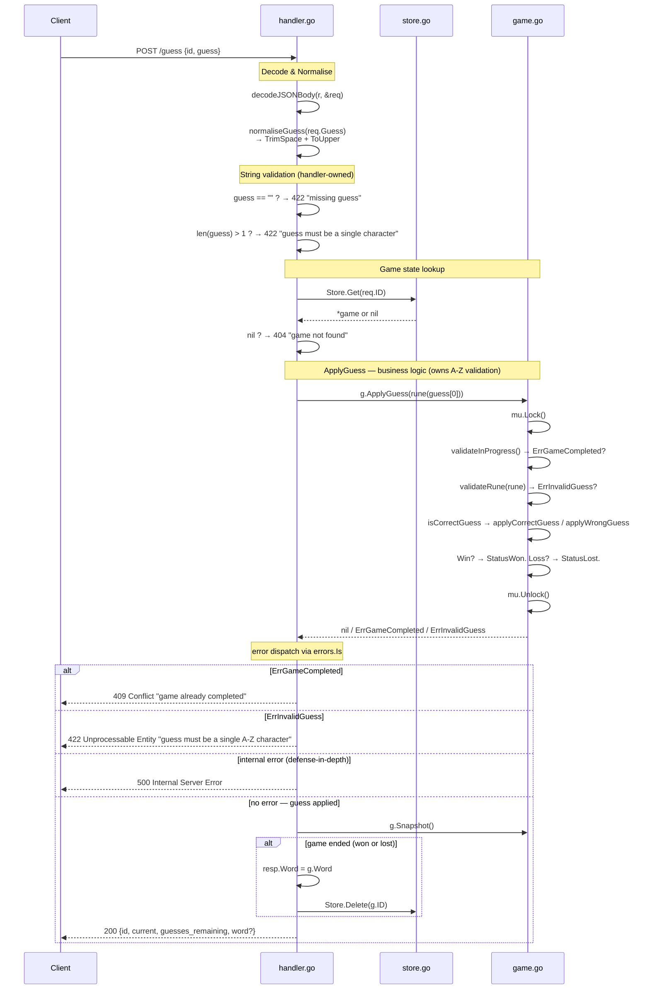

### 4.3 Every Guess Is Independent

- There is no duplicate-tracking. Every guess stands alone:
  - If the letter is in the word → reveal positions. Do NOT decrement.
  - If the letter is NOT in the word → decrement `guesses_remaining`.
- Guessing the same wrong letter twice costs you two attempts. Choose wisely.
- Guessing the same correct letter twice: still reveals (already revealed), no penalty.

---

## 5. Error Handling & Edge Cases

| Scenario | HTTP Status | Response |
|----------|-------------|----------|
| Game ID not found | `404 Not Found` | `{"error": "game not found"}` |
| Guessing on a completed game | `404 Not Found` | `{"error": "game not found"}` (game is deleted on completion) |
| Concurrent request completes game before ApplyGuess acquires lock | `409 Conflict` | `{"error": "game already completed"}` — [see §7.9.2](#792-race-condition--game-completed-by-concurrent-request) |
| Missing `guess` or empty after trim | `422 Unprocessable Entity` | `{"error": "missing guess"}` |
| `guess` is more than 1 character | `422 Unprocessable Entity` | `{"error": "guess must be a single character"}` |
| `guess` is not alpha (e.g. "5", "é", "@") | `422 Unprocessable Entity` | `{"error": "guess must be a single A-Z character"}` |
| Missing `id` in request | `400 Bad Request` | `{"error": "missing game id"}` |
| Request body not valid JSON | `400 Bad Request` | `{"error": "invalid request body"}` |
| Unknown JSON fields in request | `400 Bad Request` | `{"error": "invalid request body"}` |
| Concurrent guesses on same game | Safe (mutex serialises) | Second request waits, gets updated state. No conflict. |
| Lowercase guess (e.g. "a") | `200 OK` | Normalised to uppercase — not an error |
| Guess with whitespace (e.g. " A ") | `200 OK` | Trimmed, then normalised — not an error |

### Error Response Format

All errors use the same JSON shape:

```json
{
  "error": "human-readable description of what went wrong"
}
```

---

## 6. Postel's Law — Be Liberal in What You Accept

> *"Be conservative in what you send, be liberal in what you accept."*
> — Jon Postel, RFC 761 (TCP specification)

Applied to this API, the principle means:

**The handler normalises input BEFORE validation.** The game logic never sees raw user input — it only receives clean, validated data.

### Where it applies

| Input | Raw value | After normalisation | Result |
|-------|-----------|---------------------|--------|
| Lowercase | `"a"` | `"A"` (via `strings.ToUpper`) | Valid guess |
| Whitespace | `" A "` | `"A"` (via `strings.TrimSpace` + `ToUpper`) | Valid guess |
| Mixed | `" b "` | `"B"` | Valid guess |
| Non-alpha | `"5"` | `"5"` → fails `[A-Z]` check | Error |
| Empty | `""` | `""` → fails length check | Error |

### Implementation pattern in the handler

```go
// internal/handler/request.go — normalisation & validation extracted to SRP functions

// normaliseGuess applies Postel's Law to the guess string:
// trims surrounding whitespace and converts to uppercase.
func normaliseGuess(guess string) string {
    return strings.ToUpper(strings.TrimSpace(guess))
}

// internal/handler/handler.go — handler orchestrates the flow

func (s *Server) HandleGuess(w http.ResponseWriter, r *http.Request) {
    // ... decode JSON ...

    // Postel's Law: normalise before you validate
    guess := normaliseGuess(req.Guess)

    // String-level checks (empty, too long) stay in the handler
    if guess == "" {
        writeError(w, http.StatusUnprocessableEntity, "missing guess")
        return
    }
    if len(guess) > 1 {
        writeError(w, http.StatusUnprocessableEntity, "guess must be a single character")
        return
    }

    // Character-level validation (A-Z) is delegated to the game's
    // validateRune inside ApplyGuess, caught via errors.Is below
    if err := g.ApplyGuess(rune(guess[0])); err != nil {
        if errors.Is(err, game.ErrGameCompleted) {
            writeError(w, http.StatusConflict, err.Error())
        } else if errors.Is(err, game.ErrInvalidGuess) {
            writeError(w, http.StatusUnprocessableEntity, err.Error())
        } else {
            writeError(w, http.StatusInternalServerError, "internal error")
        }
        return
    }
    // ...
}
```

**Why split validation between handler and game?** Each layer owns the checks it's responsible for:

- `normaliseGuess` changes if normalisation rules change (e.g., strip diacritics)
- The handler validates **string structure**: empty, too long
- The game validates **character content**: A-Z via `validateRune` inside `ApplyGuess`, dispatched with `errors.Is(err, game.ErrInvalidGuess)`

### Where it does NOT apply

- The game logic (`internal/game/game.go`) validates its own rune input — defensive by design, so even callers bypassing the handler are safe.
- The word loader (`pkg/words/loader.go`) already uppercases everything. No Postel's Law needed there.

---

## 7. Sequence Diagrams

### 7.1 New Game Flow

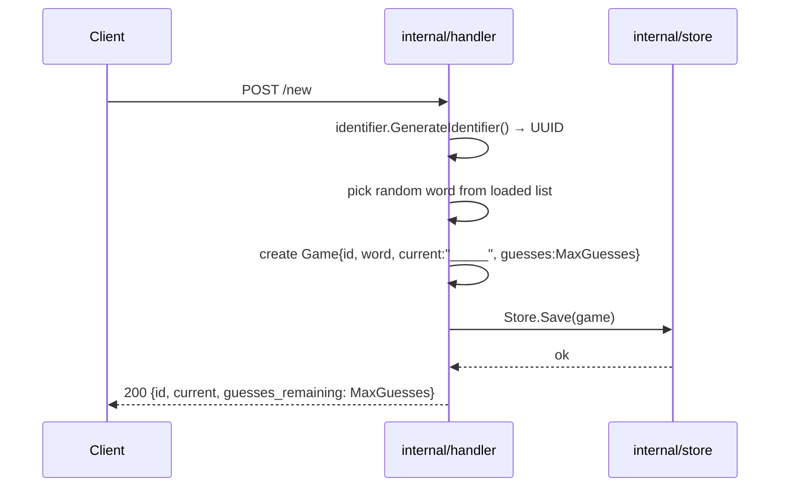

### 7.2 Guess Flow — With Postel's Law Normalisation

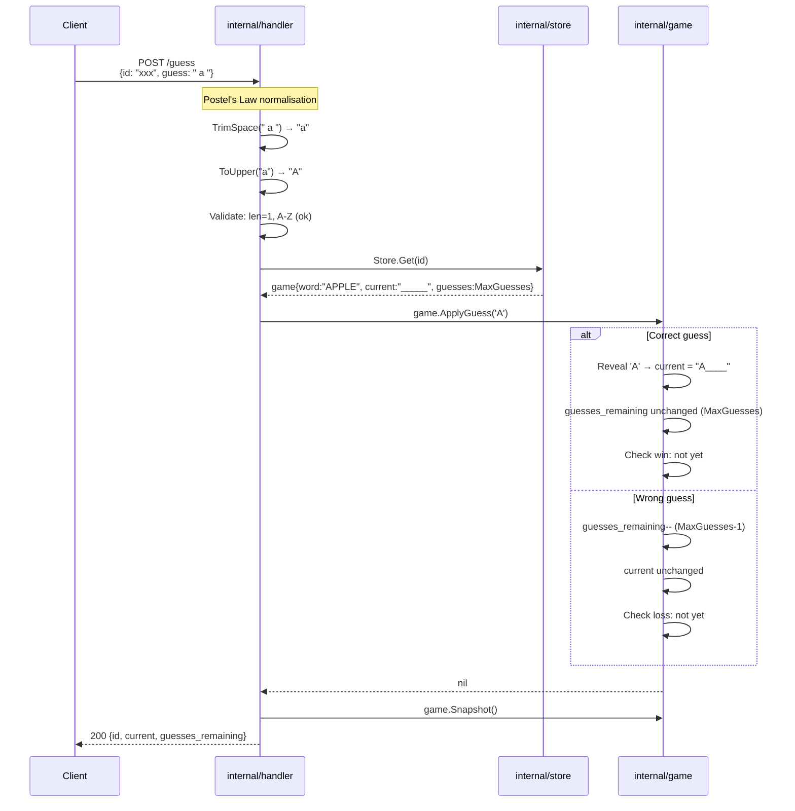

### 7.3 Win Detection & Cleanup

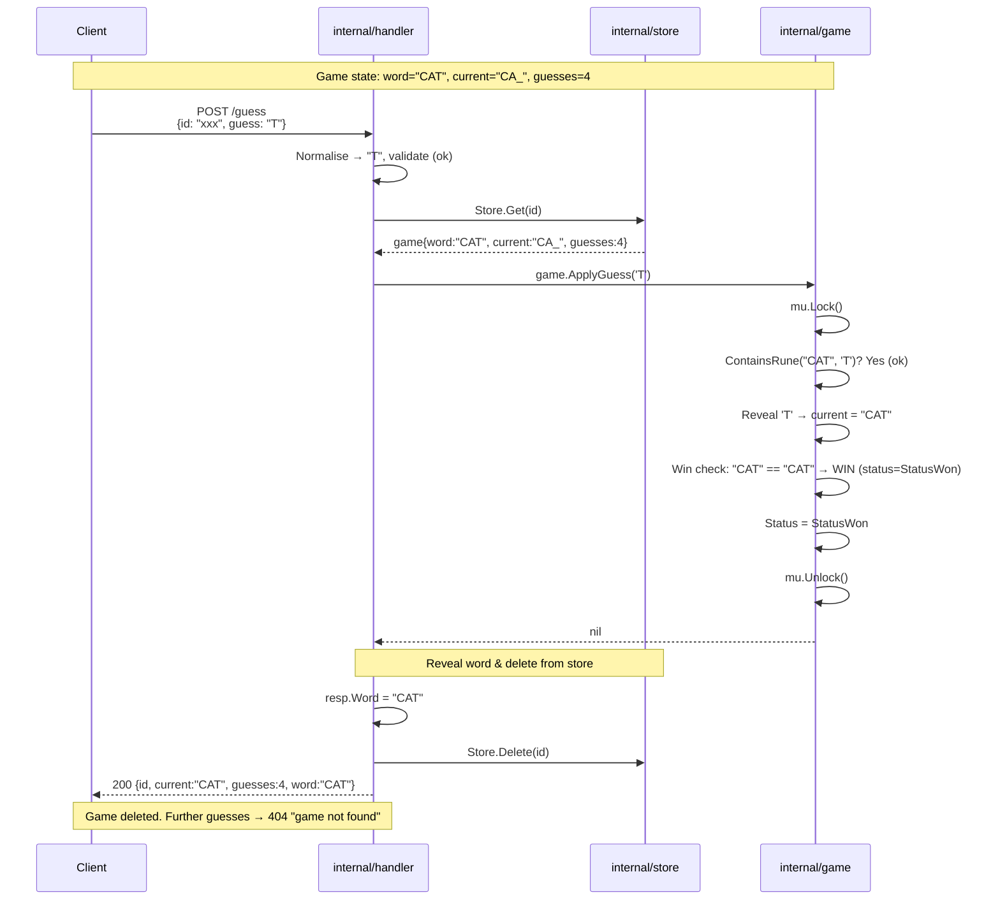

### 7.4 Loss Detection & Cleanup

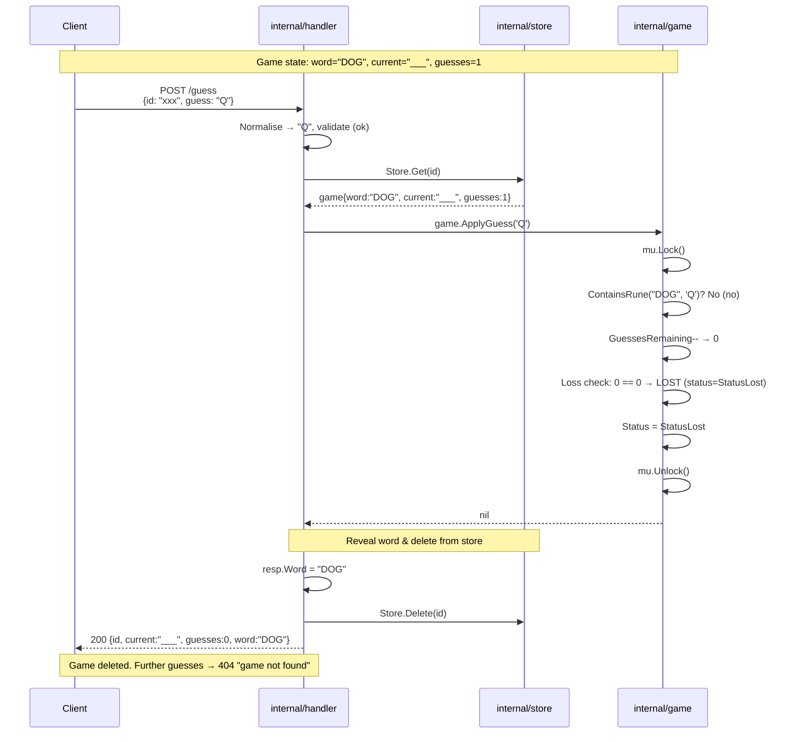

### 7.5 Repeat Guess — Wrong Letter

Every guess is processed independently. Guessing the same wrong letter twice costs two attempts.

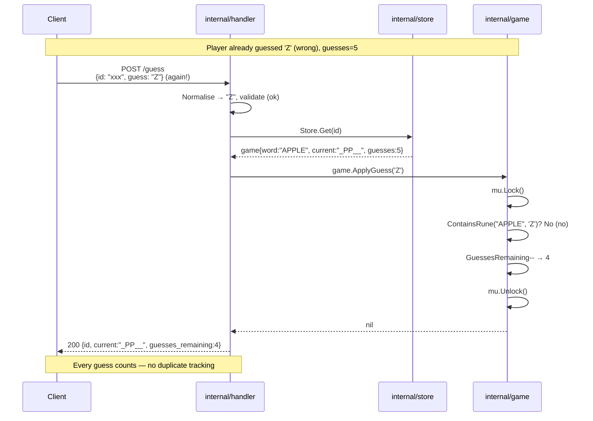

### 7.6 Repeat Guess — Correct Letter

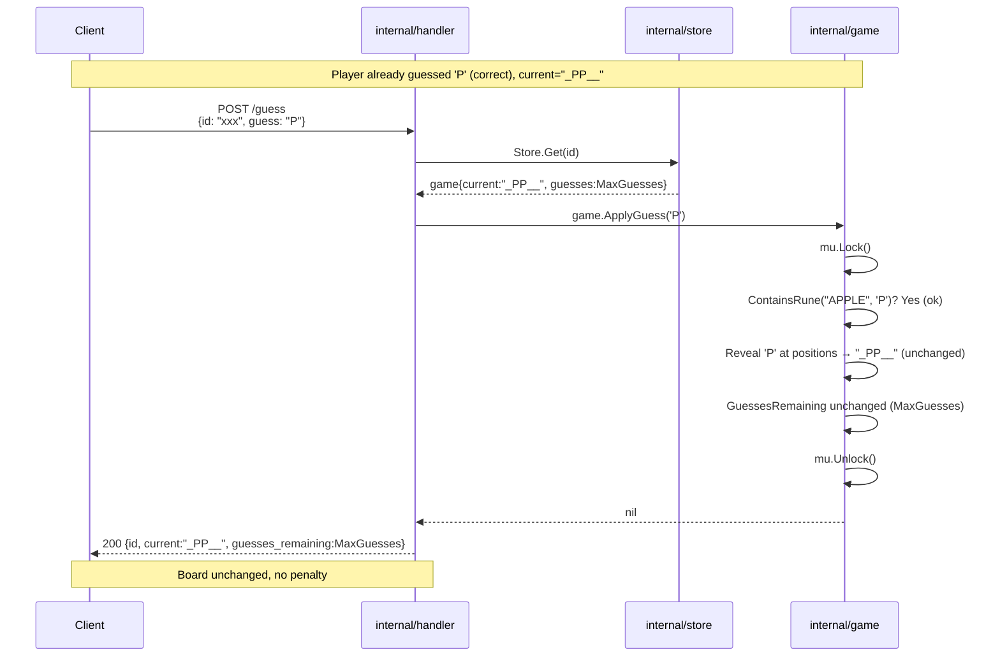

### 7.7 Error Flow — Game Not Found

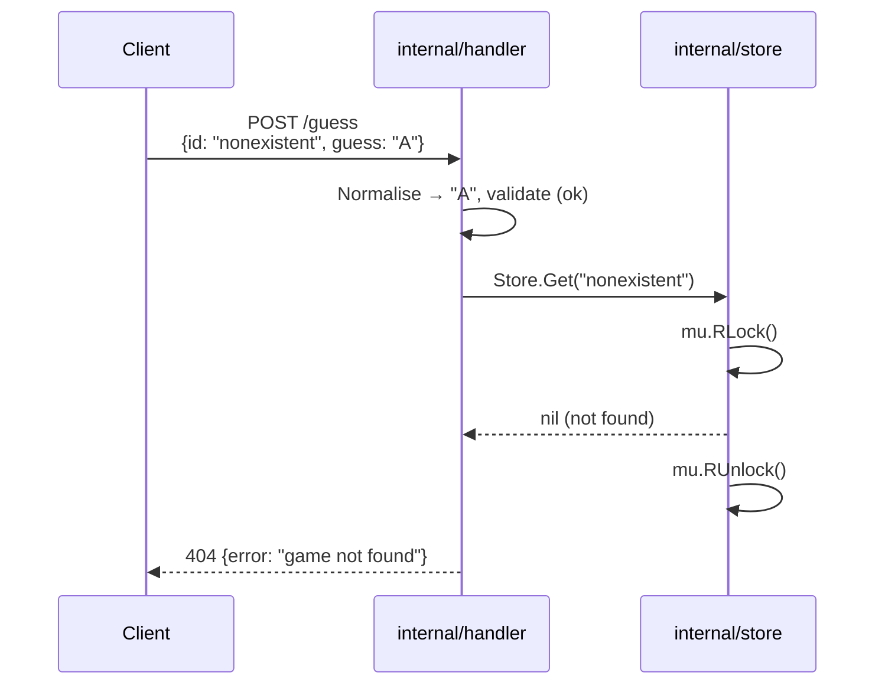

### 7.8 Error Flow — Invalid JSON

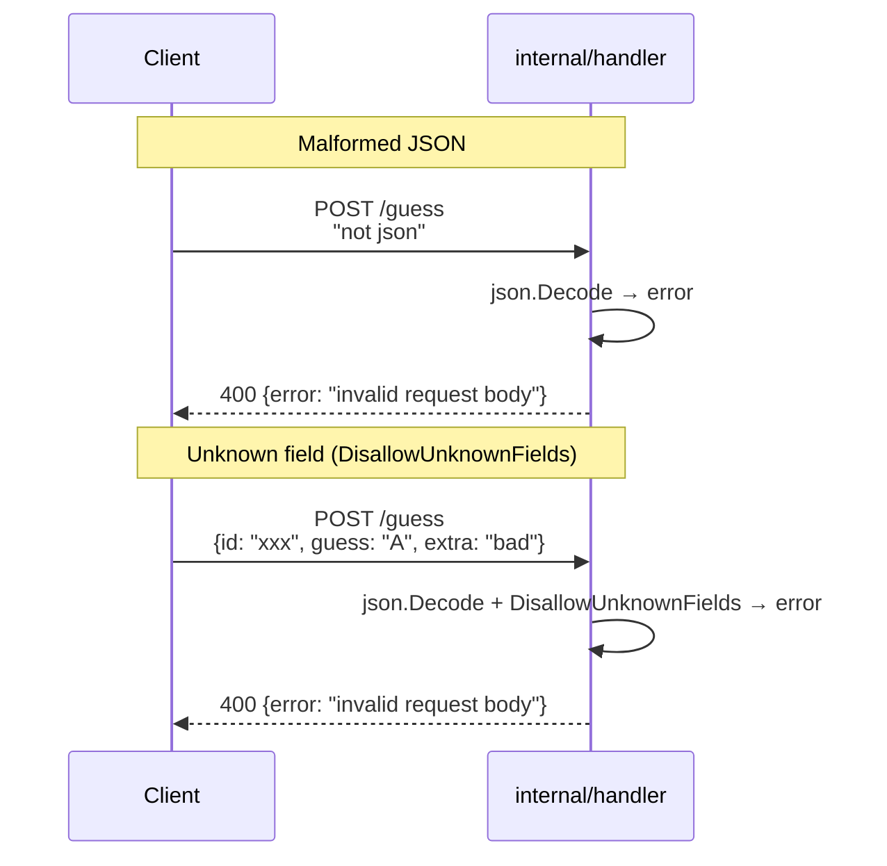

### 7.9 Concurrent Access & Race Condition

Because a game is identified by a shared UUID, multiple players can load the
same game ID into separate browsers (or clients) and solve the word together. Each guess is an independent HTTP request — the server processes them
in arrival order, serialised by `Game.Mutex`. The server handles this correctly
at two levels:

1. **No game completion** — multiple concurrent guesses on an active game are
   serialised by `Game.Mutex`. Both requests see a consistent game state.
2. **With game completion** — if one request finishes the game (win/loss) while
   another is in flight, `validateInProgress()` catches the changed status and
   returns `ErrGameCompleted` → `409 Conflict`.

This works without any WebSocket, polling, or coordination protocol — plain
HTTP, safe concurrency, correct state transitions.

#### 7.9.1 Basic Concurrent Access — No Game Completion

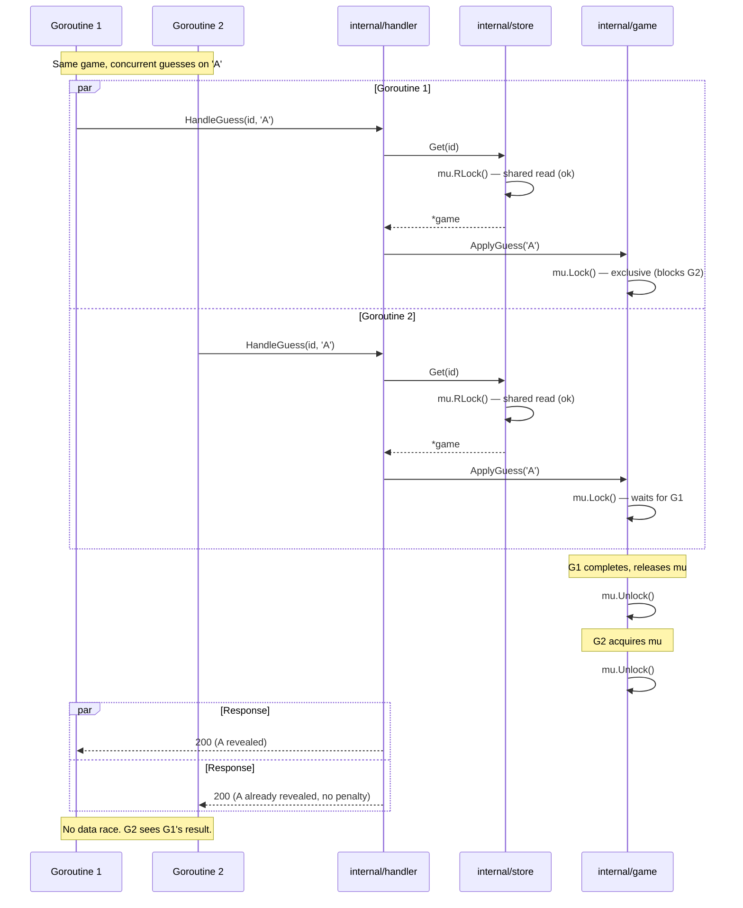

#### 7.9.2 Race Condition — Game Completed by Concurrent Request

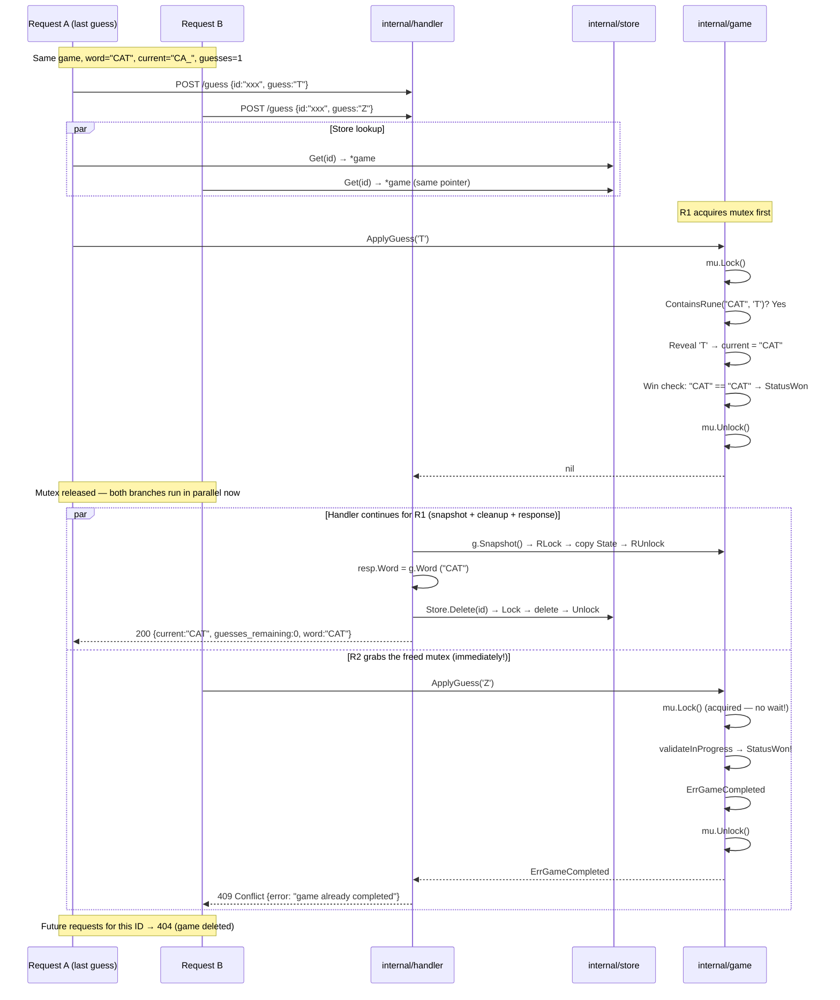

**How the design handles this correctly:**

- `Game.Mutex` serialises `ApplyGuess` — no data race on the game struct
- `Store.RWMutex` allows concurrent reads — both requests retrieve the game pointer before deletion
- Request A completes the game, sets `StatusWon`, deletes from store
- Request B still holds the `*game` pointer, but `validateInProgress()` catches the changed status
- `ApplyGuess` returns `ErrGameCompleted` → handler uses `errors.Is` → **409 Conflict**
- Any subsequent request on that ID reaches a nil `store.Get` → **404 Not Found**

## 8. Data Model & In-Memory State

### 8.1 Game Struct (`internal/game/game.go`)

```go
// Game represents the complete state of a word-guessing game session.
type Game struct {
    ID   string    // UUID v4
    Word string    // The chosen word (uppercase, e.g. "APPLE")
    State          // Embedded — Current, GuessesRemaining, Status promoted

    mu sync.RWMutex  // Protects all fields from concurrent access
}

// State holds a thread-safe snapshot of game state for external readers.
type State struct {
    Current          string
    GuessesRemaining int
    Status           Status
}

// Snapshot copies the embedded State under a read lock.
func (g *Game) Snapshot() State {
    g.mu.RLock()
    defer g.mu.RUnlock()
    return g.State
}

type Status int

const (
    StatusInProgress Status = iota
    StatusWon
    StatusLost
)
```

### 8.2 Game Store (`internal/store/store.go`)

```go
// GameStore provides thread-safe CRUD for Game instances.
type GameStore struct {
    mu    sync.RWMutex
    games map[string]*Game  // keyed by UUID
}

func NewGameStore() *GameStore {
    return &GameStore{
        games: make(map[string]*Game),
    }
}

// Save stores a new game.
func (s *GameStore) Save(game *Game)

// Get retrieves a game by ID. Returns nil if not found.
func (s *GameStore) Get(id string) *Game

// Delete removes a game from the store.
func (s *GameStore) Delete(id string)
```

### 8.3 Request/Response Structs (`internal/handler/types.go`)

```go
// --- New Game Response ---
type NewGameResponse struct {
    ID               string `json:"id"`
    Current          string `json:"current"`
    GuessesRemaining int    `json:"guesses_remaining"`
}

// --- Guess Request ---
type GuessRequest struct {
    ID    string `json:"id"`
    Guess string `json:"guess"`
}

// --- Guess Response ---
type GuessResponse struct {
    ID               string `json:"id"`
    Current          string `json:"current"`
    GuessesRemaining int    `json:"guesses_remaining"`
}

// --- Error Response ---
type ErrorResponse struct {
    Error string `json:"error"`
}
```

### 8.4 State Diagram

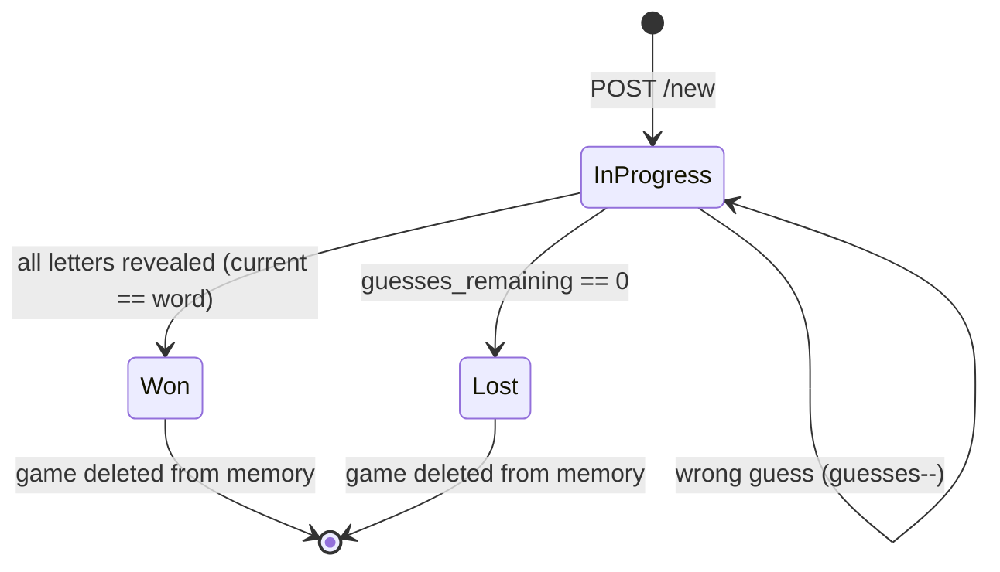

---

> See [code-structure.md](./code-structure.md) for the implementation guide — build order, package dependency flow, method responsibility table, and entry point wiring.

## 9. Modern Go Best Practices

*(Items that repeat content from previous sections — project layout, `io.Reader`, Postel's Law, `encoding/json`, `sync.RWMutex`, DI — are documented in their dedicated sections above. Only unique items are listed below.)*

### 9.1 Use `const` for Magic Numbers

```go
const (
    MaxGuesses = 6
)
```

### 9.2 Error Wrapping — `fmt.Errorf` + `%w`

```go
// Modern Go 1.13+ style (consistent across the codebase):
return fmt.Errorf("load words: %w", err)
return fmt.Errorf("generate game ID: %w", err)
```

The `%w` verb wraps the original error so callers can use `errors.Is()` and `errors.As()`.

### 9.3 Use `math/rand/v2` (Go 1.21+)

```go
import "math/rand/v2"

// No more rand.Seed() needed — auto-seeded in Go 1.20+

// Pick a random word:
word := words[rand.IntN(len(words))]
```

---

## 10. Testing Strategy

### 10.1 `pkg/words/loader_test.go` — Testing with `strings.NewReader`

Because `LoadWords` takes `io.Reader`, tests pass `strings.NewReader(...)` instead of real files — zero filesystem setup needed. Covers: basic filtering, empty input, whitespace trimming, non-alpha rejection, mixed case normalisation, single-letter words.

### 10.2 `internal/game/game_test.go` — Pure Logic Tests

Tests the game struct directly without HTTP: correct guesses, wrong guesses, win/loss detection, repeat-wrong decrements, repeat-correct no-penalty, invalid runes, completed-game rejection.

### 10.3 `internal/handler/handler_test.go` — HTTP Integration Tests

Sets up a real `GameStore` + word list, creates a `Server`, and uses `httptest.NewRecorder`/`httptest.NewRequest` to send requests end-to-end. Covers: `POST /new` response shape, `POST /guess` correct/wrong, Postel's Law (lowercase, whitespace, mixed), unknown JSON fields, duplicate wrong guesses, end-to-end win/loss flows, concurrent access safety, and every error scenario.

### 10.4 SRP Method Tests

Every extracted SRP method (`validateInProgress`, `validateRune`, `isCorrectGuess`, `applyCorrectGuess`, `applyWrongGuess`, `normaliseGuess`, `decodeJSONBody`) has direct unit tests covering its specific contract.

### 10.5 Coverage Overview

Running `make test-cover-html` produces the following per-package coverage:

```
ok      github.com/fleetdm/wordgame/cmd/wordgame        0.006s  coverage: 6.7% of statements
ok      github.com/fleetdm/wordgame/internal/game       0.003s  coverage: 100.0% of statements
ok      github.com/fleetdm/wordgame/internal/handler    0.006s  coverage: 98.3% of statements
ok      github.com/fleetdm/wordgame/internal/store      0.003s  coverage: 100.0% of statements
ok      github.com/fleetdm/wordgame/pkg/identifier      0.003s  coverage: 100.0% of statements
ok      github.com/fleetdm/wordgame/pkg/words   0.003s  coverage: 100.0% of statements
```

| Package | Coverage | Notes |
|---------|----------|-------|
| `cmd/wordgame` | 6.7% | Smoke tests exercise `registerRoutes` + handlers via `httptest.Server`; `main()` and `runServer()` are not called directly by unit tests |
| `internal/game` | 100.0% | Pure business logic, zero I/O — easy to exhaust |
| `internal/handler` | 98.3% | Defense-in-depth `else` branch is logically unreachable (see [§10.7](#107-coverage-caveat-defense-in-depth-default-branch)) |
| `internal/store` | 100.0% | Simple CRUD with `sync.RWMutex` — all paths covered |
| `pkg/identifier` | 100.0% | Single exported function with wrapped error |
| `pkg/words` | 100.0% | `io.Reader`-based loader — all filtering paths tested |

Four of six packages at 100%. The two exceptions are expected:

- **`cmd/wordgame` (6.7%)** — The `main()`, `NewRootCommand()`, and `runServer()` functions are exercised via smoke tests which start a real `httptest.Server`. The 6.7% coverage comes from `registerRoutes` + handler code paths hit by smoke test HTTP requests. Entry-point wiring (`main`, `runServer`, command setup) is not called directly by any test — standard for thin entry-point packages.
- **`internal/handler` (98.3%)** — Defense-in-depth `else` branch is unreachable (see [§10.7](#107-coverage-caveat-defense-in-depth-default-branch)).

### 10.6 Beyond Coverage: Behavior-Driven Tests & Specs

While high line coverage is a useful metric, tests shouldn't just focus on coverage. An AI agent (or even a human developer) can easily artificially inflate coverage by writing tests that simply map exactly to the existing code structure, modifying code slightly just to reach a 100% metric. However, code execution without behavioral correctness provides little value.

The main agenda for tests is to **capture changes in behavior**, not merely to test isolated functions. We need Behavior-Driven tests that are based on the initial functional requirements, which essentially build up the "behavior contract" of the application.

#### The Role of Specifications

To ensure clear behavioral boundaries, we should define clear specifications (e.g., using OpenAPI or OpenSpec) based on these functional requirements.

**Example relevant to WordGame:**
A spec for the `POST /guess` endpoint would explicitly state:

- **Given** a valid `GameID` and a 1-character uppercase `Guess`,
- **When** the guess is submitted,
- **Then** the API must return a `200 OK` with the updated `Current` string and decremented `GuessesRemaining`.
- **Except When** the game is already complete, in which case it must return `409 Conflict`.

These specs serve as the ultimate source of truth.

#### AI Agents and Human Accountability

We can do a back-and-forth with an AI agent to suggest different edge test cases for the behavior (e.g., "What if the user submits a number?", "What if the user submits multiple letters?"). The AI is excellent at brainstorming edge cases and generating the boilerplate for these tests. However, **the accountability stays with the human**. The human developer must verify that the test accurately reflects the functional requirement and isn't just "testing that the code does what the code currently does."

Behavior and tests work together to ensure the code isn't drifting away from us. When we refactor (like moving from an in-memory map to a Redis store), the behavior tests should pass without any modifications. If a test breaks, it should mean the *behavior* broke, not just that a function signature changed.

#### Types of Tests

A robust test suite uses different types of tests to build confidence at different layers:

1. **Fitness Tests (Architecture Tests):** Ensure structural rules aren't broken.
   *Example:* A test ensuring the `game` package never imports the `handler` or `store` packages.
2. **Smoke Tests:** Quick, surface-level checks to ensure the application starts and can handle basic input.
   *Example:* Starting the WordGame server, creating one game, and submitting one guess to ensure no instant panics.
3. **Integration Tests:** Ensure different components of the system work together.
   *Example:* Testing that the `Handler` correctly retrieves a `Game` from the `Store`, applies a guess, and the `Store` successfully saves the updated state.
4. **Acceptance (Behavioral) Tests:** Tests written from the user's perspective, verifying the application meets the business requirements.
   *Example:* "User creates a game, guesses 6 wrong letters, and the status changes to LOST."
5. **End-to-End (E2E) Tests:** Tests the entire system from the outermost boundary (often the UI or API boundary) down to the database.
   *Example:* An automated script acting as an HTTP client that starts a game, plays through an entire winning scenario, and validates the HTTP response headers and JSON body match the OpenAPI spec exactly.

### 10.7 Coverage Caveat: Defense-in-Depth Default Branch

The `else` branch in `HandleGuess` is defense-in-depth for unknown `ApplyGuess` errors:

```go
if err := g.ApplyGuess(rune(guess[0])); err != nil {
    if errors.Is(err, game.ErrGameCompleted) {
        writeError(w, http.StatusConflict, err.Error())
    } else if errors.Is(err, game.ErrInvalidGuess) {
        writeError(w, http.StatusUnprocessableEntity, err.Error())
    } else {
        writeError(w, http.StatusInternalServerError, "internal error")
    }
    return
}
```

It cannot be reached today — `ApplyGuess` only returns `ErrGameCompleted` or `ErrInvalidGuess` — so coverage for `HandleGuess` sits at ~93% and handler package at 98.3%. This is intentional: injecting a fake error to cover a dead branch adds test-only complexity with no runtime benefit.

---

## 11. Makefile & Deployment

### 11.1 Makefile Overview

The `Makefile` at the project root wraps all common commands behind simple targets. See the file itself for the full implementation; the [Target Reference](#112-target-reference) below summarises some important targets.

### 11.2 Target Reference

| Target | What it does | Example |
|--------|-------------|---------|
| `make build` | Compiles the binary → `bin/wordgame` | `make build` |
| `make run` | Starts the server on `:1337` | `make run` |
| `make test` | Runs all tests with verbose output | `make test` |
| `make test-race` | Runs tests with the race detector | `make test-race` |
| `make test-cover` | Runs tests + prints per-package coverage % | `make test-cover` |
| `make test-cover-html` | Runs tests + opens coverage in browser | `make test-cover-html` |
| `make smoke` | Runs end-to-end HTTP smoke tests | `make smoke` |
| `make new-game` | Creates a new game (server must be running) | `make new-game` |
| `make guess ID=<uuid> GUESS=a` | Guesses a letter in a game | `make guess ID=abc GUESS=p` |
| `make clean` | Removes `bin/` and `coverage.out` | `make clean` |
| `make stop` | Kills the server on port 1337 | `make stop` |

### 11.3 Typical Development Workflow

**Terminal 1 — start the server:**

```bash
make run
# Starting server on http://localhost:1337
```

**Terminal 2 — interact with the game (curl commands abstracted):**

```bash
# 1. Start a new game and capture the ID
make new-game
# {"id":"f8302916-...","current":"________","guesses_remaining":6}

# 2. Make guesses (Need to copy paste the uuid for now in ID)
make guess ID=f8302916-... GUESS=a
# {"id":"f8302916-...","current":"______A_","guesses_remaining":6}

make guess ID=f8302916-... GUESS=p
# {"id":"f8302916-...","current":"______A_","guesses_remaining":5} ← wrong guess
```

**When you want to verify everything works:**

```bash
# Run tests + race detection + coverage — all at once
make test-race && make test-cover
```

---

## 12. Smoke Tests

End-to-end smoke tests verify the full HTTP stack works together — routes are wired correctly, JSON serialisation is round-trip safe, and the server behaves correctly at the TCP/HTTP protocol level.

### 12.1 What they catch that unit tests miss

| Bug class | Unit tests | Smoke tests |
|-----------|:----------:|:-----------:|
| Wrong `Content-Type` header | Miss¹ | **Caught** |
| Route not registered (typo in path) | Miss | **Caught** |
| Handler signature mismatch | Miss | **Caught** |
| Response body truncated at TCP level | Miss | **Caught** |
| `ListenAndServe` / port binding errors | Miss | **Caught**² |
| Game logic bugs | Caught | Caught |

¹ Handler tests use `httptest.NewRecorder`, which bypasses the HTTP transport layer — content-type headers set via `w.Header().Set()` still appear, but the real HTTP serialisation path is never exercised.

² Via Cobra's `RunE` and `runServer(stderr, port)` — startup errors propagate as returned `error` values instead of `log.Fatal`, making them testable.

### 12.2 Test design

The smoke test (`cmd/wordgame/smoke_test.go`) uses Go's built-in `httptest.Server` to start a real HTTP server on a random port, then sends actual TCP requests via `http.Post`. The server is configured with a deterministic word list (`["ZZZZ"]`) so every guess outcome is predictable:

- `'Z'` → always correct (board changes, guesses unchanged)
- `'A'` → always wrong (board unchanged, guesses decremented)

Four test cases cover the full game lifecycle:

```go
TestSmokeNewGame_Shape      // POST /new → valid JSON shape
TestSmokeGuess_Correct      // POST /guess with correct letter
TestSmokeGuess_Wrong        // POST /guess with wrong letter
TestSmokeGuess_DeletedGame  // MaxGuesses wrong guesses → game deleted → POST /guess → 404
```

### 12.3 Running smoke tests

```bash
# Run only the smoke tests (faster)
make smoke

# Or run everything including smoke
make test
```

### 12.4 How this enables clean smoke tests

Three design decisions make smoke tests straightforward:

1. **Cobra CLI layer (`NewRootCommand`) and `runServer(stderr io.Writer, port string) error` in `cmd/wordgame/main.go`** — The binary is structured as a Cobra command. `NewRootCommand()` defines the `--port` / `-p` flag (defaulting to the `PORT` env var, falling back to `"1337"`) and auto-generates `--help` text. `RunE` delegates to `runServer`, which contains all startup logic: open `words.txt`, load the word list, wire dependencies, register routes, and call `http.ListenAndServe`. Because `RunE` and `runServer` both return `error`, errors propagate gracefully to Cobra's built-in error printing — no `log.Fatal` or `os.Exit` needed. Tests can inject a `bytes.Buffer` via `cmd.SetErr(buf)` and override flags via `cmd.SetArgs(...)` to exercise the full CLI lifecycle without starting a real server.

2. **`registerRoutes` in `cmd/wordgame/main.go`** — Route definitions live in a single `registerRoutes(r *mux.Router, srv *handler.Server)` package-level function. Both `runServer()` and smoke tests (which are in the same `package main`) call it, guaranteeing they exercise the exact same routing. No risk of routes drifting apart, and no untested mux dependency polluting the handler package.

3. **`WithIDGenerator(fn)` functional option in `internal/handler/handler.go`** — The handler's ID generator is injected at construction time via a functional option, allowing unit tests to swap in a deterministic generator (e.g., to trigger and assert on ID-generation failures) without mutable package globals or fragile defer/restore patterns. Smoke tests deliberately use the **real** UUID generator: they create a game via `POST /new`, extract the generated ID from the JSON response, and use it for subsequent guesses — a true end-to-end exercise of the full pipeline.

---

## 13. Linting and Formatting

The project uses three tiers of static analysis plus a custom `.golangci.yml` config, each wired into its own `make` target:

| Target | Tool | What it checks | When to run |
|--------|------|----------------|-------------|
| `make fmt` | `go fmt` | Code formatting (tab indentation, alignment) | Before any commit |
| `make vet` | `go vet` | Suspicious constructs (e.g., unused code, printf arg mismatches) | Before any commit |
| `make lint` | `golangci-lint` | 80+ linters aggregated (incl. `errcheck`, `govet`, `staticcheck`, **`unparam`**) | In CI / before PR |
| `make check` | All of the above + tests | Full quality gate — fmt → vet → lint → test | In CI / release |

### 13.1 Quick developer workflow

```bash
# Format, vet, and run tests in one step
make check

# Or run linting separately if you don't have golangci-lint
make fmt && make vet && make test
```
