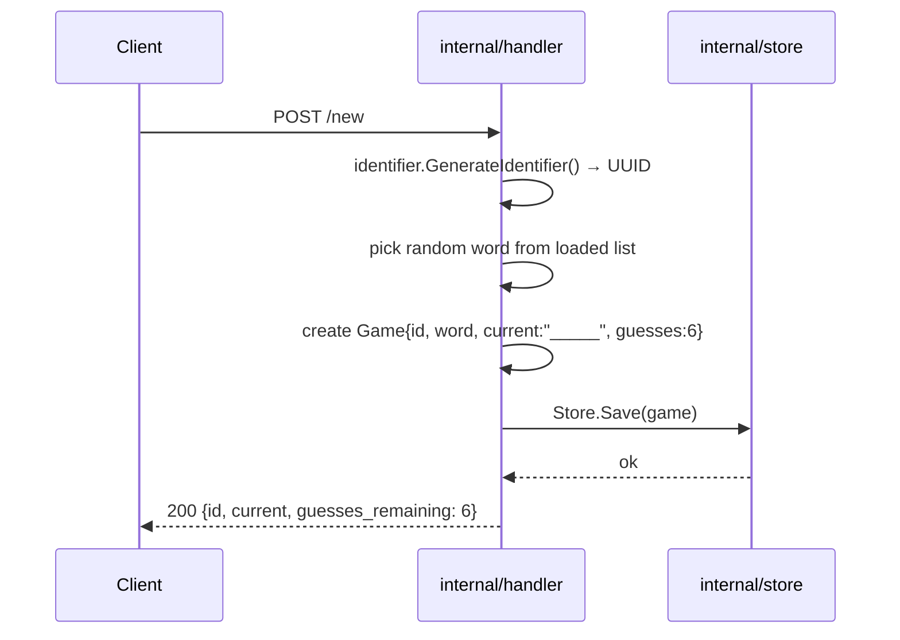
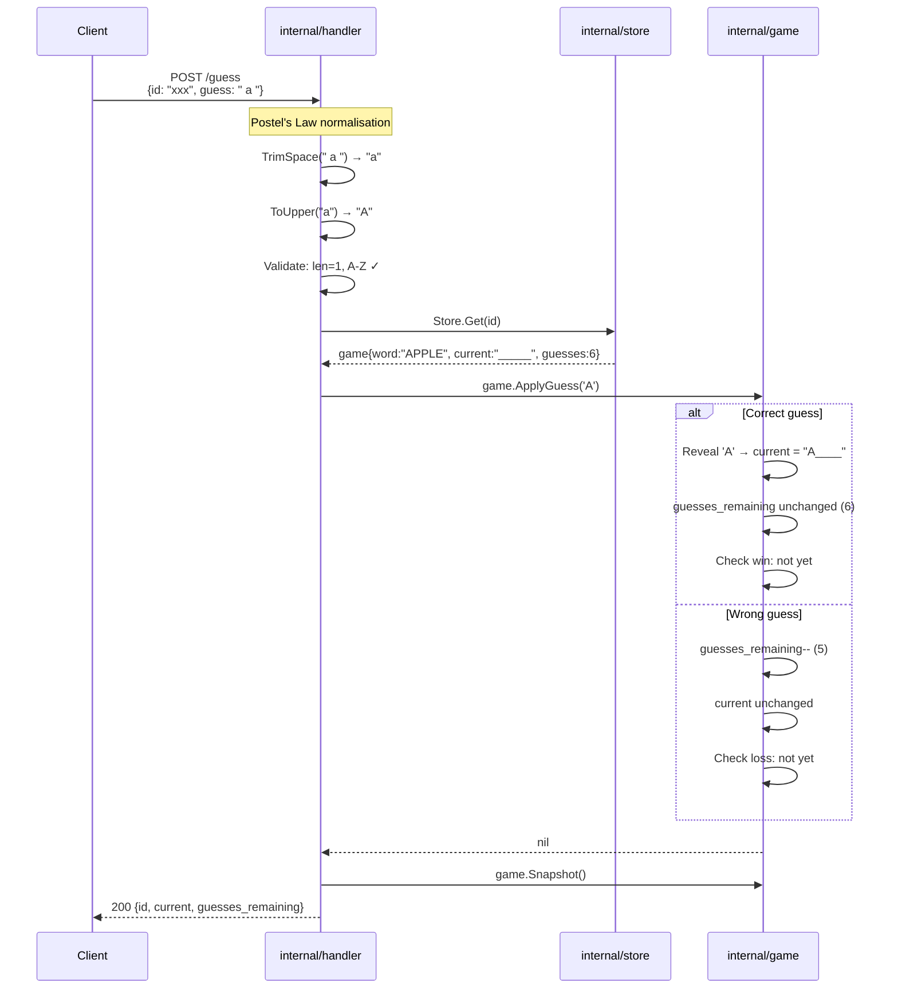
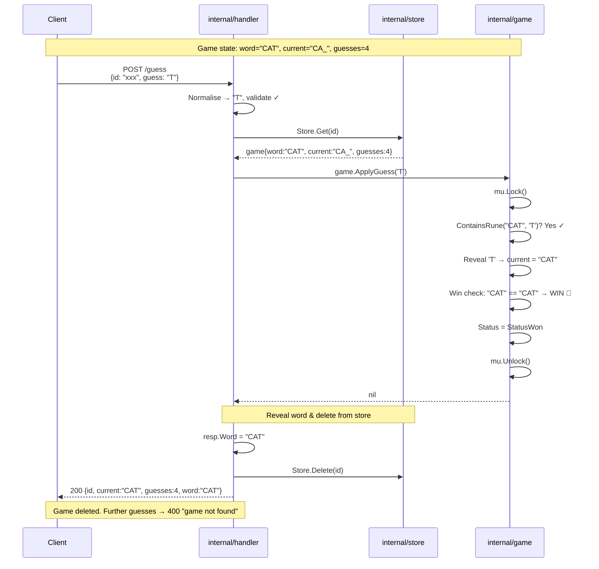
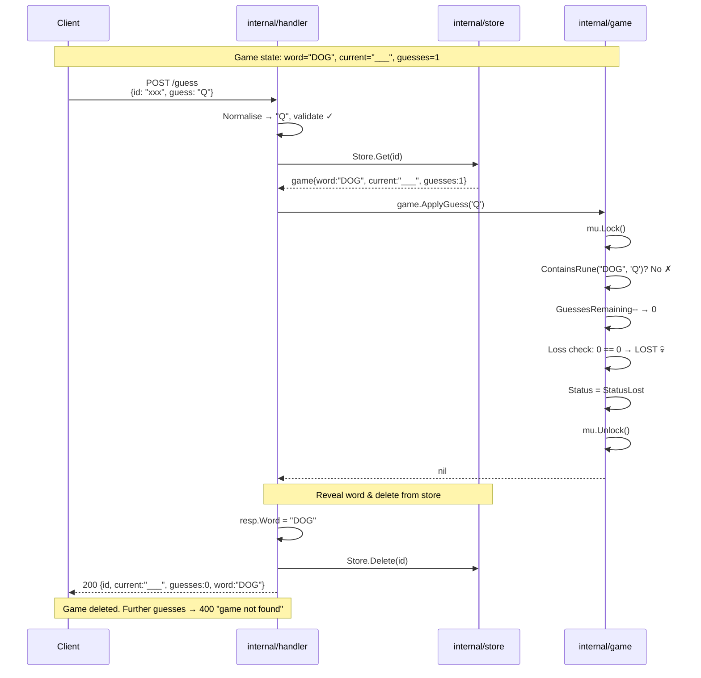
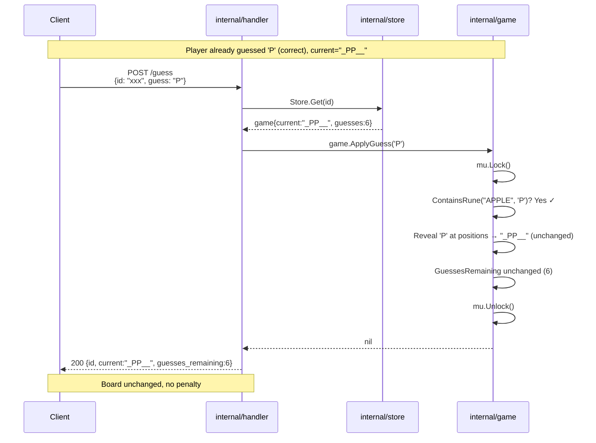
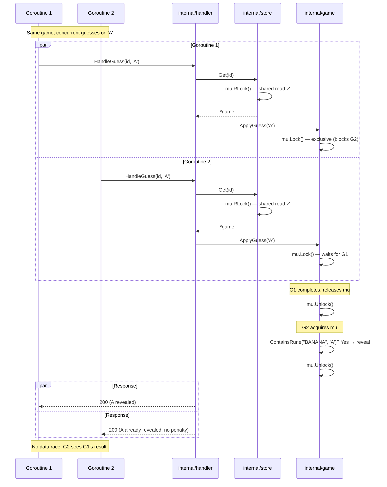
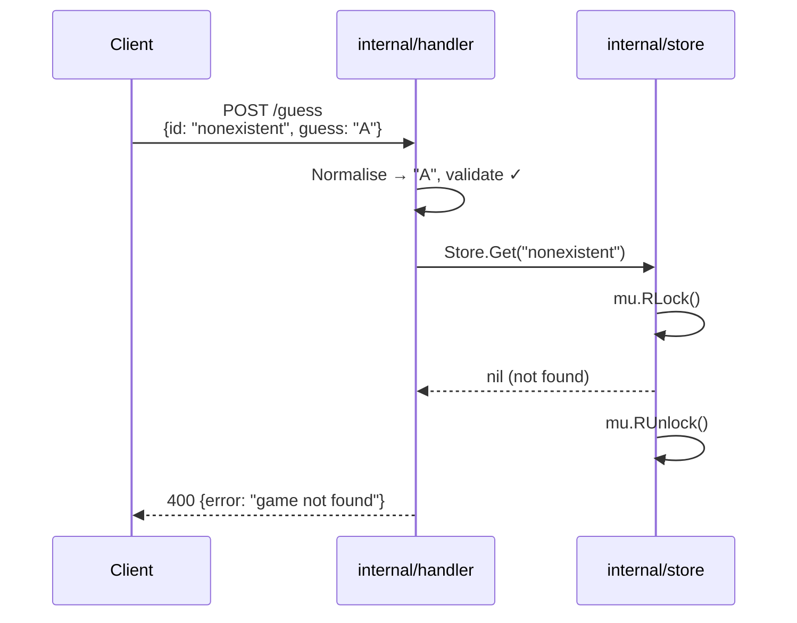
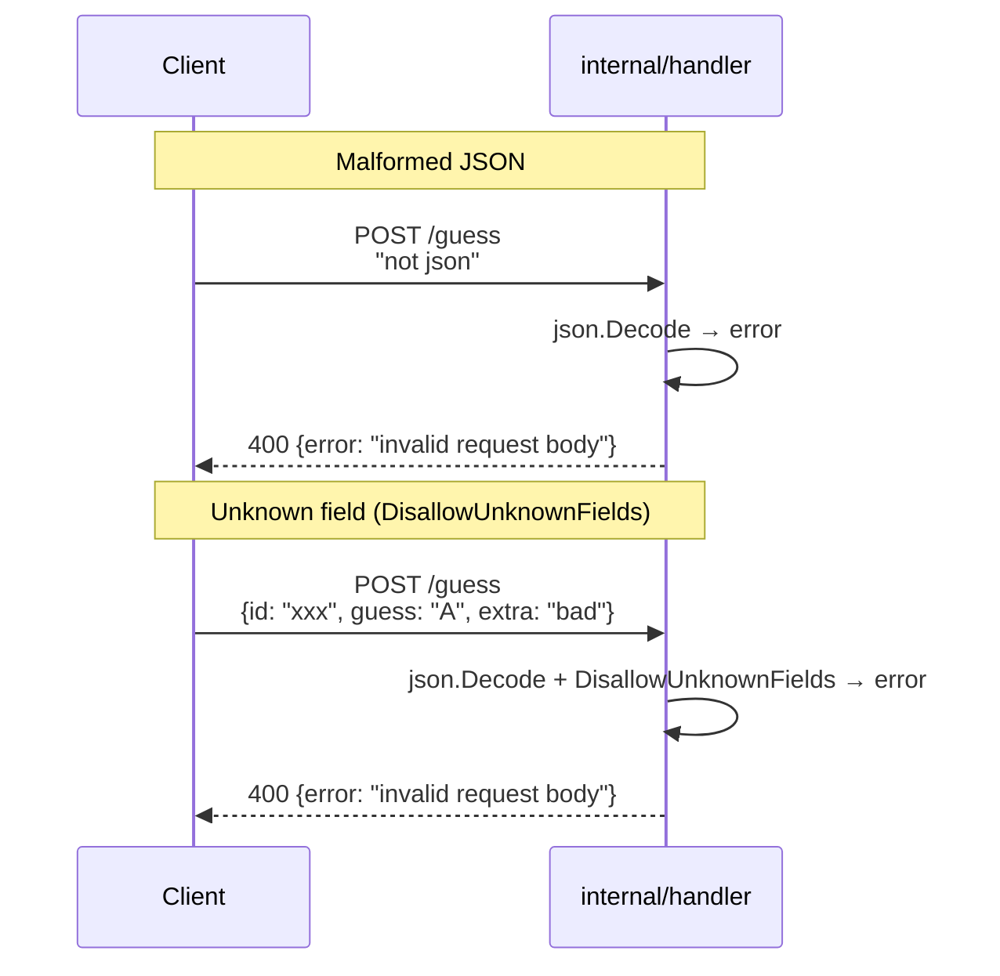
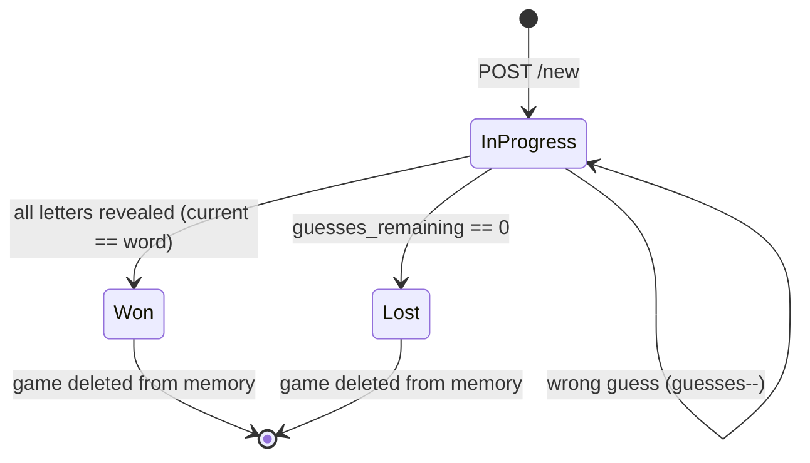

# Word Game — Backend Engineering Specification

---

## Table of Contents

1. [Project Overview](#1-project-overview)
2. [Functional Requirements](#2-functional-requirements)
3. [API Contract](#3-api-contract)
4. [Business Logic — Detailed Rules](#4-business-logic--detailed-rules)
5. [Error Handling & Edge Cases](#5-error-handling--edge-cases)
6. [Postel's Law — Be Liberal in What You Accept](#6-postels-law--be-liberal-in-what-you-accept)
7. [Sequence Diagrams](#7-sequence-diagrams)
8. [Data Model & In-Memory State](#8-data-model--in-memory-state)
9. [Implementation Guide](#9-implementation-guide)
10. [Modern Go Best Practices](#10-modern-go-best-practices)
11. [Testing Strategy](#11-testing-strategy)
12. [Makefile & Deployment](#12-makefile--deployment)
13. [SDE1 Checklist](#13-sde1-checklist)

---

## 1. Project Overview

This is a **Hangman-style word-guessing game** implemented as a REST API. The server:

- Picks a random English word from a 370K-word dictionary (`words.txt`).
- Exposes two endpoints: **`POST /new`** (start a game) and **`POST /guess`** (guess a letter).
- Maintains game state **entirely in memory** — no database.
- Runs on `http://localhost:1337`.

### Starting Point — What you get

The challenge provides a few files to get you going. They are **starting points** — refactor and reorganise them as you see fit:

| File | Purpose | What you can do with it |
|------|---------|------------------------|
| `main.go` | Seeds RNG, loads words, starts HTTP server on `:1337` | Refactor into `cmd/wordgame/main.go` — wire up your packages here |
| `words.go` | Reads `words.txt`, filters to `^[A-Z]+$`, returns `[]string` | Refactor into `pkg/words/` — decouple from filesystem (use `io.Reader`) |
| `identifier.go` | Generates UUID v4 game IDs | Refactor into `pkg/identifier/` — export the function |
| `words.txt` | 370,103-line English word dictionary (dwyl/english-words) | Keep as a data file — no code changes needed |
| `go.mod` / `go.sum` | Module definition (`github.com/fleetdm/wordgame`, Go 1.16) | Update to Go 1.21, drop unused deps |
| `Procfile` | Heroku process definition (`web: bin/wordgame`) | Keep as-is |

### What you will add

| File | Purpose |
|------|---------|
| `Makefile` | Build, test, coverage, and game interaction automation (see [Section 12](#12-makefile--deployment)) |
| `internal/game/game.go` | Game struct + business logic |
| `internal/store/store.go` | Thread-safe in-memory game store |
| `internal/handler/handler.go` | HTTP handlers with Postel's Law normalisation |

### Target Directory Structure

The codebase should follow standard Go project layout conventions:

```
wordgame-main/
├── cmd/
│   └── wordgame/
│       └── main.go                  ← Entry point — wires deps, starts server (gorilla/mux)
├── internal/                        ← Private application code (not importable externally)
│   ├── handler/
│   │   ├── handler.go               ← HTTP handlers: POST /new, POST /guess
│   │   └── handler_test.go
│   ├── game/
│   │   ├── game.go                  ← Game struct + ApplyGuess() business logic
│   │   └── game_test.go
│   └── store/
│       ├── store.go                 ← In-memory GameStore (sync.RWMutex)
│       └── store_test.go
├── pkg/                             ← Public library code (reusable, importable)
│   ├── words/
│   │   ├── loader.go                ← LoadWords(r io.Reader) — decoupled, testable
│   │   └── loader_test.go
│   └── identifier/
│       ├── id.go                    ← GenerateIdentifier() — UUID v4 generation
│       └── id_test.go
├── Makefile                         ← Build, test, coverage & game interaction targets
├── words.txt                        ← Word dictionary data file (unchanged)
├── go.mod                           ← Go 1.21, minimal deps (google/uuid only)
├── go.sum
├── Procfile
├── README.md
└── docs.md                          ← This file
```

> **Why this structure?**
>
> - `cmd/` — one subdirectory per executable binary. Keeps `main.go` small (just wiring).
> - `internal/` — the Go compiler enforces that no external module can import these packages. Perfect for private business logic.
> - `pkg/` — libraries that are safe for others to import. The word loader and ID generator have no game-specific logic, so they belong here.

---

## 2. Functional Requirements

### FR-1: Start a New Game

- The server must select a **random** word from the filtered word list.
- The word must be chosen with **uniform probability** across all loaded words.
- Initial `guesses_remaining` must always be **6**.
- The `current` board state must be a string of **underscores** (`_`), one per character in the word.
  - Example: word = `"APPLE"` → `"_____"` (length 5).
- A **new UUID v4** must be generated for each game.

### FR-2: Accept a Guess

- A guess is a **single letter** — the handler must be lenient about how it arrives (see [Postel's Law](#6-postels-law--be-liberal-in-what-you-accept)).
- The request must carry the game's UUID (`id`) and the guessed character (`guess`).
- The server must locate the game by UUID and apply the guess.

### FR-3: Reveal Correct Letters

- If the guessed letter appears **anywhere** in the word, **all** its positions must be revealed simultaneously in `current`.
  - Example: word = `"APPLE"`, guess = `"P"` → `current` changes from `"_____"` → `"_PP__"`.
- `guesses_remaining` must **NOT** change on a correct guess.

### FR-4: Penalise Wrong Guesses

- If the guessed letter **does not** appear in the word, `guesses_remaining` must be decremented by **1**.
- `current` must **NOT** change.

### FR-5: Detect Win Condition

- A win occurs when `current` contains **no underscores** (all letters revealed).
- After a win, the game is **complete**. Further guesses on this game must return an error.

### FR-6: Detect Loss Condition

- A loss occurs when `guesses_remaining` reaches **0**.
- After a loss, the game is **complete**. Further guesses on this game must return an error.

### FR-7: Clear Completed Games

- When a game is won or lost, it is **immediately deleted** from memory.
- The final `/guess` response includes the `word` field so the player sees what the answer was.
- Subsequent guesses on that game ID return `400 {"error": "game not found"}`.

### FR-8: Server Address

- Server must listen on `http://localhost:1337` (or `PORT` env var for Heroku).

### FR-9: Word Loader Must Be Filesystem-Decoupled

- The word loader must accept an **`io.Reader`**, not a file path.
- This lets tests pass `strings.NewReader("APPLE\nORANGE\n")` instead of needing real files.
- The caller (`cmd/wordgame/main.go`) is responsible for opening the file.

### FR-10: Postel's Law for Input (see Section 6)

- The `/guess` endpoint must be **liberal in what it accepts**:
  - Lowercase letters → normalise to uppercase.
  - Whitespace around the guess → trim it.
  - Only reject truly invalid input (empty, multi-character, non-alpha).

---

## 3. API Contract

### 3.1 `POST /new` — Start a New Game

```
POST /new
Content-Type: application/json   (optional — body is ignored)
```

**Request body:** Ignored. Any body (or no body) is accepted.

**Response** (200 OK):

| Field | Type | Description |
|-------|------|-------------|
| `id` | `string` | UUID v4 game identifier |
| `current` | `string` | Board state — only underscores, length = word length |
| `guesses_remaining` | `int` | Always `6` for a new game |

```json
{
  "id": "f8302916-69f1-462b-b640-e503faa94397",
  "current": "________",
  "guesses_remaining": 6
}
```

### 3.2 `POST /guess` — Guess a Letter

```
POST /guess
Content-Type: application/json
```

**Request body:**

| Field | Type | Required | Description |
|-------|------|----------|-------------|
| `id` | `string` | **Yes** | Game UUID from `/new` |
| `guess` | `string` | **Yes** | A single letter. Lowercase and whitespace are normalised server-side. |

```json
{
  "id": "f8302916-69f1-462b-b640-e503faa94397",
  "guess": "A"
}
```

Both of these also work (thanks to Postel's Law):

```json
{"id": "...", "guess": "a"}       ← lowercase → normalised to "A"
{"id": "...", "guess": " A "}     ← whitespace → trimmed, then → "A"
```

**Response** (200 OK):

| Field | Type | Description |
|-------|------|-------------|
| `id` | `string` | Echo of the game UUID (unchanged) |
| `current` | `string` | Updated board state |
| `guesses_remaining` | `int` | Updated remaining guesses |
| `word` | `string` | The chosen word — **only included when the game ends** (win or loss). Omitted during active play. |

```json
{
  "id": "f8302916-69f1-462b-b640-e503faa94397",
  "current": "______A_",
  "guesses_remaining": 6
}
```

On win or loss, the `word` field is also included:

```json
{
  "id": "f8302916-69f1-462b-b640-e503faa94397",
  "current": "APPLE",
  "guesses_remaining": 2,
  "word": "APPLE"
}
```

---

## 4. Business Logic — Detailed Rules

### 4.1 Word Selection

- `pkg/words/loader.go` handles reading, uppercasing, and filtering to `^[A-Z]+$`.
- Pick a random word: `words[rand.IntN(len(words))]` (Go 1.21+ auto-seeds).
- No extra filtering needed downstream.

### 4.2 Guess Processing Algorithm

The handler normalises input, then passes a clean `rune` to the game logic. Full flow:

```
1. Receive POST /guess with JSON body
2. Decode JSON → {id, guess}
3. NORMALISE guess (Postel's Law — see Section 6):
   a. Trim whitespace: strings.TrimSpace(guess)
   b. Convert to uppercase: strings.ToUpper(guess)
4. LOOKUP game by id → if not found, return 400 error
5. If game is already COMPLETED (won/lost) → return 400 error
6. VALIDATE normalised guess:
   a. Must be exactly 1 character
   b. Must be in range [A-Z]
7. If guess is CORRECT:
   a. Replace ALL '_' at matching positions with the letter
   b. Do NOT change guesses_remaining
8. If guess is WRONG:
   a. Decrement guesses_remaining by 1 (every time — even if guessed before)
   b. Do NOT change current
9. CHECK win: if current == word → mark game won
10. CHECK loss: if guesses_remaining == 0 → mark game lost
11. If game completed → optionally delete from store
12. RETURN {id, current, guesses_remaining}
```

### 4.3 Every Guess Is Independent

- There is no duplicate-tracking. Every guess stands alone:
  - If the letter is in the word → reveal positions. Do NOT decrement.
  - If the letter is NOT in the word → decrement `guesses_remaining`.
- Guessing the same wrong letter twice costs you two attempts. Choose wisely.
- Guessing the same correct letter twice: still reveals (already revealed), no penalty.

---

## 5. Error Handling & Edge Cases

| Scenario | HTTP Status | Response |
|----------|-------------|----------|
| Game ID not found | `400 Bad Request` | `{"error": "game not found"}` |
| Guessing on a completed game | `400 Bad Request` | `{"error": "game not found"}` (game is deleted on completion) |
| Missing `id` in request | `400 Bad Request` | `{"error": "missing game id"}` |
| Missing `guess` in request | `400 Bad Request` | `{"error": "missing guess"}` |
| `guess` is empty (after trimming) | `400 Bad Request` | `{"error": "guess must be a single character"}` |
| `guess` is more than 1 character | `400 Bad Request` | `{"error": "guess must be a single character"}` |
| `guess` is not alpha (e.g. "5", "é", "@") | `400 Bad Request` | `{"error": "guess must be a single letter A-Z"}` |
| Request body not valid JSON | `400 Bad Request` | `{"error": "invalid request body"}` |
| Concurrent guesses on same game | Must be safe (use mutex) | — |
| Lowercase guess (e.g. "a") | `200 OK` | Normalised to uppercase — not an error |
| Guess with whitespace (e.g. " A ") | `200 OK` | Trimmed, then normalised — not an error |

### Error Response Format

All errors use the same JSON shape:

```json
{
  "error": "human-readable description of what went wrong"
}
```

---

## 6. Postel's Law — Be Liberal in What You Accept

> *"Be conservative in what you send, be liberal in what you accept."*
> — Jon Postel, RFC 761 (TCP specification)

Applied to this API, the principle means:

**The handler normalises input BEFORE validation.** The game logic never sees raw user input — it only receives clean, validated data.

### Where it applies

| Input | Raw value | After normalisation | Result |
|-------|-----------|---------------------|--------|
| Lowercase | `"a"` | `"A"` (via `strings.ToUpper`) | Valid guess |
| Whitespace | `" A "` | `"A"` (via `strings.TrimSpace` + `ToUpper`) | Valid guess |
| Mixed | `" b "` | `"B"` | Valid guess |
| Non-alpha | `"5"` | `"5"` → fails `[A-Z]` check | Error |
| Empty | `""` | `""` → fails length check | Error |

### Implementation pattern in the handler

```go
// internal/handler/handler.go

func (s *Server) HandleGuess(w http.ResponseWriter, r *http.Request) {
    // ... decode JSON ...

    // Postel's Law: normalise before you validate
    guess := strings.TrimSpace(req.Guess)
    guess = strings.ToUpper(guess)

    // Now validate the clean input
    if len(guess) != 1 {
        writeError(w, http.StatusBadRequest, "guess must be a single character")
        return
    }
    if guess[0] < 'A' || guess[0] > 'Z' {
        writeError(w, http.StatusBadRequest, "guess must be a single letter A-Z")
        return
    }

    // Pass the clean rune to game logic
    err := game.ApplyGuess(rune(guess[0]))
    // ...
}
```

### Where it does NOT apply

- The game logic (`internal/game/game.go`) receives a `rune` that is already validated `[A-Z]`. It does **not** need to re-normalise.
- The word loader (`pkg/words/loader.go`) already uppercases everything. No Postel's Law needed there.

---

## 7. Sequence Diagrams

### 7.1 New Game Flow



### 7.2 Guess Flow — With Postel's Law Normalisation



### 7.3 Win Detection & Cleanup



### 7.4 Loss Detection & Cleanup



### 7.5 Repeat Guess — Wrong Letter

Every guess is processed independently. Guessing the same wrong letter twice costs two attempts.


### 7.6 Repeat Guess — Correct Letter



### 7.7 Concurrent Access



### 7.8 Error Flow — Game Not Found



### 7.9 Error Flow — Invalid JSON



## 8. Data Model & In-Memory State

### 8.1 Game Struct (`internal/game/game.go`)

```go
// Game represents the complete state of a word-guessing game session.
type Game struct {
    ID               string    // UUID v4
    Word             string    // The chosen word (uppercase, e.g. "APPLE")
    Current          string    // Board state with underscores (e.g. "_PP__")
    GuessesRemaining int       // Starts at 6, counts down on every wrong guess
    Status           Status    // InProgress, Won, or Lost

    mu sync.Mutex              // Protects all fields from concurrent access
}

// State holds a thread-safe snapshot for external readers.
type State struct {
    Current          string
    GuessesRemaining int
    Status           Status
}

type Status int

const (
    StatusInProgress Status = iota
    StatusWon
    StatusLost
)
```

### 8.2 Game Store (`internal/store/store.go`)

```go
// GameStore provides thread-safe CRUD for Game instances.
type GameStore struct {
    mu    sync.RWMutex
    games map[string]*Game  // keyed by UUID
}

func NewGameStore() *GameStore {
    return &GameStore{
        games: make(map[string]*Game),
    }
}

// Save stores a new game.
func (s *GameStore) Save(game *Game)

// Get retrieves a game by ID. Returns nil if not found.
func (s *GameStore) Get(id string) *Game

// Delete removes a game from the store.
func (s *GameStore) Delete(id string)
```

### 8.3 Request/Response Structs (`internal/handler/handler.go`)

```go
// --- New Game Response ---
type NewGameResponse struct {
    ID               string `json:"id"`
    Current          string `json:"current"`
    GuessesRemaining int    `json:"guesses_remaining"`
}

// --- Guess Request ---
type GuessRequest struct {
    ID    string `json:"id"`
    Guess string `json:"guess"`
}

// --- Guess Response ---
type GuessResponse struct {
    ID               string `json:"id"`
    Current          string `json:"current"`
    GuessesRemaining int    `json:"guesses_remaining"`
}

// --- Error Response ---
type ErrorResponse struct {
    Error string `json:"error"`
}
```

### 8.4 State Diagram



---

## 9. Implementation Guide

### 9.1 Package Dependency Flow

```
cmd/wordgame/main.go
    │
    ├── pkg/words/loader.go        ← LoadWords(r io.Reader) []string
    ├── pkg/identifier/id.go       ← GenerateIdentifier() string
    ├── internal/store/store.go    ← NewGameStore() *GameStore
    ├── internal/game/game.go      ← NewGame(), ApplyGuess()
    └── internal/handler/handler.go ← NewServer(), HandleNewGame(), HandleGuess()
```

**Key rule:** `internal/` packages can import `pkg/`. `cmd/` can import both. Nothing outside this module can import `internal/` (Go enforces this).

### 9.2 Step-by-Step Build Order

Build bottom-up — each step depends only on packages already built:

| Step | Package | File | What to build |
|------|---------|------|---------------|
| 1 | `pkg/identifier/` | `id.go` | Export `GenerateIdentifier() (string, error)` — move from `identifier.go`, use `fmt.Errorf` + `%w` |
| 2 | `pkg/words/` | `loader.go` | Export `LoadWords(r io.Reader) ([]string, error)` — change signature from file path to `io.Reader` |
| 3 | `internal/game/` | `game.go` | `Game` struct, `NewGame()`, `ApplyGuess(rune)` — pure business logic, no I/O |
| 4 | `internal/store/` | `store.go` | `GameStore` with `sync.RWMutex` — `Get`, `Save`, `Delete` |
| 5 | `internal/handler/` | `handler.go` | `Server` struct (dep injection), `HandleNewGame`, `HandleGuess` — includes Postel's Law normalisation |
| 6 | `cmd/wordgame/` | `main.go` | Open `words.txt`, wire everything, `http.HandleFunc`, `ListenAndServe` |

### 9.3 Core Game Logic — Reference (`internal/game/game.go`)

```go
// ApplyGuess processes a single letter guess.
// The guess rune MUST already be validated (A-Z). Normalisation happens in the handler.
// Every guess is independent — guessing the same wrong letter twice costs two attempts.
//
// Returns an error if:
//   - The game has already been won or lost
//   - The guess rune is not A-Z (defensive check)
func (g *Game) ApplyGuess(guess rune) error {
    g.mu.Lock()
    defer g.mu.Unlock()

    // 1. Validate game is in progress
    if g.Status != StatusInProgress {
        return fmt.Errorf("game already completed")
    }

    // 2. Defensive: validate guess is A-Z (handler should already do this)
    if guess < 'A' || guess > 'Z' {
        return fmt.Errorf("guess must be a single A-Z character")
    }

    // 3. Check if guess is in the word
    if strings.ContainsRune(g.Word, guess) {
        // Correct guess — reveal all occurrences
        runes := []rune(g.Current)
        wordRunes := []rune(g.Word)
        for i, ch := range wordRunes {
            if ch == guess {
                runes[i] = guess
            }
        }
        g.Current = string(runes)

        // Check win
        if g.Current == g.Word {
            g.Status = StatusWon
        }
    } else {
        // Wrong guess — always decrement
        g.GuessesRemaining--

        // Check loss
        if g.GuessesRemaining <= 0 {
            g.GuessesRemaining = 0
            g.Status = StatusLost
        }
    }

    return nil
}
```

### 9.4 Handler — Reference (`internal/handler/handler.go`)

```go
type Server struct {
    store *store.GameStore
    words []string
}

func NewServer(store *store.GameStore, words []string) *Server {
    return &Server{store: store, words: words}
}

func (s *Server) HandleNewGame(w http.ResponseWriter, r *http.Request) {
    if r.Method != http.MethodPost {
        writeError(w, http.StatusMethodNotAllowed, "method not allowed")
        return
    }

    id, err := identifier.GenerateIdentifier()
    if err != nil {
        writeError(w, http.StatusInternalServerError, "failed to generate game ID")
        return
    }

    word := s.words[rand.IntN(len(s.words))]
    game := game.NewGame(id, word)

    s.store.Save(game)

    snap := game.Snapshot()
    writeJSON(w, http.StatusOK, NewGameResponse{
        ID:               game.ID,
        Current:          snap.Current,
        GuessesRemaining: snap.GuessesRemaining,
    })
}

func (s *Server) HandleGuess(w http.ResponseWriter, r *http.Request) {
    if r.Method != http.MethodPost {
        writeError(w, http.StatusMethodNotAllowed, "method not allowed")
        return
    }

    var req GuessRequest
    decoder := json.NewDecoder(r.Body)
    decoder.DisallowUnknownFields()
    if err := decoder.Decode(&req); err != nil {
        writeError(w, http.StatusBadRequest, "invalid request body")
        return
    }

    // --- Postel's Law: normalise before validate ---
    guess := strings.TrimSpace(req.Guess)
    guess = strings.ToUpper(guess)
    // -----------------------------------------------

    if len(guess) != 1 {
        writeError(w, http.StatusBadRequest, "guess must be a single character")
        return
    }
    guessRune := rune(guess[0])
    if guessRune < 'A' || guessRune > 'Z' {
        writeError(w, http.StatusBadRequest, "guess must be a single letter A-Z")
        return
    }

    game := s.store.Get(req.ID)
    if game == nil {
        writeError(w, http.StatusBadRequest, "game not found")
        return
    }

    if err := game.ApplyGuess(guessRune); err != nil {
        writeError(w, http.StatusBadRequest, err.Error())
        return
    }

    snap := game.Snapshot()
    writeJSON(w, http.StatusOK, GuessResponse{
        ID:               game.ID,
        Current:          snap.Current,
        GuessesRemaining: snap.GuessesRemaining,
    })
}
```

### 9.5 Entry Point — Reference (`cmd/wordgame/main.go`)

```go
func main() {
    // 1. Load words from file (cmd/ opens the file, pkg/ reads from io.Reader)
    f, err := os.Open("words.txt")
    if err != nil {
        log.Fatalf("open words.txt: %v", err)
    }
    defer f.Close()

    words, err := words.LoadWords(f)
    if err != nil {
        log.Fatalf("load words: %v", err)
    }

    // 2. Create store (in-memory)
    store := store.NewGameStore()

    // 3. Create handler server with dependencies injected
    srv := handler.NewServer(store, words)

    // 4. Register routes with gorilla/mux
    r := mux.NewRouter()
    r.HandleFunc("/new", srv.HandleNewGame).Methods(http.MethodPost)
    r.HandleFunc("/guess", srv.HandleGuess).Methods(http.MethodPost)

    // 5. Start listening
    addr := "localhost:" + port()
    log.Printf("starting server on http://%s", addr)
    if err := http.ListenAndServe(addr, r); err != nil {
        log.Fatal(err)
    }
}

func port() string {
    if p := os.Getenv("PORT"); p != "" {
        return p
    }
    return "1337"
}
```

---

## 10. Modern Go Best Practices

### 10.1 Standard Go Project Layout

Go projects follow a convention — not a requirement — but it makes your code immediately understandable to any Go developer:

| Directory | Purpose | Visibility |
|-----------|---------|------------|
| `cmd/` | One subdirectory per executable binary | — |
| `internal/` | Private application code. The Go compiler **blocks** external imports. | This module only |
| `pkg/` | Public libraries safe for any project to import | Any module |

### 10.2 `io.Reader` for File Decoupling

**Before (tightly coupled):**

```go
// Hard to test — needs a real file on disk
func loadWords(path string) ([]string, error) {
    f, err := os.Open(path)  // depends on filesystem
    // ...
}
```

**After (decoupled, testable):**

```go
// Easy to test — pass any io.Reader
func LoadWords(r io.Reader) ([]string, error) {
    scanner := bufio.NewScanner(r)
    // ...
}

// In tests:
words, err := LoadWords(strings.NewReader("APPLE\nORANGE\nBANANA"))
```

The caller (`cmd/wordgame/main.go`) is responsible for `os.Open`. The library only reads from an `io.Reader` — it doesn't care where the bytes come from.

### 10.3 Postel's Law in Input Validation

Normalise BEFORE you validate. The handler is the single place where "be liberal" happens. Everything downstream gets clean data.

```
Raw input → [TrimSpace] → [ToUpper] → [Validate] → Clean data → Game logic
```

### 10.4 Use `encoding/json` Standard Library

```go
// Encode response
w.Header().Set("Content-Type", "application/json")
json.NewEncoder(w).Encode(response)

// Decode request — reject unknown JSON keys
decoder := json.NewDecoder(r.Body)
decoder.DisallowUnknownFields()
if err := decoder.Decode(&req); err != nil {
    writeError(w, http.StatusBadRequest, "invalid request body")
    return
}
```

### 10.5 Use `sync.RWMutex` for Concurrent Safety

```go
type GameStore struct {
    mu    sync.RWMutex
    games map[string]*Game
}

// Read operations use RLock (multiple readers allowed)
func (s *GameStore) Get(id string) *Game {
    s.mu.RLock()
    defer s.mu.RUnlock()
    return s.games[id]
}

// Write operations use Lock (exclusive)
func (s *GameStore) Save(g *Game) {
    s.mu.Lock()
    defer s.mu.Unlock()
    s.games[g.ID] = g
}
```

### 10.6 Dependency Injection via Struct

No global variables. Everything a handler needs is passed through its struct:

```go
type Server struct {
    store *store.GameStore    // injected
    words []string            // injected
}

func NewServer(store *store.GameStore, words []string) *Server {
    return &Server{store: store, words: words}
}
```

Testing is trivial — inject a real store with test words:

```go
store := store.NewGameStore()
words := []string{"APPLE", "ORANGE"}
srv := handler.NewServer(store, words)
```

### 10.7 Use `const` for Magic Numbers

```go
const (
    InitialGuesses = 6
    ServerAddr     = "localhost:1337"
)
```

### 10.8 Error Wrapping — `fmt.Errorf` + `%w`

```go
// Modern Go 1.13+ style (consistent across the codebase):
return fmt.Errorf("load words: %w", err)
return fmt.Errorf("generate game ID: %w", err)
```

The `%w` verb wraps the original error so callers can use `errors.Is()` and `errors.As()`.

### 10.9 Use `math/rand/v2` (Go 1.21+)

```go
import "math/rand/v2"

// No more rand.Seed() needed — auto-seeded in Go 1.20+

// Pick a random word:
word := words[rand.IntN(len(words))]
```

---

## 11. Testing Strategy

### 11.1 `pkg/words/loader_test.go` — Testing with `strings.NewReader`

```go
func TestLoadWords(t *testing.T) {
    input := strings.NewReader("apple\norange\nbanana\n123abc\nhéllo\n")
    words, err := LoadWords(input)

    assert.NoError(t, err)
    assert.Equal(t, []string{"APPLE", "ORANGE", "BANANA"}, words)
    // "123abc" filtered out (contains digits)
    // "héllo" filtered out (non-ASCII)
}

func TestLoadWords_Empty(t *testing.T) {
    words, err := LoadWords(strings.NewReader(""))
    assert.NoError(t, err)
    assert.Empty(t, words)
}
```

> Because `LoadWords` takes `io.Reader`, tests need **zero files on disk**. No `os.Create`, no `t.TempDir`, no cleanup.

### 11.2 `internal/game/game_test.go` — Pure Logic Tests

```go
func TestApplyGuess_Correct(t *testing.T) {
    g := game.NewGame("test-id", "APPLE")

    err := g.ApplyGuess('P')
    assert.NoError(t, err)
    assert.Equal(t, "_PP__", g.Current)
    assert.Equal(t, 6, g.GuessesRemaining)
    assert.Equal(t, game.GameStatusInProgress, g.Status)
}

func TestApplyGuess_Wrong(t *testing.T) {
    g := game.NewGame("test-id", "APPLE")
    g.ApplyGuess('Z')
    assert.Equal(t, "_____", g.Current)
    assert.Equal(t, 5, g.GuessesRemaining)
}

func TestApplyGuess_Win(t *testing.T) {
    g := game.NewGame("test-id", "CAT")
    g.Current = "CA_"

    g.ApplyGuess('T')
    assert.Equal(t, "CAT", g.Current)
    assert.Equal(t, game.StatusWon, g.Snapshot().Status)
}

func TestApplyGuess_Loss(t *testing.T) {
    g := game.NewGame("test-id", "DOG")
    g.GuessesRemaining = 1

    g.ApplyGuess('Q')
    assert.Equal(t, 0, g.GuessesRemaining)
    assert.Equal(t, game.StatusLost, g.Snapshot().Status)
}

func TestApplyGuess_RepeatWrong_DecrementsAgain(t *testing.T) {
    g := game.NewGame("test-id", "APPLE")
    g.ApplyGuess('Z') // 6 → 5

    err := g.ApplyGuess('Z') // 5 → 4 (no special treatment)
    assert.NoError(t, err)
    assert.Equal(t, 4, g.GuessesRemaining)
}

func TestApplyGuess_InvalidRune(t *testing.T) {
    g := game.NewGame("test-id", "APPLE")

    assert.Error(t, g.ApplyGuess('5'))
    assert.Error(t, g.ApplyGuess('é'))
}

func TestApplyGuess_AlreadyCompleted(t *testing.T) {
    g := game.NewGame("test-id", "APPLE")
    g.Status = game.StatusWon

    err := g.ApplyGuess('A')
    assert.Error(t, err)
    assert.Contains(t, err.Error(), "already completed")
}
```

### 11.3 `internal/handler/handler_test.go` — HTTP Integration Tests

```go
func TestHandleNewGame(t *testing.T) {
    store := store.NewGameStore()
    words := []string{"APPLE", "ORANGE", "BANANA"}
    srv := handler.NewServer(store, words)

    req := httptest.NewRequest(http.MethodPost, "/new", nil)
    rec := httptest.NewRecorder()

    srv.HandleNewGame(rec, req)

    assert.Equal(t, http.StatusOK, rec.Code)

    var resp handler.NewGameResponse
    json.Unmarshal(rec.Body.Bytes(), &resp)

    assert.NotEmpty(t, resp.ID)
    assert.Equal(t, 6, resp.GuessesRemaining)
    // Verify current is all underscores, matching some word length
    assert.Regexp(t, `^_+$`, resp.Current)
}

func TestHandleGuess_PostelsLaw_Lowercase(t *testing.T) {
    // Setup: create a game first
    store := store.NewGameStore()
    words := []string{"APPLE"}
    srv := handler.NewServer(store, words)

    rec := httptest.NewRecorder()
    srv.HandleNewGame(rec, httptest.NewRequest(http.MethodPost, "/new", nil))
    var newResp handler.NewGameResponse
    json.Unmarshal(rec.Body.Bytes(), &newResp)

    // Guess with lowercase
    body := strings.NewReader(`{"id":"` + newResp.ID + `","guess":"a"}`)
    req := httptest.NewRequest(http.MethodPost, "/guess", body)
    rec = httptest.NewRecorder()

    srv.HandleGuess(rec, req)

    assert.Equal(t, http.StatusOK, rec.Code)
    var resp handler.GuessResponse
    json.Unmarshal(rec.Body.Bytes(), &resp)
    assert.Equal(t, "A____", resp.Current) // normalised and applied
}

func TestHandleGuess_PostelsLaw_Whitespace(t *testing.T) {
    // ... similar: guess=" P " → normalised to "P" → correct reveal
}

func TestHandleGuess_GameNotFound(t *testing.T) {
    store := store.NewGameStore()
    srv := handler.NewServer(store, []string{"APPLE"})

    body := strings.NewReader(`{"id":"nonexistent","guess":"A"}`)
    req := httptest.NewRequest(http.MethodPost, "/guess", body)
    rec := httptest.NewRecorder()

    srv.HandleGuess(rec, req)
    assert.Equal(t, http.StatusBadRequest, rec.Code)
}
```

### 11.4 Race Detection

Always run tests with the race detector:

```bash
go test -race ./...
```

---

## 12. Makefile & Deployment

### 12.1 Makefile Overview

A `Makefile` lives at the project root and wraps all common commands — no need to remember `go build`, `go test -race`, or long `curl` one-liners. Every developer workflow is a single `make` target away.

**Full Makefile:**

```makefile
.PHONY: build run test test-race test-cover test-cover-html clean new-game guess

## Build: compile the server binary to bin/wordgame
build:
 go build -o bin/wordgame ./cmd/wordgame/

## Run: start the server on localhost:1337
run:
 go run ./cmd/wordgame/

## Test: run all tests with verbose output
test:
 go test ./... -v

## Test (race): run all tests with race detector
test-race:
 go test -race ./...

## Coverage: run tests and print per-package coverage percentages
test-cover:
 go test ./... -coverprofile=coverage.out
 go tool cover -func=coverage.out

## Coverage (HTML): open coverage report in browser
test-cover-html:
 go test ./... -coverprofile=coverage.out
 go tool cover -html=coverage.out

## New-game: hit POST /new and pretty-print the result (requires jq)
##   Prints friendly error if the server is down.
new-game:
 @RESP=$$(curl -s -w '\n%{http_code}' -X POST http://localhost:1337/new 2>&1) || { \
  echo "❌ Server not running. Start it with: make run"; \
  exit 1; \
 }; \
 HTTP_CODE=$$(echo "$$RESP" | tail -1); \
 if [ "$$HTTP_CODE" != "200" ]; then \
  echo "❌ Server returned HTTP $$HTTP_CODE. Is the server running?"; \
  exit 1; \
 fi; \
 echo "$$RESP" | sed '$$d' | jq .

## Guess: hit POST /guess with ID and GUESS vars (requires jq)
##   Validates missing args. Prints friendly error if server is down.
guess:
 @if [ -z "$(ID)" ]; then \
  echo "❌ Missing ID. Usage: make guess ID=<uuid> GUESS=<letter>"; \
  exit 1; \
 fi; \
 if [ -z "$(GUESS)" ]; then \
  echo "❌ Missing GUESS. Usage: make guess ID=<uuid> GUESS=<letter>"; \
  exit 1; \
 fi; \
 RESP=$$(curl -s -w '\n%{http_code}' -X POST http://localhost:1337/guess \
  -H "Content-Type: application/json" \
  -d '{"id":"$(ID)","guess":"$(GUESS)"}' 2>&1) || { \
  echo "❌ Server not running. Start it with: make run"; \
  exit 1; \
 }; \
 HTTP_CODE=$$(echo "$$RESP" | tail -1); \
 if [ "$$HTTP_CODE" != "200" ]; then \
  echo "❌ Server returned HTTP $$HTTP_CODE."; \
  echo "$$RESP" | sed '$$d' | jq . 2>/dev/null || true; \
  exit 1; \
 fi; \
 echo "$$RESP" | sed '$$d' | jq .

## Clean: remove build artifacts and coverage files
clean:
 rm -rf bin/ coverage.out
```

### 12.2 Target Reference

| Target | What it does | Example |
|--------|-------------|---------|
| `make build` | Compiles the binary → `bin/wordgame` | `make build` |
| `make run` | Starts the server on `:1337` | `make run` |
| `make test` | Runs all tests with verbose output | `make test` |
| `make test-race` | Runs tests with the race detector | `make test-race` |
| `make test-cover` | Runs tests + prints per-package coverage % | `make test-cover` |
| `make test-cover-html` | Runs tests + opens coverage in browser | `make test-cover-html` |
| `make new-game` | Creates a new game (server must be running) | `make new-game` |
| `make guess ID=<uuid> GUESS=a` | Guesses a letter in a game | `make guess ID=abc GUESS=p` |
| `make clean` | Removes `bin/` and `coverage.out` | `make clean` |

### 12.3 Typical Development Workflow

**Terminal 1 — start the server:**

```bash
make run
# Starting server on http://localhost:1337
```

**Terminal 2 — interact with the game:**

```bash
# 1. Start a new game and capture the ID
make new-game
# {"id":"f8302916-...","current":"________","guesses_remaining":6}

# 2. Make guesses (lowercase, whitespace both work thanks to Postel's Law)
make guess ID=f8302916-... GUESS=a
# {"id":"f8302916-...","current":"______A_","guesses_remaining":6}

make guess ID=f8302916-... GUESS=p
# {"id":"f8302916-...","current":"______A_","guesses_remaining":5} ← wrong guess
```

**When you want to verify everything works:**

```bash
# Run tests + race detection + coverage — all at once
make test-race && make test-cover
```

### 12.4 Heroku Deployment

- The `Procfile` expects the binary at `bin/wordgame`. Use `make build` to generate it:

  ```bash
  make build   # → bin/wordgame
  ```

- Heroku sets the `PORT` environment variable. The server must listen on `os.Getenv("PORT")` with a fallback to `1337`:

  ```go
  func port() string {
      if p := os.Getenv("PORT"); p != "" {
          return p
      }
      return "1337"
  }
  ```

---

## 13. SDE1 Checklist

Use this checklist to verify everything is complete before you submit:

- [ ] `Makefile` — all targets defined: `build`, `run`, `test`, `test-race`, `test-cover`, `test-cover-html`, `new-game`, `guess`, `clean`
- [ ] `pkg/identifier/id.go` — `GenerateIdentifier()` exported, uses `fmt.Errorf` + `%w`
- [ ] `pkg/words/loader.go` — `LoadWords(r io.Reader)` exported, decoupled from filesystem
- [ ] `internal/game/game.go` — `Game` struct, `NewGame()`, `ApplyGuess(rune)`, win/loss detection
- [ ] `internal/store/store.go` — `GameStore` with `sync.RWMutex`, `Get`/`Save`/`Delete`
- [ ] `internal/handler/handler.go` — `Server` struct (DI), `HandleNewGame`, `HandleGuess` with **Postel's Law normalisation**
- [ ] `cmd/wordgame/main.go` — Opens `words.txt`, wires dependencies, registers routes with **gorilla/mux**, starts server
- [ ] Postel's Law — handler trims whitespace, uppercases before validation
- [ ] Input validation — single char `[A-Z]`, game ID exists, game not completed
- [ ] Every guess is independent — no duplicate tracking; repeat wrong guesses still decrement
- [ ] Error responses — consistent `{"error": "..."}` JSON format, appropriate HTTP status codes
- [ ] Thread safety — `sync.Mutex` on `Game`, `sync.RWMutex` on `GameStore`, `Snapshot()` for safe reads
- [ ] Unit tests per package — word loader, game logic, store, handler
- [ ] Postel's Law tests — lowercase guess, whitespace guess both handled
- [ ] Race detector passes — `make test-race` (or `go test -race ./...`)
- [ ] Coverage report clean — `make test-cover` shows meaningful coverage
- [ ] Manual CLI testing — `make new-game` + `make guess` flow in two terminals
- [ ] Go 1.21 — `go.mod` updated, `math/rand/v2` used, `pkg/errors` dropped
