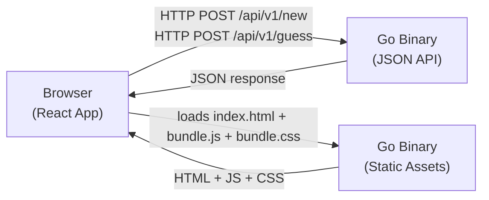
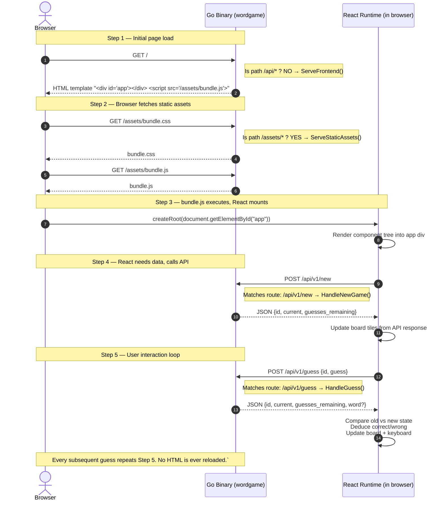
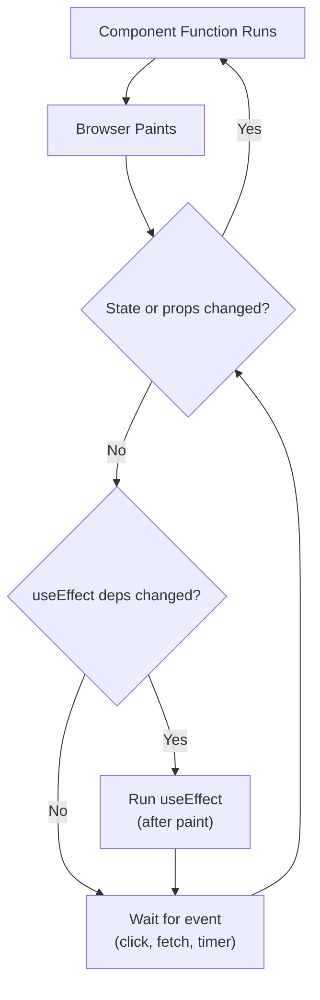
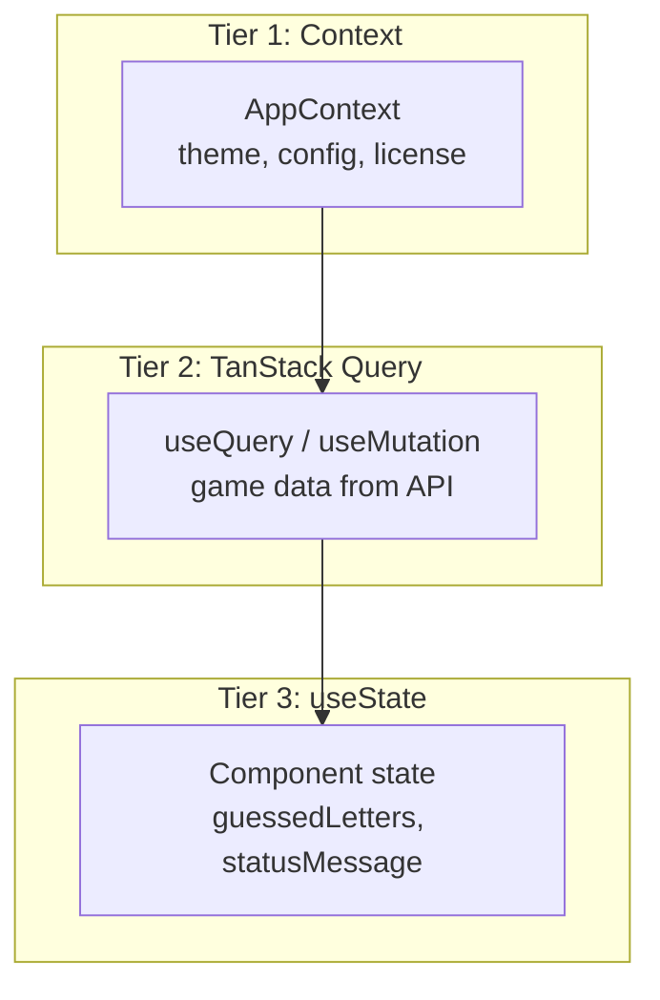
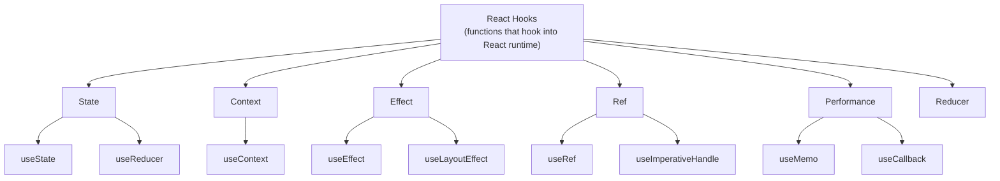
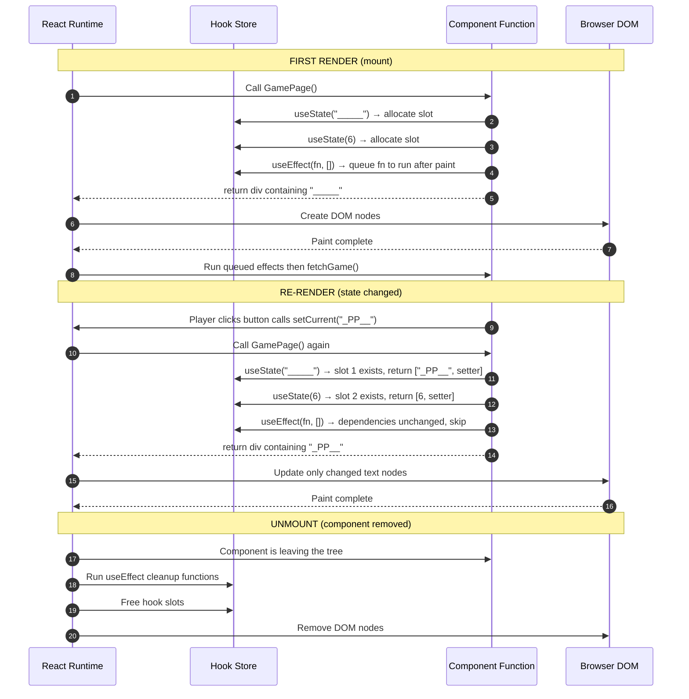
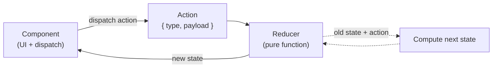
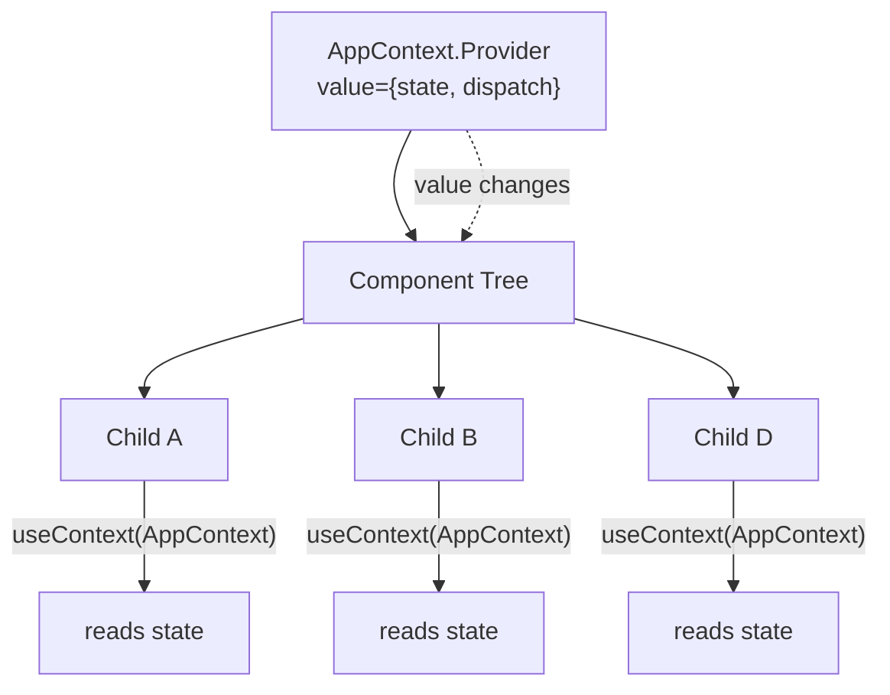
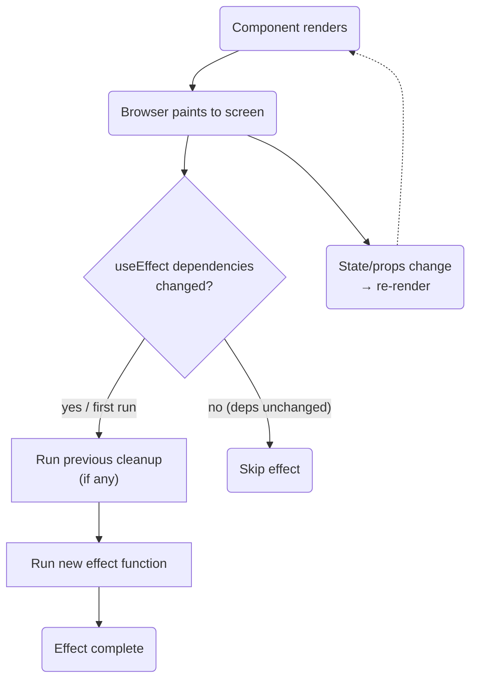

# Frontend Doc #1: The Architecture & Directory Skeleton

## Table of Contents

1. [What We're Building](#1-what-were-building)
2. [The Tech Stack — One Sentence Each](#2-the-tech-stack-one-sentence-each)
3. [SPA: What "Single Page Application" Actually Means](#3-spa-what-single-page-application-actually-means)
4. [How the Go Binary Serves the Frontend](#4-how-the-go-binary-serves-the-frontend)
5. [TypeScript Deep Dive](#5-typescript-deep-dive)
6. [React Deep Dive](#6-react-deep-dive)
7. [The Component Model](#7-the-component-model)
8. [JSX: HTML Inside JavaScript](#8-jsx-html-inside-javascript)
9. [State: The Game Loop Concept](#9-state-the-game-loop-concept)
9b. [React Hooks — Deep Dive](#9b-react-hooks-deep-dive)
10. [Data Flow (Conceptual)](#10-data-flow-conceptual)
11. [Project Structure (Brief)](#11-project-structure-brief)
12. [Quiz Yourself](#13-quiz-yourself)

---

## 1. What We're Building

We're adding a **browser-based UI** to our existing Go word-game API. Currently
the API is pure JSON — you `curl -X POST /api/v1/new` to start a game. We're building
a visual interface that:

- Shows the hidden word as underscore tiles (`_ _ P P _`)
- Shows a clickable keyboard (A through Z)
- Tracks remaining guesses
- Handles win, loss, and error states gracefully
- Talks to our **SAME** Go binary — no new server, no new process



---

## 2. The Tech Stack (What & Why)

Each item below is a technology we use, what problem it solves, how it maps to something you already know from Go, and what else exists in the same space.

---

### TypeScript
**What it does:** Adds a static type system to JavaScript — you declare the shapes and kinds of values (numbers, strings, objects, etc.), and the compiler catches mismatches before your code ever runs in the browser. Also powers IDE features like autocomplete and go-to-definition. See [Section 5](#5-typescript-deep-dive) for the full details on types, interfaces, and how it compiles away.

**Go analogy:** It's Go's compiler checking that you didn't pass a `string` where `int` is expected, but retrofitted onto JavaScript. The types are "erasable" — they vanish during compilation and the browser never sees them, just like Go generics are monomorphised away.

**Alternatives:** Flow (Facebook's type checker, now niche), plain JavaScript with JSDoc annotations (limited), or Elm/ReScript (compile-to-JS languages with their own type systems, different ecosystem).

---

### React
**What it does:** A component-based UI library. You write small functions (`function BoardTile(): JSX`) that each describe a piece of UI, then compose them into a tree. When data changes, React automatically re-runs the affected functions and surgically updates the real browser DOM — you never write `document.querySelector(...)` or `element.textContent = ...`.

**Go analogy:** Like `html/template` but interactive — React doesn't just render once and send HTML to the browser; it keeps a virtual copy of the DOM in memory, diffs it against the new output, and applies only the minimal changes. The template re-executes every time the data changes, and only the changed parts of the page flicker.

**Alternatives:** Vue (similar philosophy, more HTML-centric template syntax), Svelte (compiles away the framework — no virtual DOM, direct DOM manipulation), Angular (full framework with dependency injection, opinionated), Solid.js (fine-grained reactivity, no virtual DOM).

---

### React Router
**What it does:** Maps URL paths to React components — `"/"` → `<GamePage />`. When the user clicks a link, React Router intercepts the click (no HTTP request to the server), updates the URL bar via `history.pushState()`, and renders the corresponding component. The SPA never reloads.

**Go analogy:** `gorilla/mux` running *inside the browser*. Routes are declared declaratively (like `mux.NewRouter().HandleFunc("/", handler)`) but instead of handling HTTP requests, they handle URL changes in the browser's address bar.

**Alternatives:** TanStack Router (newer, fully typed, supports search params natively), reach/router (merged into React Router), wouter (tiny, hook-based), Next.js file-system router (server-side routing + file-convention-based).

---

### TanStack Query (formerly React Query)
**What it does:** Manages server-state — data that comes from an API. It fetches, caches, deduplicates, and background-refetches data. When two components both need the same game data, TanStack Query sends one request and shares the result. When the user refocuses the tab, it quietly refreshes stale data. Handles loading/error/success states.

**Go analogy:** A Redis cache for HTTP responses living in the browser's memory, with automatic cache invalidation and background refresh built in. Each cache entry has a TTL (`staleTime`), and TanStack Query automatically refetches when it expires.

**Alternatives:** SWR (by Vercel, similar fetch-on-stale strategy), RTK Query (part of Redux Toolkit, deeper Redux integration), Apollo Client (for GraphQL, overkill for REST), plain `useEffect` + `useState` (manual, no caching/dedup out of the box).

---

### Axios
**What it does:** Makes HTTP requests (GET, POST, etc.) with a clean promise-based API. Handles JSON parsing automatically, supports request/response interceptors (log requests, attach auth tokens), base URL configuration, request cancellation, and timeout. Every API call in our frontend goes through a single Axios wrapper (`sendRequest`).

**Go analogy:** Go's `net/http` client — `http.Get()`, `http.Post()`, `client.Do(req)`. Axios is the browser's `fetch()` but with better defaults (automatic JSON parse, no double-wrapping of error responses).

**Alternatives:** `fetch()` (browser native, no automatic JSON parsing, no interceptors, but no dependency), ky (tiny wrapper around fetch, similar API to Axios), got (Node.js-only).

---

### SCSS (Sass)
**What it does:** A superset of CSS that adds variables (`$color-primary: #333`), nesting (`.board { .tile { ... } }`), mixins (reusable style blocks), and functions. Compiles down to plain CSS. Lets you organise styles into partial files (`_styles.scss`) imported into a master stylesheet.

**Go analogy:** Like Go templates (variables, includes, functions) but for CSS instead of HTML. The nesting saves you from repeating selector chains that plain CSS forces you to write.

**Alternatives:** PostCSS (plugin-based CSS transformations, can replicate Sass features), Tailwind CSS (utility-first — you compose styles from hundreds of small classes like `text-lg p-4 flex`), CSS Modules (scoped class names, no extra syntax), styled-components (CSS-in-JS, styles defined alongside components in JS files).

---

### Webpack
**What it does:** A module bundler. It starts at an entry file (`index.tsx`), follows every `import` statement to build a dependency graph, then processes each file through loaders (TypeScript → JavaScript via `ts-loader`, SCSS → CSS via `sass-loader`), and finally bundles everything into a small number of output files — one `.js` and one `.css` for production. Also handles code splitting, tree-shaking (dead code elimination), and asset hashing for cache busting.

**Go analogy:** `go build` — it reads imports, resolves the dependency graph, applies the compiler (type-checking, inlining, dead-code elimination), and outputs a single binary. Webpack outputs `bundle.js` (the Go binary equivalent) and `bundle.css`.

**Alternatives:** Vite (much faster dev server using native ES modules, uses Rollup for production builds — the modern default for new React projects), esbuild (blazing fast bundler written in Go, used by Vite internally), Parcel (zero-config bundler), Turbopack (Next.js's new Rust-based bundler, very fast but tied to Next.js).

---

### Jest
**What it does:** A test runner and assertion library. Finds files matching `*.test.tsx` or `*.spec.ts` patterns, executes them in a Node.js environment, and reports pass/fail. Includes built-in mocking (`jest.mock()`, `jest.fn()`), code coverage, snapshot testing, and watch mode (re-runs tests on file changes).

**Go analogy:** `go test` — discovers `*_test.go` files, runs them, and reports results. `go test -cover` for coverage, `go test -run TestName` for specific tests.

**Alternatives:** Vitest (Jest-compatible API but built on Vite — much faster, native TypeScript support, no Babel/jest config needed), Mocha + Chai (older, more flexible, needs more configuration), Playwright (for browser-level integration tests, not unit tests).

---

### React Testing Library
**What it does:** Renders React components in a simulated browser environment (jsdom) so you can test them without a real browser. Provides queries to find elements by their accessible role, label text, placeholder, or data-testid — encouraging tests that interact with your UI the same way a user does (click buttons, read text, type into fields).

**Go analogy:** `httptest.NewRecorder` and `httptest.NewServer` — it creates a fake environment (jsdom instead of a real browser) where your React components can render and be interacted with programmatically.

**Alternatives:** Enzyme (older, deprecated in React 18 — tested component internals directly, which React itself advises against), Playwright Component Testing (renders components in a real browser, not jsdom — slower but more realistic).

---

### MSW (Mock Service Worker)
**What it does:** Intercepts network requests at the browser's fetch/XHR level (and at Node's `http`/`https` level for tests) and returns mock responses — without your application knowing the difference. The same mock handlers can be shared between tests, dev, and even Storybook.

**Go analogy:** `httptest.NewServer` — a fake HTTP server that your code talks to, returning pre-defined responses. Except MSW runs in the browser (or Node.js for tests) and intercepts at the `fetch()` / `XMLHttpRequest` / `http` level, so your code doesn't need URL changes.

**Alternatives:** nock (intercepts at the Node.js HTTP level — only works in Node, not browser), json-server (a real fake REST API you run separately), miragejs (similar to MSW but uses a faux database on the client side), `jest.mock()` (mocks at the module level — no polyfills, but tests know about implementation details).

**How we set it up (matches Fleet):** `test/test-setup.ts` starts the MSW server with `beforeAll` and tears it down with `afterAll`; `test/mock-server.ts` exports a default `setupServer(...handlers)` instance; `test/default-handlers.ts` declares the default route handlers. The jest config uses `jest-fixed-jsdom` (a jsdom variant that exposes Node's Web APIs — `Request`, `Response`, `fetch`, `TransformStream`, etc.), plus a `transformIgnorePatterns` allow-list for MSW's ESM dependencies (`msw`, `@mswjs/*`, `@bundled-es-modules/*`, `undici`, etc.) so babel-jest converts their ESM to CJS. A handful of Web APIs that `jest-fixed-jsdom@0.0.8` doesn't expose yet (`WritableStream`, `MessagePort`, `MessageChannel`, `Event`, `EventTarget`) are polyfilled in `test-setup.ts` before MSW loads.

In tests, override a default handler per-case with `mockServer.use(http.post("/api/v1/...", () => HttpResponse.json({...})))`. Handlers are reset to defaults after each test (`afterEach(() => mockServer.resetHandlers())`).

---

## 3. SPA: What "Single Page Application" Actually Means

### The Old Way (Multi-Page)

```
User clicks "Hosts" link
  → Browser sends GET /hosts to server
  → Go server renders full HTML page
  → Browser clears screen, paints new page
  → User sees a white flash, then new content
```

Every navigation = full page reload. Slow, clunky, wasteful — the nav bar,
logo, and CSS all get re-downloaded and re-rendered.

### The SPA Way (Our Way)

```
User clicks "New Game" button
  → React Router intercepts the click (no HTTP request!)
  → React swaps out the old component, renders the new one
  → Only the changed portion of the DOM updates
  → No white flash, no full reload, no re-downloading assets
```

```
┌─────────────────────────────────────────────────────┐
│  ONE HTML PAGE (index.html)                          │
│                                                      │
│  <html>                                              │
│    <body>                                            │
│      <div id="app">  ← React owns everything here    │
│                                                      │
│        ┌─────────────────────────────┐              │
│        │ SiteTopNav (always visible)  │              │
│        ├─────────────────────────────┤              │
│        │                             │              │
│        │  DashboardPage              │  ← React     │
│        │        OR                   │    swaps     │
│        │  GamePage                   │    these     │
│        │                             │    in/out    │
│        └─────────────────────────────┘              │
│      </div>                                          │
│    </body>                                           │
│  </html>                                             │
└─────────────────────────────────────────────────────┘
```

The browser loads `index.html` **once**. After that, React handles all
"navigation" by swapping components in and out of `<div id="app">`. The URL bar
still changes (React Router updates it), but no HTTP request is made.

**Backend analogy:** Imagine your Go server never calls `http.Redirect`. Instead,
all routes render into the same page, and `gorilla/mux` just decides which
template block to show. That's an SPA.

---

## 4. How the Go Binary Serves the Frontend

This is the most important architectural diagram. Study it.



**Key insight:** All API routes live under `/api/v1/`, keeping a clean separation
between the JSON API and the HTML/assets. The frontend's `sendRequest()` calls
endpoint constants like `/api/v1/new` and `/api/v1/guess`.

---

## 5. TypeScript Deep Dive

### The Problem: JavaScript Has No Types

```javascript
// Plain JavaScript — no compiler checking
function add(a, b) {
  return a + b;
}

add(5, 3);        // 8 — fine
add("hello", 3);  // "hello3" — silently succeeds but is wrong
add({}, []);      // "0[object Object]" — WTF?
```

JavaScript will happily run all of these. The bug surfaces at **runtime**, maybe
in production, maybe never caught by tests.

### The Solution: TypeScript

```typescript
// TypeScript — compiler catches errors before code runs
function add(a: number, b: number): number {
  return a + b;
}

add(5, 3);        // ✓ compiles
add("hello", 3);  // ✗ COMPILE ERROR: Argument of type 'string' is not
                  //   assignable to parameter of type 'number'.
```

**Backend analogy:** TypeScript is to JavaScript what Go's compiler is to an
untyped scripting language. It catches entire categories of bugs before your
code ever runs.

### .ts vs .tsx

| Extension | Contains | Example |
|-----------|----------|---------|
| `.ts` | Pure TypeScript (no HTML-like syntax) | `utilities/endpoints.ts` |
| `.tsx` | TypeScript + JSX (HTML inside code) | `components/Game/Game.tsx` |

**Analogy:** `.ts` is like a Go file with only logic. `.tsx` is like a Go file
that also has `html/template` snippets embedded in it.

### Example: `.ts` File (Pure Logic)

This file defines our API endpoint URLs — no UI, no HTML, just typed strings.
Exactly like a Go constants file.

```typescript
// utilities/endpoints.ts
//                     ^^^^ — .ts extension = no JSX allowed here

// Endpoints as typed values — note how parameterised paths are functions
// (like Go functions that return formatted strings):
export default {
  // Static paths — just strings
  NEW_GAME: "/api/v1/new",
  GUESS: "/api/v1/guess",

  // Parameterised path — a function that takes typed args and returns a string
  GAME_BY_ID: (id: string) => `/api/v1/games/${id}`,
};

// TypeScript enforces types here, just like Go would:
//   endpoints.NEW_GAME           → string (always "/api/v1/new")
//   endpoints.GAME_BY_ID("abc")  → string (returns "/api/v1/games/abc")
//   endpoints.GAME_BY_ID(42)     → ✗ COMPILE ERROR: number is not string
```

**What this compiles to (JavaScript):**

```javascript
// After Webpack strips TypeScript types, the runtime gets plain JavaScript.
// The types vanished — they only existed at compile time:
export default {
  NEW_GAME: "/api/v1/new",
  GUESS: "/api/v1/guess",
  GAME_BY_ID: (id) => `/api/v1/games/${id}`,
};
```

**Key point:** TypeScript types are **erasable** — they're removed during
compilation. The browser never sees them, just like how Go generics are
monomorphised away and the runtime doesn't know `T` existed. The types
protect you at **build time**, not at runtime.

---

### Example: `.tsx` File (UI Component)

This file defines a React component that renders part of the game board —
it uses JSX (HTML-like syntax inside JavaScript).

```tsx
// components/Game/BoardTile.tsx
//                        ^^^^^ — .tsx extension = JSX allowed here

// Props = the function parameter. Like a Go struct passed to a function.
interface BoardTileProps {
  letter: string;    // the character to show (e.g. "P" or "_")
  index: number;     // position in the word (e.g. 0, 1, 2...)
}

// Component = a function that receives props and returns JSX.
// Capital letter = React component (convention, not enforced by compiler).
export default function BoardTile({ letter, index }: BoardTileProps) {
  // Logic: decide CSS class based on letter value.
  // This is just plain TypeScript — no different from Go logic.
  const isRevealed = letter !== "_";

  // Return JSX: the "template" part. This compiles to React.createElement() calls.
  return (
    <span
      key={index}
      className={`board__tile ${isRevealed ? "board__tile--revealed" : ""}`}
    >
      {letter}
    </span>
  );
}
```

**What this compiles to (JavaScript):**

```javascript
// The TypeScript interface is erased. The JSX is transformed into
// React.createElement() function calls. This is what actually runs:
function BoardTile({ letter, index }) {
  const isRevealed = letter !== "_";
  return React.createElement(
    "span",
    {
      key: index,
      className: `board__tile ${isRevealed ? "board__tile--revealed" : ""}`,
    },
    letter
  );
}
```

**What this renders in the browser (for a 5-letter word "APPLE"):**

```html
<!-- If you call <BoardTile letter="_" index={0} /> -->
<span class="board__tile">_</span>

<!-- If you call <BoardTile letter="P" index={1} /> -->
<span class="board__tile board__tile--revealed">P</span>

<!-- If you call <BoardTile letter="P" index={2} /> -->
<span class="board__tile board__tile--revealed">P</span>

<!-- Player sees: _ P P _ _   (the third tile is also "_" but indexed 3) -->
```

**How you'd compose these into a board:**

```tsx
// components/Game/Board.tsx
import BoardTile from "./BoardTile";

interface BoardProps {
  current: string;  // e.g. "_PP__" from the API
}

export default function Board({ current }: BoardProps) {
  return (
    <div className="board">
      {current.split("").map((letter, i) => (
        <BoardTile key={i} letter={letter} index={i} />
      ))}
    </div>
  );
}

// Usage: <Board current="_PP__" />
// Renders: <div class="board">
//            <span class="board__tile">_</span>
//            <span class="board__tile board__tile--revealed">P</span>
//            <span class="board__tile board__tile--revealed">P</span>
//            <span class="board__tile">_</span>
//            <span class="board__tile">_</span>
//          </div>
```

**Backend analogy summary:**

```
.ts file   ≡  Go package with only functions + constants + structs
.tsx file  ≡  Go package with functions + constants + structs
                PLUS html/template calls that return HTML strings

Compilation:
  .ts  → Webpack strips types  → plain .js file
  .tsx → Webpack strips types  → plain .js file
              AND converts <div> → React.createElement("div")
```

### Interfaces in TypeScript

```typescript
// This is exactly like a Go struct:
interface NewGameResponse {
  id: string;               // string in TS = string in Go
  current: string;
  guesses_remaining: number; // number in TS = int/float in Go
}

// Usage — typed just like Go:
const response: NewGameResponse = await apiCall();
console.log(response.current);  // TypeScript KNOWS this is a string
```

**The Fleet naming convention:** Fleet prefixes interfaces with `I`:

```typescript
interface IHost { ... }
interface IConfig { ... }
```

We may or may not adopt this. It's a stylistic choice.

### Paths: Bare Imports

In Go, you write:

```go
import "github.com/fleetdm/wordgame/pkg/words"
```

Without TypeScript paths, you'd write:

```typescript
// HORRIBLE — fragile, breaks when you move files
import Button from "../../../components/buttons/Button";
```

With TypeScript paths (configured in `tsconfig.json`):

```typescript
// CLEAN — works from anywhere, survives refactoring
import Button from "components/buttons/Button";
```

This is configured via two settings:

1. `tsconfig.json` → `"paths": { "*": ["./frontend/*"] }` — tells TypeScript
2. `webpack.config.js` → `resolve.modules: ["./frontend", "node_modules"]` — tells Webpack

---

## 6. React Deep Dive

### What React Actually Is

React is a **runtime library** that:

1. Takes a description of what the UI should look like (your component functions)
2. Compares it to what's currently on screen (the "virtual DOM diff")
3. Calculates the minimum set of changes needed
4. Applies only those changes to the real browser DOM

**Backend analogy:** React is like a template rendering engine (`html/template`)
that doesn't just render once — it keeps the rendered output in sync with your
data, only updating the parts that changed.

---

### The Render Cycle — Visualised



---

### Step-by-Step: A Re-Render Walkthrough

Let's trace what happens when a player guesses the letter "P" and the board
needs to change from `"_____"` → `"_PP__"`. This is a **state change** — the
most common re-render trigger.

#### Before the guess (current state in browser DOM)

```html
<!-- What's actually on screen right now -->
<div class="board">
  <span class="board__tile">_</span>   <!-- index 0 -->
  <span class="board__tile">_</span>   <!-- index 1 -->
  <span class="board__tile">_</span>   <!-- index 2 -->
  <span class="board__tile">_</span>   <!-- index 3 -->
  <span class="board__tile">_</span>   <!-- index 4 -->
</div>
```

#### The component (our code)

```tsx
// pages/GamePage/GamePage.tsx
export default function GamePage() {
  // useState = "give me a variable that triggers re-render when changed"
  const [current, setCurrent] = useState("_____");   // initial value
  const [guessesLeft, setGuessesLeft] = useState(6);

  async function handleGuess(letter: string) {
    // 1. Call the API
    const response = await sendRequest("POST", "/api/v1/guess", {
      id: gameId,
      guess: letter,
    });

    // 2. Update state — THIS triggers the re-render
    setCurrent(response.current);       // "_PP__"
    setGuessesLeft(response.guesses_remaining);  // 6
  }

  // 3. Every time state changes, this return block re-executes
  return (
    <div className="board">
      {current.split("").map((letter, i) => (
        <span key={i} className={`board__tile ${letter !== "_" ? "board__tile--revealed" : ""}`}>
          {letter}
        </span>
      ))}
    </div>
  );
}
```

#### What React does, frame by frame

```
╔══════════════════════════════════════════════════════════════════╗
║  FRAME 1: Player clicks "P"                                      ║
║                                                                  ║
║  handleGuess("P") is called.                                     ║
║  API returns { current: "_PP__", guesses_remaining: 6 }          ║
║                                                                  ║
║  setCurrent("_PP__")   ← React queues a re-render                ║
║  setGuessesLeft(6)     ← React queues a re-render                ║
║                         (React batches these into ONE re-render)  ║
╚══════════════════════════════════════════════════════════════════╝
                              │
                              ▼
╔══════════════════════════════════════════════════════════════════╗
║  FRAME 2: React re-runs GamePage() function                      ║
║                                                                  ║
║  current = "_PP__"   (useState remembers the new value)          ║
║                                                                  ║
║  The function returns NEW JSX:                                   ║
║  <div class="board">                                             ║
║    <span key=0 class="board__tile">_</span>                      ║
║    <span key=1 class="board__tile board__tile--revealed">P</span>║
║    <span key=2 class="board__tile board__tile--revealed">P</span>║
║    <span key=3 class="board__tile">_</span>                      ║
║    <span key=4 class="board__tile">_</span>                      ║
║  </div>                                                          ║
╚══════════════════════════════════════════════════════════════════╝
                              │
                              ▼
╔══════════════════════════════════════════════════════════════════╗
║  FRAME 3: Reconciliation (Diffing)                               ║
║                                                                  ║
║  React compares OLD virtual tree vs NEW virtual tree:             ║
║                                                                  ║
║  key=0: "_" → "_"   NO CHANGE  ✓                                ║
║  key=1: "_" → "P"   TEXT CHANGED + CLASS CHANGED  ✗             ║
║  key=2: "_" → "P"   TEXT CHANGED + CLASS CHANGED  ✗             ║
║  key=3: "_" → "_"   NO CHANGE  ✓                                ║
║  key=4: "_" → "_"   NO CHANGE  ✓                                ║
║                                                                  ║
║  Result: only 2 DOM operations needed.                           ║
╚══════════════════════════════════════════════════════════════════╝
                              │
                              ▼
╔══════════════════════════════════════════════════════════════════╗
║  FRAME 4: React applies minimal mutations to real DOM            ║
║                                                                  ║
║  document.querySelector("[key='1']").textContent = "P";          ║
║  document.querySelector("[key='1']").className =                 ║
║    "board__tile board__tile--revealed";                          ║
║                                                                  ║
║  document.querySelector("[key='2']").textContent = "P";          ║
║  document.querySelector("[key='2']").className =                 ║
║    "board__tile board__tile--revealed";                          ║
║                                                                  ║
║  (key=0, key=3, key=4 were not touched at all.)                  ║
╚══════════════════════════════════════════════════════════════════╝
                              │
                              ▼
╔══════════════════════════════════════════════════════════════════╗
║  FRAME 5: Browser paints                                         ║
║                                                                  ║
║  Player sees:  _ P P _ _                                         ║
║  Tiles 1 and 2 now show "P" with green highlight.                ║
║  Tiles 0, 3, 4 are untouched — no flicker, no re-render flash.   ║
╚══════════════════════════════════════════════════════════════════╝
```

---

### Why This Matters: The Performance Story

Without React (manually updating the DOM):

```typescript
// What you'd have to write without React — tedious, error-prone:
function updateBoard(oldWord: string, newWord: string) {
  for (let i = 0; i < newWord.length; i++) {
    if (oldWord[i] !== newWord[i]) {
      const tile = document.querySelector(`[data-index='${i}']`);
      if (!tile) continue;
      tile.textContent = newWord[i];
      if (newWord[i] !== "_") {
        tile.classList.add("board__tile--revealed");
      }
    }
  }
}
// Now imagine doing this for guesses, keyboard, status bar, modals...
// Every single UI change requires manual DOM surgery.
```

With React:

```tsx
// You just declare what the UI should look like for any given state.
// React handles the DOM surgery for you.
function Board({ current }: { current: string }) {
  return (
    <div className="board">
      {current.split("").map((letter, i) => (
        <span key={i} className={`board__tile ${letter !== "_" ? "board__tile--revealed" : ""}`}>
          {letter}
        </span>
      ))}
    </div>
  );
}
```

**Backend analogy:** Manual DOM manipulation is like writing raw SQL queries
for every CRUD operation — you specify exactly how to get the data. React is
like an ORM — you declare the desired state, and it figures out the optimal
way to get there.

---

### The Component Function

A React component is just a **function** that returns UI:

```typescript
// This is a React component. It's just a function.
// Capital letter = component. Lowercase = regular function.
function Greeting(props: { name: string }) {
  return <h1>Hello, {props.name}!</h1>;
}

// Usage:
<Greeting name="Ajit" />
// Renders: <h1>Hello, Ajit!</h1>
```

**Backend analogy:** A component is like a Go function that takes a struct
(`props`) and returns a `template.HTML` string. But instead of being called
once, React calls it whenever the data changes.

### Props = Function Parameters (Read-Only)

```typescript
// Parent passes data down via props
function GamePage() {
  const word = "APPLE";
  return <Board word={word} guessesLeft={6} />;
}

// Child receives via props parameter
function Board(props: { word: string; guessesLeft: number }) {
  // props is READ-ONLY. You cannot do: props.word = "NEW";
  return (
    <div>
      <p>Word: {props.word}</p>
      <p>Guesses left: {props.guessesLeft}</p>
    </div>
  );
}
```

**Data flows DOWN.** Parent → child via props. Never child → parent via props.
If a child needs to communicate UP, it uses callbacks (functions passed as props).

---

## 7. The Component Model

### Tree Structure

Every React app is a **tree** of components. Like a filesystem tree:

```
<App>                          ← root (like "/")
├── <CoreLayout>               ← layout wrapper (like a directory)
│   ├── <SiteTopNav />         ← navigation bar
│   ├── <FlashMessage />       ← success/error notifications
│   └── <GamePage>             ← the actual content (like a file)
│       ├── <Board>            ← shows _ P P _ _
│       │   ├── <Tile letter="_" />
│       │   ├── <Tile letter="P" />
│       │   ├── <Tile letter="P" />
│       │   ├── <Tile letter="_" />
│       │   └── <Tile letter="_" />
│       ├── <Keyboard>         ← clickable letters
│       │   ├── <LetterButton letter="A" />
│       │   ├── <LetterButton letter="B" />
│       │   └── ... (24 more)
│       └── <StatusBar />      ← guesses remaining
```

### Two Categories of Components

| Category | Location | Purpose | Backend Analogy |
|---|---|---|---|
| **Shared components** | `components/` | Reusable across many pages | `pkg/` library code |
| **Page components** | `pages/` | One per URL route | HTTP handlers |

A `Button` in `components/buttons/` can be used anywhere. `GamePage` in
`pages/GamePage/` is bound to a specific URL route.

### Convention: Co-located Files

Fleet puts related files together:

```
components/Game/
├── Game.tsx              ← the component
├── Game.tests.tsx        ← its tests
├── _styles.scss          ← its CSS
└── index.ts              ← barrel export
```

This is like putting `handler.go`, `handler_test.go`, and handler-specific
utilities in the same Go package directory. Everything about this component
lives together.

### Barrel Export (`index.ts`)

```typescript
// components/buttons/index.ts
export { default } from "./Button";
```

This lets you write:

```typescript
import Button from "components/buttons";  // "buttons" resolves to "buttons/index.ts"
```

instead of:

```typescript
import Button from "components/buttons/Button/Button";
```

**Go analogy:** It's like `package buttons` — you import the package, not the
individual file.

---

## 8. JSX: HTML Inside JavaScript

### What It Looks Like

```tsx
function Board({ word }: { word: string }) {
  return (
    <div className="board">
      {word.split("").map((letter, i) => (
        <span key={i} className="board__tile">
          {letter}
        </span>
      ))}
    </div>
  );
}
```

### What It Actually Is (After Compilation)

JSX is **syntactic sugar** for function calls. The above compiles to:

```javascript
function Board({ word }) {
  return React.createElement(
    "div",
    { className: "board" },
    word.split("").map((letter, i) =>
      React.createElement(
        "span",
        { key: i, className: "board__tile" },
        letter
      )
    )
  );
}
```

**Backend analogy:** JSX is to `React.createElement()` what `html/template`
syntax `{{.Name}}` is to raw `template.Execute()` calls. It's just a nicer way
to write the same thing.

### Key JSX Rules (for Backend Engineers)

1. **`{}` means "evaluate this JavaScript"**

   ```tsx
   <h1>Score: {guessesRemaining}</h1>  {/* renders "Score: 5" */}
   ```

2. **`className` not `class`** (because `class` is a reserved word in JS)

   ```tsx
   <div className="game-board">  // NOT class="game-board"
   ```

3. **Must return a single root element** (or use `<>...</>` fragment)

   ```tsx
   // WRONG — two roots
   return (
     <h1>Title</h1>
     <p>Subtitle</p>
   );

   // RIGHT — wrapped in a div
   return (
     <div>
       <h1>Title</h1>
       <p>Subtitle</p>
     </div>
   );

   // RIGHT — fragment (invisible wrapper)
   return (
     <>
       <h1>Title</h1>
       <p>Subtitle</p>
     </>
   );
   ```

4. **Self-closing tags require `/`**

   ```tsx
   <br />         // not <br>
   <Tile />       // not <Tile>
   ```

---

## 9. State: The Game Loop Concept

### The Core Idea

State is **data that changes over time**. When state changes, React **re-renders**
the component automatically.

```typescript
import { useState } from "react";

function Counter() {
  const [count, setCount] = useState(0);  // state variable

  return (
    <div>
      <p>Count: {count}</p>
      <button onClick={() => setCount(count + 1)}>
        Increment
      </button>
    </div>
  );
}
```

When the button is clicked:

1. `setCount(1)` is called
2. React marks this component as "dirty"
3. React re-runs the `Counter()` function
4. `count` is now `1` (useState remembers it)
5. React diffs: old DOM said "Count: 0", new says "Count: 1"
6. React updates only `<p>Count: 1</p>` in the real browser

**Backend analogy:** State is like a struct field. Changing it is like calling
a setter that triggers a re-render of your template. Unlike Go where you
explicitly call `t.Execute()`, React watches state and re-renders automatically.

### The Three Tiers of State (Fleet's Pattern)

Fleet uses three different state mechanisms for three different kinds of data:



### State Flow for Our Game

**Conceptual tiers** — each solves a different problem:

**Why three tiers?** Each tier solves a different problem:

| Data | Tier | Because... |
|---|---|---|
| `config.apiBaseUrl` | Tier 1 (Context) | Set once at startup. Every component may need it. No API call needed. |
| `theme` | Tier 1 (Context) | Global preference (light/dark). Changed rarely. Available everywhere without prop-drilling. |
| `gameId`, `current`, `guesses` | Tier 2 (TanStack Query) | Comes from the API. Changes frequently. Needs caching, refetching, loading/error states. |
| `guessedLetters`, `statusMessage` | Tier 3 (useState) | Derived locally by comparing new API response to old state. No other component needs it. |

The API never tells you "that guess was correct" or "that guess was wrong." It
just returns the new `current` and `guesses_remaining`. The frontend **compares**
the new response to the old state to figure out what happened. That local
deduction lives in `useState` — the API data lives in TanStack Query.

---

## 9b. React Hooks — Deep Dive

Before reading the Tier 1 code, you need to understand **hooks**. Every React
feature you'll use — `useState`, `useReducer`, `useContext`, `useEffect` — is
a hook. They are the fundamental building block of modern React.

---

### What Is a Hook?

A hook is a **function that "hooks into" React's internal runtime**. It lets
your component functions do things that plain functions can't normally do:
remember values across calls, run code after rendering, or read shared global
state.



**Backend analogy:** Hooks are like Go's `context.Context` — an invisible
thread through your function calls that carries state, schedules work, and
connects to shared resources. Your function looks like a pure computation,
but hooks give it access to React's internal machinery behind the scenes.

---

### Why Hooks Exist (What They Replaced)

**Before hooks (2013–2018):** React used **classes**. State lived in
`this.state`, logic was split across lifecycle methods (`componentDidMount`,
`componentDidUpdate`, `componentWillUnmount`), and sharing logic between
components required complex patterns like "higher-order components."

```javascript
// THE OLD WAY — class components (no longer used)
class GamePage extends React.Component {
  constructor(props) {
    super(props);
    this.state = { current: "_____", guesses: 6 };
  }

  componentDidMount() {
    this.fetchGame();
  }

  componentDidUpdate(prevProps) {
    if (prevProps.gameId !== this.props.gameId) {
      this.fetchGame();
    }
  }

  fetchGame() { /* ... */ }

  render() {
    return <div>{this.state.current}</div>;
  }
}
```

**After hooks (2019–present):** Functions + hooks. Same logic, but the
related code stays together instead of being scattered across lifecycle methods.

```typescript
// THE MODERN WAY — function component + hooks
function GamePage() {
  const [current, setCurrent] = useState("_____");
  const [guesses, setGuesses] = useState(6);

  // All setup logic for fetching lives HERE, together.
  useEffect(() => {
    fetchGame();
  }, []);

  return <div>{current}</div>;
}
```

---

### The Hook Lifecycle — When Do They Run?



**The key insight:** Hook call order matters. React identifies hooks by
their **call order**, not by name. The first `useState` call is always
slot #1, the second is slot #2, even across re-renders. This is why hooks
**cannot be called inside conditions or loops** — the order must stay
identical on every render.

---

### The 6 Hooks You'll Use Every Day

#### 1. `useState` — Local Variables That Survive Re-Renders

```typescript
// Signature:
// const [value, setValue] = useState(initialValue);

function Counter() {
  const [count, setCount] = useState(0);

  console.log("Rendering with count =", count);
  // First render:   "Rendering with count = 0"
  // After click:    "Rendering with count = 1"
  // After click:    "Rendering with count = 2"

  return (
    <button onClick={() => setCount(count + 1)}>
      Clicked {count} times
    </button>
  );
}
```

**What's happening:** On the first render, `useState(0)` creates a memory
slot in React's internal store with value `0`. On re-renders, React sees
"this is slot #1" and returns the stored value (now `1`, `2`, etc.) instead
of `0`. The `setCount` function updates that slot AND triggers a re-render.

**Backend analogy:** `useState` is like a struct field on a long-lived object.
`setCount(5)` is like `obj.count = 5; obj.ReRender()`. The value persists
between "frames" of the render loop.

```
const [value, setValue] = useState(initialValue);
        ^        ^                    ^
        |        |                    └── Only used on FIRST render.
        |        |                        Ignored on subsequent renders.
        |        └── Setter function. Calling it updates state
        |            AND schedules a re-render.
        └── Current value. Read-only. Treat it as immutable.
```

#### 2. `useReducer` — useState for Complex State Transitions

`useState` works for simple values. When you have multiple pieces of state
that change together, or when the next state depends on the previous state
in complex ways, use `useReducer`.

```typescript
// useState version — fragile, easy to miss an update
const [current, setCurrent] = useState("_____");
const [guesses, setGuesses] = useState(6);
const [status, setStatus] = useState("playing");

// A bug: what if we forget to update all three?
function handleGuess() {
  setCurrent("_PP__");
  // OOPS: forgot setGuesses() and setStatus()!
}

// useReducer version — all state transitions in one place
// Backend analogy: this is a STATE MACHINE.

type GameState = {
  current: string;
  guessesRemaining: number;
  status: "idle" | "playing" | "won" | "lost";
};

type GameAction =
  | { type: "NEW_GAME"; payload: { id: string; current: string } }
  | { type: "CORRECT_GUESS"; payload: { current: string } }
  | { type: "WRONG_GUESS"; payload: { guessesRemaining: number } }
  | { type: "GAME_OVER"; payload: { status: "won" | "lost"; word?: string } };

function gameReducer(state: GameState, action: GameAction): GameState {
  switch (action.type) {
    case "NEW_GAME":
      return {
        current: action.payload.current,
        guessesRemaining: 6,
        status: "playing",
      };
    case "CORRECT_GUESS":
      return { ...state, current: action.payload.current };
    case "WRONG_GUESS":
      return { ...state, guessesRemaining: action.payload.guessesRemaining };
    case "GAME_OVER":
      return { ...state, status: action.payload.status };
    default:
      return state;
  }
}

// Usage in a component:
function GamePage() {
  const [state, dispatch] = useReducer(gameReducer, {
    current: "_____",
    guessesRemaining: 6,
    status: "idle",
  });

  // All updates go through one channel:
  dispatch({ type: "CORRECT_GUESS", payload: { current: "_PP__" } });
}
```

**Backend analogy:** If `useState` is like individual setter methods,
`useReducer` is like an event-sourcing state machine. You dispatch
"actions" (events) and a single `reducer` function (the state machine's
transition function) computes the new state. Impossible to produce an
invalid state because all transitions are in one place.



#### 3. `useContext` — Read Global State Without Prop-Drilling

```typescript
// context/app.tsx
const ThemeContext = createContext<"light" | "dark">("light");

// pages/GamePage.tsx
function GamePage() {
  // Read from the nearest <ThemeContext.Provider> above this component.
  // No props needed. No passing through intermediate components.
  const theme = useContext(ThemeContext);

  return <div className={`game game--${theme}`}>...</div>;
}
```

**Backend analogy:** `useContext` is like reading from a global config
singleton. The difference is that when the Provider's value changes,
every component that called `useContext` for that context **automatically
re-renders**. Like pub/sub for configuration changes.



#### 4. `useEffect` — Run Code After Render (API Calls, Timers, Cleanup)

```typescript
function GamePage() {
  const [gameId, setGameId] = useState<string | null>(null);

  // Signature: useEffect(setupFunction, dependencyArray)
  useEffect(() => {
    // This runs AFTER React paints to the screen.
    // Good place for: API calls, timers, subscriptions.

    if (!gameId) return;

    const interval = setInterval(() => {
      console.log("Game still active:", gameId);
    }, 10000);

    // CLEANUP FUNCTION — runs before the next effect,
    // or when the component unmounts.
    return () => {
      clearInterval(interval);
      console.log("Cleaned up interval for", gameId);
    };
  }, [gameId]);  // ← re-run effect whenever gameId changes

  // Dependency array meanings:
  // []        → run once (on mount only)
  // [a, b]    → run whenever a or b changes
  // omitted   → run after EVERY render (rarely used)

  return <div>...</div>;
}
```

**Backend analogy:** `useEffect` is like `defer` in Go — it schedules work
to happen later. But unlike `defer`, it can also have a **cleanup** function
(like `defer` for the teardown) and can be configured to re-run when
specific values change (like a reactive observer).



#### 5. `useRef` — A Mutable Box That Survives Re-Renders

```typescript
function GamePage() {
  const inputRef = useRef<HTMLInputElement>(null);
  //               ^^^^ Like a pointer in Go (*html.InputElement)

  const renderCount = useRef(0);
  renderCount.current += 1;

  // Unlike useState, changing .current does NOT trigger a re-render.

  function focusInput() {
    inputRef.current?.focus();  // Direct DOM access — escape hatch
  }

  return (
    <>
      <input ref={inputRef} />
      <button onClick={focusInput}>Focus input</button>
      <p>Rendered {renderCount.current} times</p>
    </>
  );
}
```

**Backend analogy:** `useRef` is like a `sync.Mutex` or a pointer — a
container whose contents can change without triggering any notifications.
Use it for: DOM references, interval IDs, previous value tracking, or
any mutable value that shouldn't cause re-renders.

#### 6. `useMemo` and `useCallback` — Performance Caching

```typescript
function GamePage({ words }: { words: string[] }) {
  const [filter, setFilter] = useState("");

  // Without useMemo: this filter runs on EVERY render, even if
  // words and filter haven't changed. Wasteful for large lists.
  // const filtered = words.filter(w => w.includes(filter));

  // With useMemo: re-computes ONLY when words or filter changes.
  const filtered = useMemo(
    () => words.filter(w => w.includes(filter)),
    [words, filter]
  );

  // Without useCallback: a NEW function is created on every render.
  // This causes child components to re-render unnecessarily.
  // const handleClick = () => { setFilter(""); };

  // With useCallback: same function reference unless deps change.
  const handleClick = useCallback(
    () => { setFilter(""); },
    []
  );

  return <WordList words={filtered} onReset={handleClick} />;
}
```

**Backend analogy:** `useMemo` is like a memoized/cached function — same
inputs → return cached result, skip recomputation. `useCallback` is like
a stable function pointer — the reference doesn't change between renders
so child components can skip re-rendering.

---

### The Rules of Hooks

```
┌─────────────────────────────────────────────────────────┐
│                 THE TWO RULES OF HOOKS                    │
│                                                         │
│  RULE 1: Only call hooks at the TOP LEVEL.              │
│  ────────────────────────────────────                   │
│  ✓ function Comp() {                                    │
│      const [a, setA] = useState(0);  // top level ✓     │
│      const [b, setB] = useState(0);  // top level ✓     │
│      return ...                                         │
│    }                                                    │
│                                                         │
│  ✗ function Comp() {                                    │
│      if (condition) {                                   │
│        const [a, setA] = useState(0);  // inside if ✗   │
│      }                                                  │
│      for (...) {                                        │
│        const [b, setB] = useState(0);  // inside loop ✗ │
│      }                                                  │
│    }                                                    │
│                                                         │
│  WHY: React identifies hooks by call ORDER. If the      │
│  order changes between renders, React gets confused     │
│  about which state belongs to which hook.               │
│                                                         │
│  RULE 2: Only call hooks from React functions.          │
│  ─────────────────────────────────────────              │
│  ✓ Inside component functions                           │
│  ✓ Inside custom hooks (functions starting with "use")   │
│  ✗ Inside regular JavaScript functions                  │
│  ✗ Inside callbacks, event handlers, loops              │
└─────────────────────────────────────────────────────────┘
```

---

### Custom Hooks — Composing Hooks Together

A custom hook is just a **function whose name starts with `use`** that calls
other hooks inside it. It's the primary mechanism for **reusing stateful logic**
across components.

**Backend analogy:** A custom hook is like extracting shared middleware or
helper functions into a separate package. Instead of copy-pasting the same
`sendRequest` + `setState` pattern into 5 components, you write it once in
a `useGame()` hook and import it everywhere.

The actual `useGame` hook for this project uses `useState` for game data and
`useMutation` (TanStack Query) for API lifecycle. See
[frontend-doc3.md](frontend-doc3.md) Sections 8-9 for the full implementation.

---

### How to Read `useX()` as a Backend Engineer

When you see a hook call, mentally translate it:

```
useState(0)          → "Allocate a state slot, init with 0.
                        Return [currentValue, updateFunction]."

useReducer(fn, init) → "Create a state machine with transition
                        function `fn`. Return [currentState, dispatch]."

useContext(MyCtx)    → "Read from the nearest <MyCtx.Provider> above me.
                        Re-render when that value changes."

useEffect(fn, [a])   → "After the browser paints, if `a` changed since
                        last time, run `fn`. Run cleanup from last `fn` first."

useRef(val)          → "Give me a mutable box. Changes to .current won't
                        trigger re-renders."

useMemo(fn, deps)    → "Cache the result of fn. Only recompute when a
                        dependency changes."

useCallback(fn, deps)→ "Stabilise this function reference. Don't create
                        a new one unless dependencies change."
```

With that foundation, here's how Context + useReducer fits together:

---

### Tier 1 in Code: Context + useReducer Setup

See [frontend-doc3.md](frontend-doc3.md) Sections 4-5 for the complete
`context/app.tsx` source (AppProvider, useReducer, ThemeSync) and how
`SiteTopNav` consumes it.

Key takeaway: Theme lives in Context, not props — `SiteTopNav` reads and
dispatches theme via `useAppContext()` with zero prop drilling.

**Backend analogy summary:**

```
Context + useReducer   ≡  A global config struct + a state machine
                           shared across all HTTP handlers.
                           Like passing app.State to every handler
                           via dependency injection.

TanStack Query         ≡  A Redis cache for HTTP responses.
                           Deduplicates requests, caches results,
                           auto-refetches stale data.

useState               ≡  A local variable inside a handler function.
                           No one else needs it. Dies when the
                           component unmounts (like a function return).
```

---

## 10. Data Flow (Conceptual)

The frontend is a **read-interpret-render** pipeline:

1. User clicks a letter → calls `makeGuess(letter)`
2. `useGame` hook sends an Axios POST to `/api/v1/guess`
3. Go backend responds with `{current: "_PP__", guesses_remaining: 6}`
4. React re-renders the board showing new tiles + disabled keyboard button

The API returns raw data; the frontend interprets it for display — same separation as a Go handler reading from a database.

See [frontend-doc3.md](frontend-doc3.md) Sections 14-15 for the full sequence diagrams including error recovery flow.

## 11. Project Structure (Brief)

The 31 frontend source files are grouped into directories by role:

- `frontend/index.tsx` — entry point
- `components/App/` — root component wiring providers
- `pages/GamePage/` — the only route-level component
- `layouts/` — app shell (CoreLayout + SiteTopNav)
- `context/` — Tier 1 (AppProvider) and Tier 2 (QueryProvider)
- `hooks/` — `useGame.ts` (the core state hook)
- `services/entities/` — API service wrappers
- `utilities/` — `sendRequest` and endpoint constants
- `router/` — route tree and URL paths
- `interfaces/` — TypeScript types
- `styles/` — shared SCSS variables
- `test/` — test infrastructure

See [frontend-doc3.md](frontend-doc3.md) Section 3 for the complete annotated directory tree and every file explained.

For full implementation details — every source file, data flow diagrams, error recovery, theme system, and testing strategy — read [frontend-doc3.md](frontend-doc3.md).

---

## 13. Quiz Yourself

To make sure you've absorbed this, try answering these:

1. **What is an SPA and how is it different from a traditional website?**
   <details><summary>Answer</summary>
   An SPA loads one HTML page, then uses JavaScript to swap content without
   full page reloads. Traditional sites send a new HTML page from the server for
   every navigation. SPA = React handles routing in-memory. Traditional =
   server handles routing via HTTP.
   </details>

2. **Why do we need Webpack if the browser can run JavaScript directly?**
   <details><summary>Answer</summary>
   Browsers can't run TypeScript, JSX, or SCSS directly. Webpack transpiles
   TypeScript → JavaScript, JSX → function calls, and SCSS → CSS. It also
   bundles 100+ source files into 1 JS + 1 CSS file for efficient loading.
   </details>

3. **What's the difference between `.ts` and `.tsx` files?**
   <details><summary>Answer</summary>
   `.ts` = pure TypeScript (logic only). `.tsx` = TypeScript + JSX (HTML-like
   syntax inside code). Use `.tsx` for React components, `.ts` for utilities.
   </details>

4. **What are the three tiers of state and when do you use each?**
   <details><summary>Answer</summary>
   Context (global data every page needs — like currentUser), TanStack Query
   (API data that changes — like game state), useState (local UI state — like
   which letter is hovered).
   </details>

5. **What is a "bare import"?**
   <details><summary>Answer</summary>
   An import without `../../../` relative paths. `import Button from
   "components/buttons/Button"` instead of `import Button from
   "../../../components/buttons/Button"`. Configured via tsconfig paths +
   webpack resolve.modules.
   </details>

6. **Why does each component directory have `index.ts`, `_styles.scss`, and
   `*.tests.tsx` co-located?**
   <details><summary>Answer</summary>
   Fleet's convention: everything related to a component lives together. Tests
   are co-located (like Go's `_test.go`), styles are co-located (keeps CSS
   scoped to the component), and `index.ts` provides a barrel export (like a
   Go package declaration).
   </details>

7. **Why did we choose `go-bindata` over `//go:embed` for asset embedding?**
   <details><summary>Answer</summary>
   `go-bindata` has a `-debug` flag that reads from disk during development.
   `//go:embed` only embeds at compile time — no way to bypass the embedded
   bytes. With go-bindata, you run `go-bindata -debug` during dev (reads from
   disk, no rebuild needed) and `go-bindata` (no flag) for production (embeds
   bytes into binary). Same handler code works for both modes.
   </details>

8. **How does `make dev` work and why don't we need CORS or a proxy?**
   <details><summary>Answer</summary>
   `make dev` builds the JS bundle, runs `go-bindata -debug`, starts webpack
   in watch mode, then launches the Go server on `:1337`. The Go server serves
   both the frontend (via `bindata.Asset()`) and the API (via gorilla/mux).
   Since everything is on port `:1337`, the browser loads `index.html` and
   makes API calls to `/api/v1/*` on the **same origin** — no CORS needed,
   no proxy required. One port, one server, zero configuration.
   </details>

9. **What is the difference between direct `bindata.Asset()` calls and
   `http.FileServer` for serving frontend assets?**
   <details><summary>Answer</summary>
   `http.FileServer` issues a 301 redirect when it encounters a path like
   `/index.html` (it checks if the path is a directory, finds it's not,
   and redirects to `/index.html` with a leading slash). For an SPA catch-all,
   this causes an infinite redirect loop. Direct `bindata.Asset()` calls avoid
   this entirely — we read the file bytes ourselves, set the Content-Type, and
   write them to the response. No redirect logic, no path manipulation.
   </details>

10. **What state management does the useGame hook use?**
    <details><summary>Answer</summary>
    Game data is read from TanStack Query's cache via `useQuery` (keyed on
    `gameId`, with `enabled: !!gameId`). Mutations write to the cache via
    `queryClient.setQueryData(["game", id], data)` in their `onSuccess`
    callbacks. `gameId` and `guessedLetters` are local `useState`. The
    `queryClient` provides the cache + lifecycle tracking (`isPending`,
    `isError`) for the mutations.
    </details>

---
