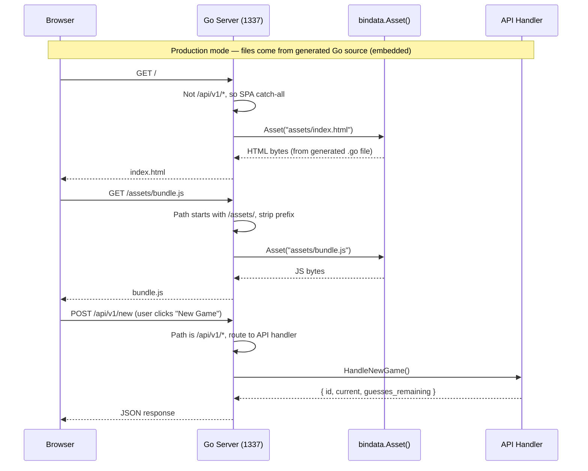
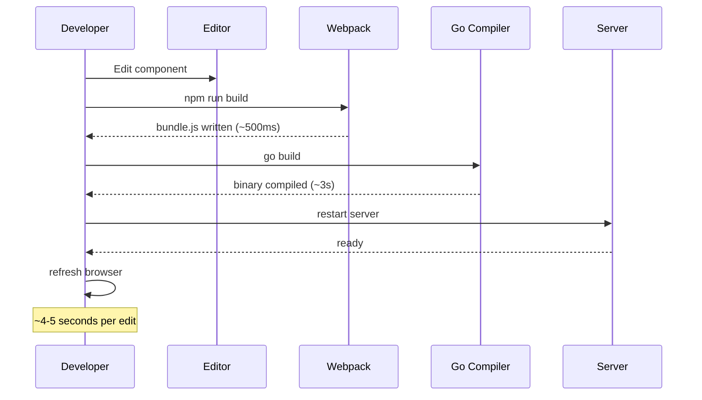
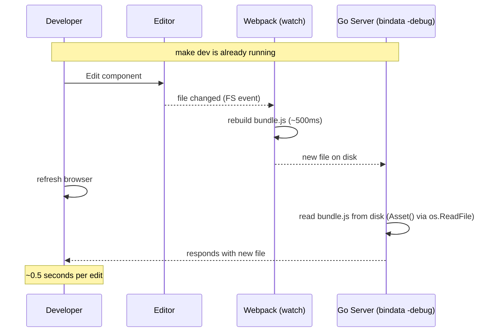

# Frontend Doc 2 — Dev vs Production: How the Frontend Gets Served

## Table of Contents

- [The Big Question](#the-big-question)
- [One Port Serves Both](#one-port-serves-both)
- [The Short Answer](#the-short-answer)
- [Production Mode: One Binary, Zero Dependencies](#production-mode-one-binary-zero-dependencies)
  - [How the Go Embed Directive Works](#how-the-go-embed-directive-works)
  - [The Request Flow](#the-request-flow)
- [Dev Mode: Read from Disk, No Recompilation](#dev-mode-read-from-disk-no-recompilation)
  - [Why Not Embed in Dev?](#why-not-embed-in-dev)
  - [How Does the Go Server Know It's in Dev Mode?](#how-does-the-go-server-know-its-in-dev-mode)
  - [The Request Flow](#the-request-flow-1)
  - [What Happens When You Change a File](#what-happens-when-you-change-a-file)
- [How Fleet Does It](#how-fleet-does-it)
- [Makefile in Detail](#makefile-in-detail)
  - [`make generate`](#make-generate)
  - [`make dev`](#make-dev)
  - [`make run`](#make-run)
- [Comparing the Two Modes Side by Side](#comparing-the-two-modes-side-by-side)
- [Why Two Handlers Instead of One?](#why-two-handlers-instead-of-one)
- [The SPA Catch-All](#the-spa-catch-all)

---

## The Big Question

We have two ways to run the word game:

```bash
# Way 1 — Production
make generate   # webpack builds JS/CSS/HTML, go-bindata embeds them, Go compiles
make run        # starts server, serves API + frontend from one Go binary

# Way 2 — Development
make dev        # webpack watch + go-bindata -debug + Go server, all in one terminal
```

Why two ways? Why not just always embed the frontend in the binary?

---

## One Port Serves Both

Here's the critical thing to understand: **there is one Go server on port 1337 that serves everything** — the API responses AND the frontend HTML/JS/CSS files. You point your browser at `http://localhost:1337` and it handles both.

The server has a router that decides where each request goes:

```
                        ┌────────────────────────────────────────┐
                        │          Go Server (localhost:1337)     │
                        │                                        │
Browser ──→ GET / ─────→│  mux.Router checks the path:           │
                        │                                        │
                        │  ┌─────────────────────────────────┐   │
                        │  │  /api/v1/new  →  Go API handler  │   │
                        │  │  /api/v1/guess →  Go API handler  │   │
                        │  │  /assets/*    →  Serve file       │   │
                        │  │  /* (all else) → Serve index.html │   │
                        │  └─────────────────────────────────┘   │
                        │                                        │
                        │  ┌─────────────────────────────────┐   │
                        │  │  Embedded in the binary:         │   │
                        │  │  • index.html (SPA shell)        │   │
                        │  │  • bundle.js (React app)          │   │
                        │  │  • bundle.css (styles)            │   │
                        │  └─────────────────────────────────┘   │
                        └────────────────────────────────────────┘
```

Notice the last two rules. They're registered **after** the API routes, so API requests are handled first. Everything else that doesn't match `/api/v1/*` falls through to the frontend handler, which:

- Serves files from `/assets/*` directly (JS, CSS, images)
- Returns `index.html` for **any other path** (this is the "SPA catch-all")

So `http://localhost:1337` returns the full React app. `http://localhost:1337/api/v1/new` returns JSON. Same server, same port, different routes.

### What This Means for You as a Developer

```bash
make run
# Server starts:
#   http://localhost:1337  ← OPEN THIS IN YOUR BROWSER
#     → Returns the full React game UI
#
#   http://localhost:1337/api/v1/new
#     → Returns JSON: { "id": "...", "current": "_____", ... }
#
# Both are served by the same Go process on the same port.
# There is no separate "API server" and "frontend server".
```

### Why This Matters

Traditional backend development often has:
- One server for the API (e.g., `localhost:8080/api/`)
- A different server for the frontend (e.g., `localhost:3000`)
- CORS configuration to let them talk to each other

We have **one server, one port**. The frontend files are baked into the same binary that handles API requests. No CORS, no proxy, no two-terminal dance. Just `make run` → `localhost:1337`.

---

## The Short Answer

| Mode | Frontend files come from... | After editing a component... |
|---|---|---|
| **Production** (`make run`) | Embedded in Go binary via go-bindata | Must re-run `make generate` (~5-10s) |
| **Development** (`make dev`) | On disk in `./assets/` (via go-bindata -debug) | Just refresh the browser (~0.5s) |

**Production** cares about **deployment simplicity** — a single binary with no external files. Give ops one file, they run one command.

**Dev** cares about **iteration speed** — edit a button, refresh the browser. No waiting for recompilation.

The secret? `go-bindata` generates a Go file that either **embeds the file bytes** (production) or **stores file paths** (development, with `-debug` flag). The HTTP handler calls `bindata.Asset()` either way — it doesn't know or care which mode it's in. The API logic never changes.

---

## Production Mode: One Binary, Zero Dependencies

### Backend Engineer Analogy

You know how a Go binary is self-contained — no Python runtime needed, no virtualenv, no `pip install`? That's exactly what we do for the frontend. The JS, CSS, and HTML are **baked into the Go binary itself**:

```
make generate-js (webpack)    →  writes bundle.js + index.html to assets/
make generate-go              →  go-bindata reads assets/*, generates Go code
                               →  go build compiles binary with embedded files
make run                      →  single binary serves everything on :1337
```

No Node.js runtime on the server. No file system dependencies. Just a Go binary.

### How go-bindata Works

`go-bindata` is a tool that reads files from a directory and generates a Go source file containing those files as byte arrays. It's like a compiler plugin that says "take these files and make them part of the binary."

You run it like this:

```bash
# Production: embed file bytes into the binary
go-bindata -pkg=bindata -o=internal/bindata/generated.go assets/...

# Development: store file paths instead (reads from disk at runtime)
go-bindata -debug -pkg=bindata -o=internal/bindata/generated.go assets/...
```

The `-debug` flag is the magic switch:
- **Without `-debug`**: `go-bindata` reads every file under `assets/`, converts it to a `[]byte`, and stores it in the generated Go file. The generated file is large — it literally contains `var bundleJS = []byte{0x48, 0x65, 0x6c, ...}`.
- **With `-debug`**: `go-bindata` stores **file paths** as strings instead of byte arrays. The generated `Asset()` function calls `os.ReadFile()` on the real file at runtime.

Either way, you get the same API:

```go
package bindata

// Generated by go-bindata. In production:
//   func Asset(name string) ([]byte, error) { return data[name], nil }
//
// In debug mode:
//   func Asset(name string) ([]byte, error) { return os.ReadFile(name) }

// Your HTTP handler calls this, never knowing which mode it's in:
data, err := bindata.Asset("assets/index.html")
```

The generated Go file lives at `internal/bindata/generated.go`. It's listed in `.gitignore` because it's regenerated on every build — so you never accidentally commit the wrong mode.

### The Request Flow

```
┌──────────┐     GET /                 ┌──────────────────────────┐
│  Browser │ ──────────────────────→   │     Go Server (1337)     │
│          │                           │                          │
│          │                           │  mux.Router checks       │
│          │                           │  the path:               │
│          │                           │                          │
│          │    ┌──────────────────────┤  ┌─ /api/v1/*  → API    │
│          │    │                      │  ├─ /assets/*  → serve  │
│          │    │                      │  │    file directly     │
│          │    │    bindata.Asset()   │  └─ everything else     │
│          │    │                     │       → index.html      │
│          │    │    ┌───────────────┐ │                          │
│          │    │    │ In production: │ │                          │
│          │    │    │ returns bytes  │◄┘                          │
│          │    │    │ from generated │                            │
│          │    │    │ Go source file │                            │
│          │    │    └───────────────┘                             │
│          │ ◄─────────────────────────────────────────────────┘  │
│          │     index.html (HTML response)                        │
└──────────┘                                                       │
│                                                                  │
│     GET /assets/bundle.js                                        │
│ ──────────────────────────────────────────────────────────────→  │
│                                                                  │
│     bindata.Asset("assets/bundle.js") returns bytes ◄────────── │
│ ◄──────────────────────────────────────────────────────────────  │
│     bundle.js (JS response)                                      │
└──────────────────────────────────────────────────────────────────┘
```



### Key Point

The browser has no idea whether the files came from RAM or disk. It just gets HTTP responses. The Go binary looks exactly like a regular web server — it just happens to have all its files built in.

---

## Dev Mode: Read from Disk, No Recompilation

### Why Not Embed in Dev?

If we always embed, then every time you change a frontend file, you have to:

1. Run webpack (to produce new bundle.js)
2. Run `go build` (to embed the new bundle.js into a new binary)
3. Restart the server

That's **3-5 seconds** of waiting per edit. Over a day of development, those seconds add up to minutes of frustration. In dev mode, steps 2 and 3 disappear:

1. Edit a component
2. Webpack detects the change and rebuilds automatically (~500ms)
3. Refresh the browser — the Go server reads the new file from disk

The difference: **500ms vs 5 seconds** every time you change a file.

Here's a sequence diagram showing both scenarios side by side:

### Slow Path (if we used embed in dev)



### Fast Path (our `make dev`)



### How Does the Go Server Know It's in Dev Mode?

It doesn't! That's the beauty of go-bindata.

When you run `make dev`, the Makefile generates the bindata file with `-debug`:

```bash
go-bindata -debug -pkg=bindata -o=internal/bindata/generated.go assets/...
```

The `-debug` flag changes how `bindata.Asset()` works:

```go
// Production mode (generated WITHOUT -debug):
func Asset(name string) ([]byte, error) {
    return data[name], nil  // data is a map[string][]byte embedded in the .go file
}

// Dev mode (generated WITH -debug):
func Asset(name string) ([]byte, error) {
    return os.ReadFile(name)  // reads from the real filesystem on disk
}
```

The HTTP handler calls `bindata.Asset()` either way — it has no idea which code path will execute. It just gets `[]byte` back:

```go
// internal/bindata/handler.go
func FrontendHandler() http.Handler {
    return http.HandlerFunc(func(w http.ResponseWriter, r *http.Request) {
        // ...
        data, err := bindata.Asset(assetPath)
        // data always contains the file contents, whether from RAM or disk
        // ...
    })
}
```

**No `--dev` flag needed on the server.** The decision between "read from embedded memory" vs "read from disk" happens at **generation time** (when you run go-bindata), not at runtime. The generated Go file **is** the switch.

This means the HTTP handler code is simpler and never changes between environments. You build the server binary once, and its behavior depends on whether you generated with or without `-debug`.

### The Request Flow (Dev Mode)

```
┌──────────┐     GET /                 ┌──────────────────────────┐
│  Browser │ ──────────────────────→   │     Go Server (1337)     │
│          │                           │  (bindata -debug mode)   │
│          │                           │                          │
│          │    ┌──────────────────────┤  SPA catch-all:           │
│          │    │                      │  bindata.Asset() reads   │
│          │    │    ./assets/ (disk)  │  from real filesystem:    │
│          │    │    ┌──────────────┐  │                          │
│          │    │    │ index.html   │◄─┤  os.ReadFile(path)        │
│          │    │    │ bundle.js    │  │  returns bytes            │
│          │    │    └──────────────┘  │                          │
│          │    │                      │                          │
│          │ ◄─────────────────────────────────────────────────┘  │
│          │     index.html                                        │
└──────────┘                                                       │
│                                                                  │
│     Webpack (separate process, --watch)                          │
│     ┌──────────────────────────┐                                 │
│     │ Watches source files     │                                 │
│     │ On change:               │                                 │
│     │  1. Recompile            │                                 │
│     │  2. Write new files      │  ───→ ./assets/bundle.js        │
│     │     to ./assets/          │       (overwritten on disk)    │
│     └──────────────────────────┘                                 │
└──────────────────────────────────────────────────────────────────┘
```

### What Happens When You Change a File

Let's trace the exact sequence of events:

1. **You edit a file** — say you change the button color in `frontend/pages/GamePage/_styles.scss`
2. **Webpack detects the change** — because `--watch` tells it to watch the entire source tree for modifications
3. **Webpack rebuilds** — it re-runs the SCSS compiler, produces new CSS, and writes `assets/bundle.css` (new content, same filename)
4. **You refresh the browser**
5. **The browser requests `GET /assets/bundle.css`**
6. **`DevFrontendHandler()` serves the file** — reads `./assets/bundle.css` from disk, which now contains your new color
7. **The browser renders the new style**

No server restart. No Go recompilation. Just edit, save, refresh.

---

## How Fleet Does It / Our Approach

We now use the same approach as Fleet: `go-bindata` with a `-debug` flag for development.

### The Flow

```
make generate-js  → webpack writes bundle.js + index.html to assets/
make generate-go  → go-bindata reads assets/*, generates internal/bindata/generated.go
                 → go build compiles binary with embedded file bytes
make run         → single binary, Asset() returns bytes from generated .go file

make dev          → webpack build → go-bindata -debug → webpack watch
                 → go run ./cmd/wordgame/ (debug bindata reads from disk)
```

### What go-bindata Generates

When you run `go-bindata`, it reads every file under `assets/` and generates a Go source file like this:

```go
// internal/bindata/generated.go (auto-generated, do not edit)
package bindata

// Production: actual file bytes are stored in the source
var _assetsIndexHtml = []byte("<!doctype html><html>...")

func Asset(name string) ([]byte, error) {
    switch name {
    case "assets/index.html": return _assetsIndexHtml, nil
    case "assets/bundle.js":  return _assetsBundleJs, nil
    // ...
    }
    return nil, os.ErrNotExist
}
```

With `-debug`, the same function looks different:

```go
// internal/bindata/generated.go (auto-generated with -debug)
package bindata

func Asset(name string) ([]byte, error) {
    return os.ReadFile(name) // reads from the real filesystem
}
```

The calling code never changes — it always calls `bindata.Asset()`. Only the generated **implementation** changes:

- **Production**: `go-bindata` (no `-debug`) → `Asset()` returns embedded bytes
- **Development**: `go-bindata -debug` → `Asset()` reads from disk

### One Handler to Rule Them All

Because the same function call (`bindata.Asset()`) handles both modes, we have a **single HTTP handler**:

```go
// internal/bindata/handler.go
func FrontendHandler() http.Handler {
    return http.HandlerFunc(func(w http.ResponseWriter, r *http.Request) {
        path := r.URL.Path

        var assetPath string
        if strings.HasPrefix(path, "/assets/") {
            assetPath = path[1:] // "assets/bundle.js"
        } else {
            assetPath = "assets/index.html"
        }

        data, err := Asset(assetPath) // works in both modes!
        if err != nil {
            http.NotFound(w, r)
            return
        }

        w.Header().Set("Content-Type", mime.TypeByExtension(filepath.Ext(assetPath)))
        w.Write(data)
    })
}
```

No `--dev` flag. No `DevFrontendHandler` vs `FrontendHandler`. Just one handler that calls `Asset()`.

---

## Makefile in Detail

### `make generate`

```
generate → generate-js (webpack) → generate-go (go build)
```

This is the production build pipeline. Two steps in one command:

**Step 1: `generate-js`** — runs webpack in `--mode production`:

```
npm run build
  → webpack --mode production
    → processes .tsx → .js, .scss → .css
    → writes bundle.[hash].js, bundle.[hash].css, index.html
    → all go to assets/
```

The `.html` file references the `.js` and `.css` files by path:

```html
<script defer="defer" src="/assets/bundle.343000f1.js"></script>
<link href="/assets/bundle.21456169.css" rel="stylesheet">
```

**Step 2: `generate-go`** — compiles the Go binary:

```
go build -o bin/wordgame ./cmd/wordgame/
  → Go compiler sees //go:embed assets/* in embed_assets.go
    → reads all files under assets/
    → stores them in the binary
  → produces bin/wordgame (~20MB, all self-contained)
```

### `make dev`

This is the development command. It does four things:

1. Runs webpack build (initial output to `assets/`)
2. Runs `go-bindata -debug` — generates bindata code that reads from disk
3. Starts webpack in `--watch` mode (background process)
4. Starts the Go server (uses bindata, which reads from disk in debug mode)

```makefile
dev:
    @( \
        trap 'kill 0' SIGINT EXIT; \              ← cleanup: kill all children on Ctrl+C
        echo "Building frontend JS bundle..."; \
        npm run build && \                         ← initial webpack build
        echo "Generating go-bindata (debug mode)..."; \
        go-bindata -debug -pkg=bindata \
            -o=internal/bindata/generated.go \
            assets/... && \                        ← generate disk-reading bindata
        echo "Starting webpack watch..." \                        .
        npx webpack --mode development --watch & \ ← background webpack watch
        echo "Waiting for initial build..."; \
        sleep 3 && \                               ← give webpack time to build
        echo "Starting Go server on http://localhost:1337"; \
        go run ./cmd/wordgame/; \                  ← foreground Go server
    )
```

The `trap 'kill 0' SIGINT EXIT` is important. Without it, when you press Ctrl+C to stop `make dev`, the webpack process keeps running in the background. `kill 0` sends the signal to the entire process group, including background processes.

### `make run`

Starts the server using the pre-generated bindata file:

```bash
make run
  → go run ./cmd/wordgame/
    → bindata.FrontendHandler() → Asset() returns bytes
    → In production mode: bytes come from the generated .go file
    → In debug mode: bytes come from os.ReadFile() on disk
```

Run `make generate` first to generate the bindata file in production mode (embeds bytes into binary). Or run `make dev` which generates debug mode bindata first, then starts the server.

---

## Comparing the Two Modes Side by Side

| Aspect | Production (`make generate` + `make run`) | Development (`make dev`) |
|---|---|---|
| Frontend source | Embedded in Go binary (via go-bindata) | Files on disk (`./assets/`) |
| Go recompilation after frontend change? | Yes (re-run `make generate`) | No (webpack watch + bindata `-debug` reads new file from disk) |
| Webpack mode | `--mode production` (minified, hashed filenames) | `--mode development` (unminified, readable sourcemaps) |
| Iterating on a frontend change | ~5s — webpack + go-bindata + `go build` | ~0.5s — webpack watch + browser refresh |
| Starting the server | `make generate && make run` | `make dev` (one command) |
| Runtime dependencies | None (single binary) | Node.js, node_modules |
| Use case | Staging, production, CI | Local development |

The HTTP handler (`bindata.FrontendHandler()`) and the generated `bindata.Asset()` function are the **same code path** in both modes — the only thing that changes between modes is whether `Asset()` returns bytes embedded in the binary or reads them from disk. This is the whole point of the `go-bindata -debug` switch.

---

## One Handler for Both Modes

We have exactly one HTTP handler (`bindata.FrontendHandler()`). It calls `bindata.Asset()` to read files. The **generated code** decides whether those bytes come from memory (production) or disk (dev).

This is the same design as Fleet. The key insight: **the switch between modes happens at code-generation time, not at runtime.** You generate the bindata file differently (`-debug` vs no `-debug`), but the handler binary doesn't change.

Compare this to our earlier `//go:embed` approach, which required two separate handlers and a `--dev` flag. With go-bindata:

- Cleaner architecture: one handler, one function call
- No runtime flags or branching
- Impossible to accidentally serve stale files in dev mode
- Same code path in production and development — what you test in dev is what runs in prod

---

## The SPA Catch-All

Both handlers share a critical piece of logic: the **SPA catch-all**.

In a traditional multi-page website, every URL maps to a different HTML file:

```
GET /about     → server returns about.html
GET /contact   → server returns contact.html
```

A Single Page Application works differently. React Router handles navigation **in the browser**, not on the server. The server only needs to return one HTML file (`index.html`), and React Router figures out what to render based on the URL.

But there's a problem: if you navigate directly to `http://localhost:1337/some/deep/link`, the browser sends a `GET /some/deep/link` request to the server. The server has no HTML file at that path. If it returns 404, the SPA breaks.

The solution: the server always returns `index.html` for any request that doesn't match an API route or an asset file. That `index.html` loads React, which reads the URL, sees `/some/deep/link`, and renders the correct page.

```
GET /                    → SPA catch-all → index.html  ✓
GET /api/v1/new          → API route      → JSON        ✓
GET /assets/bundle.js    → /assets/*      → bundle.js   ✓
GET /some/deep/link      → SPA catch-all → index.html  ✓
GET /nonexistent/file.js → /assets/*      → 404         ✓ (legit 404)
```

The catch-all logic lives in `FrontendHandler()` in `internal/bindata/handler.go`:

```go
func FrontendHandler() http.Handler {
    return http.HandlerFunc(func(w http.ResponseWriter, r *http.Request) {
        path := r.URL.Path

        var assetPath string
        if strings.HasPrefix(path, "/assets/") {
            assetPath = path[1:] // "assets/bundle.js"
        } else {
            assetPath = "assets/index.html"
        }

        data, err := Asset(assetPath)
        if err != nil {
            http.NotFound(w, r)
            return
        }

        contentType := mime.TypeByExtension(filepath.Ext(assetPath))
        if contentType == "" {
            contentType = "application/octet-stream"
        }
        w.Header().Set("Content-Type", contentType)
        w.Write(data)
    })
}
```

It's simpler than the traditional `http.FileServer` approach because we're not wrapping a filesystem — we're calling `bindata.Asset()` directly, which returns `[]byte` regardless of whether the source is embed (production) or disk (dev). No `http.Dir`, no `http.FS`, no redirect quirks.

### Route Priority

The key insight: the mux router checks `/api/v1/*` before the catch-all runs. So API requests are handled by the Go handler, not by the SPA. The catch-all only gets requests that aren't API calls.

```go
// registerRoutes in cmd/wordgame/main.go
func registerRoutes(r *mux.Router, srv *handler.Server) {
    api := r.PathPrefix("/api/v1").Subrouter()
    api.HandleFunc("/new", srv.HandleNewGame)
    api.HandleFunc("/guess", srv.HandleGuess)

    // SPA catch-all registered LAST so API routes take priority
    r.PathPrefix("/").Handler(bindata.FrontendHandler())
}
```

---

## Summary

- **Two modes, one binary.** `go-bindata` generates a Go file that either embeds file bytes (production) or reads from disk (development). The same `bindata.Asset()` function call works in both modes.

- **go-bindata for production.** `go-bindata` (no `-debug`) reads every file under `assets/` and stores their bytes in the generated Go source file. The Go compiler bakes those bytes into the binary. Zero runtime dependencies. One file to deploy.

- **go-bindata -debug for development.** The `-debug` flag generates code that calls `os.ReadFile()` at runtime on every request. Webpack `--watch` rebuilds files on change, and the server reads the latest version from disk. No recompilation, no restart.

- **`make dev` ties it all together.** One command: webpack build → go-bindata -debug → webpack watch → Go server. Ctrl+C kills both processes cleanly.

- **The SPA catch-all.** The handler returns `index.html` for any non-API, non-asset request. React Router handles client-side routing from there.

- **Same architecture as Fleet.** We use the same `go-bindata` tool with the same `-debug` flag pattern. No `--dev` flag on the server, no runtime branching. The generated code IS the switch.
