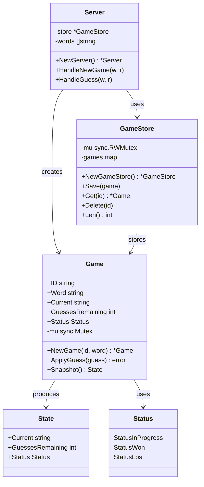

# Word Game — Domain Model & Code Structure

> How the codebase is organised, why each package exists, and how domain concepts map to code.

---

## Class Diagram



### Field Visibility Convention

| Prefix | Meaning | Example |
|--------|---------|---------|
| `+` | Exported (public) | `Game.ID`, `NewGameStore()` |
| `-` | Unexported (private) | `Game.mu`, `GameStore.games` |

---

## Dependency Direction

```
┌─────────────────────────────────────────────────────────────┐
│  cmd/wordgame/main.go     ← composes everything, owns main  │
│                         │                                    │
│          ┌──────────────┼──────────────┐                    │
│          ▼              ▼              ▼                    │
│  internal/handler   pkg/words    pkg/identifier             │
│          │              │              │                    │
│     ┌────┴────┐         │              │                    │
│     ▼         ▼         │              │                    │
│  internal/  internal/    │              │                    │
│  store      game         │              │                    │
│     │         │          │              │                    │
│     └────┬────┘          │              │                    │
│          ▼               │              │                    │
│       game.Game          │              │                    │
│                          │              │                    │
└─────────────────────────────────────────────────────────────┘
```

**Rules enforced by Go:**

- `cmd/` can import `internal/` and `pkg/`
- `internal/` can import `pkg/` and other `internal/` packages
- `pkg/` can only import standard library + external deps (no `internal/`)
- No external module can import `internal/` — Go compiler blocks it

**Direction:** Dependencies flow toward stability. `pkg/` packages have zero internal dependencies. `internal/game` has zero I/O. `internal/handler` orchestrates but contains no business rules.

---

**Why Game is the aggregate root:** Every operation revolves around a `Game` instance. The `Game` enforces its own invariants (no guesses after win/loss, valid letters only). Nothing outside the `Game` can break its state.

---

## Package Separation — Why Three `internal/` Packages

```
internal/handler   →  HTTP layer (controllers)
internal/game      →  Domain logic (pure, no I/O)
internal/store     →  Data access (repository)
```

### `internal/handler` — HTTP Concerns Only

**What it does:**

- Decodes JSON request bodies
- Applies Postel's Law (trims, uppercases)
- Validates input (single char, A-Z)
- Encodes JSON responses with correct HTTP status codes
- Orchestrates the flow: store → game logic → snapshot → response

**What it does NOT do:**

- Know how letters are matched in a word
- Know how guesses are counted
- Know how game state is stored (map? database? Redis?)
- Contain any business rules

**Why separated:** You can swap the HTTP layer (e.g., gRPC, WebSocket, CLI) without touching game logic. You can test game logic without spinning up an HTTP server.

### `internal/game` — Pure Business Logic

**What it does:**

- Creates new games (`NewGame`)
- Processes guesses (`ApplyGuess`)
- Enforces game rules (win/loss detection, valid letters)
- Provides thread-safe snapshots (`Snapshot`)
- Owns its own mutex for concurrency

**What it does NOT do:**

- Read from the network
- Write JSON
- Know about HTTP status codes
- Know about the store

**Why separated:** This is the heart of the domain. It has zero I/O dependencies — just `fmt` and `strings`. You can unit-test every rule in isolation with no mocks. If the game rules change (e.g., 8 guesses instead of 6), you change only this package.

### `internal/store` — Data Access (Repository)

**What it does:**

- Thread-safe CRUD for `Game` instances
- In-memory `map[string]*Game` with `sync.RWMutex`

**What it does NOT do:**

- Know HTTP
- Know game rules
- Know word loading

**Why separated:** If you ever replace the in-memory map with Redis, PostgreSQL, or an on-disk store, you change only this package. The handler and game logic remain untouched.

### The Flow

```
POST /guess {"id":"abc","guess":"a"}
        │
        ▼
internal/handler   ← Parse JSON, trim, uppercase, validate
        │
        ├──→ internal/store.Get("abc")  ← Data access
        │
        ├──→ internal/game.ApplyGuess('A')  ← Business logic
        │
        ├──→ internal/game.Snapshot()  ← Thread-safe read
        │
        └──→ JSON response (200 or 400)
```

---

## Why There Are No Interfaces (Yet)

Every package currently has **exactly one concrete implementation**:

| Package | Implementation | Interface would be |
|---------|---------------|-------------------|
| `internal/store` | In-memory `GameStore` | `GameRepository` |
| `pkg/words` | `LoadWords(io.Reader)` | `WordLoader` |
| `pkg/identifier` | `GenerateIdentifier()` | `IDGenerator` |

**We don't extract interfaces because:**

 **YAGNI** (You Ain't Gonna Need It) — there is no second implementation to abstract over. Extracting an interface now adds indirection without benefit.

**When would we add interfaces?**

If any of these happened:

- **PostgreSQL store** — create `GameRepository` interface, implement `PostgresGameStore`
- **Multiple word sources** — create `WordLoader` interface, implement `FileLoader` and `APILoader`
- **Integration tests** — inject a real store but a fake word list

The Go convention is: **define interfaces where they are consumed, not where they are implemented.** So the `Server` struct would own the interface definition:

```go
// hypothetical — NOT implemented
type GameRepository interface {
    Get(id string) *game.Game
    Save(g *game.Game)
    Delete(id string)
}

type Server struct {
    store GameRepository  // ← accepts anything that satisfies the interface
    words []string
}
```

This is the opposite of Java/C# — the interface lives with the consumer, not the implementation. We haven't reached a point where this pays off.

---

## Request Flow Through Packages

```
1. Client sends POST /guess
         │
         ▼
2. gorilla/mux routes to Handler.HandleGuess
         │
         ▼
3. Handler decodes JSON, normalises input
         │
         ▼
4. Handler calls Store.Get(id)         ← data access
         │
         ▼
5. Handler calls Game.ApplyGuess('A')  ← business logic
         │  (Game acquires mu.Lock)
         │  (checks status, matches letter, checks win/loss)
         │  (Game releases mu.Lock)
         ▼
6. Handler calls Game.Snapshot()       ← thread-safe read
         │
         ▼
7. If game won/lost:
   │  Handler sets response.Word
   │  Handler calls Store.Delete(id)   ← cleanup
         │
         ▼
8. Handler writes JSON 200 response
```

**Key insight:** The handler never reads `Game.Current` or `Game.GuessesRemaining` directly — it always goes through `Snapshot()` to avoid data races. Similarly, it never touches the store's internal map directly — it uses `Get`/`Save`/`Delete` which handle locking internally.

---

## Concurrency Model

```
HTTP Request 1 ──→ Store.Get() [RLock ✓] ──→ Game.Mutex [acquired]
HTTP Request 2 ──→ Store.Get() [RLock ✓] ──→ Game.Mutex [waits]

                    Different game IDs:
HTTP Request 1 ──→ Store.Get("abc") ──→ Game-abc.Mutex [acquired]
HTTP Request 2 ──→ Store.Get("xyz") ──→ Game-xyz.Mutex [acquired]
                    ↑ no contention — different games
```

**Two-level locking:**

1. `GameStore.RWMutex` — protects the `games` map (add/remove/lookup)
2. `Game.Mutex` — protects a single game's state (current, guesses, status)

This means:

- Creating/deleting games locks the store
- Looking up a game allows concurrent reads
- Guessing on the *same* game serialises (one guess at a time)
- Guessing on *different* games runs fully in parallel
